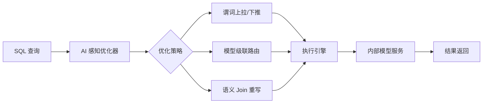

# 精读笔记：Cortex AISQL (SIGMOD 2026)

---

## ▎第一层 · 基本信息

| 字段 | 内容 |
|------|------|
| **论文** | Aggarwal, Chen, Datta, Han et al. *Cortex AISQL: A Production SQL Engine for Unstructured Data.* SIGMOD Companion 2026, arXiv:2511.07663 |
| **来源级别** | CCF-A 会议工业轨 / 产业生产系统 |
| **链接** | https://arxiv.org/abs/2511.07663 |
| **阅读日期** | 2026-07-15 |
| **状态** | 精读完成 |
| **相关论文组** | DB4AI（数据库 AI 算子） |

### 一句话核心结论

Snowflake 在生产环境中将六类 AI 算子（EMBED/COMPLETE/FILTER/CLASSIFY/JOIN/AGG）作为 SQL 执行引擎一等公民，通过 AI 感知查询优化、模型级联和语义 Join 重写三项技术，在 2025 年 7-9 月生产监控中证实 AI 算子主导查询成本。

`#DB4AI` `#AI-SQL` `#Snowflake` `#production-system` `#cost-model`

---

## ▎第二层 · 论文结构分析

### 1. 问题拆解

| 问题 | 论文的回答 |
|------|-----------|
| 要解决什么痛点？ | 传统 SQL 引擎无法处理非结构化数据上的语义操作。AI 推理调用比传统 SQL 算子昂贵数个量级，简单地把 AI 函数作为 UDF 会导致查询计划质量灾难性下降 |
| 之前的方法为什么不够？ | UDF 方式下优化器无法感知 AI 算子的成本特征（每行推理成本极高、编译期成本和选择率未知） |
| 论文的**核心论点** | AI 算子应作为 SQL 执行引擎的一等公民，需要 AI 感知的查询优化 |
| 它的**关键假设** | 所有 AI 推理调用走 Snowflake 内部模型服务（同集群低延迟），且模型调用成本可以建模为 `C_op(n) = n × c_model + α` |

### 2. 方法拆解

**核心技术要点**：

1. **AI 感知查询优化（2-8×）**：将 LLM 推理成本 `C_op(n) = n × c_model + α` 作为一阶代价目标。优化器在 `w1·C_LLM + w2·C_CPUIO` 联合代价下选择最优计划。必要时将昂贵 AI 谓词上拉到 Join 之后，先用传统结构化过滤缩小数据集。关键案例：~110,000 次模型调用 → 330 次（~300×）。
2. **自适应模型级联（2-6×，90-95% 质量）**：小模型（Llama 3.1-8B）做 proxy 处理大部分行，大模型（Llama 3.3-70B）做 oracle 处理不确定行。重要性采样学习双阈值路由（接受区/不确定区/拒绝区）。NQ 数据集 5.85× 加速，平均节省 65.5% 执行时间。
3. **语义 Join 重写（15-70×）**：O(N×M) 交叉连接 → 线性多标签分类，将右侧表列作为标签，AI_JOIN 转为 AI_CLASSIFY。平均 30.7× 加速，F1 平均提升 44.7 个百分点。

### 3. 实验拆解

| 维度 | 内容 |
|------|------|
| **数据集** | 生产监控数据（2025 年 7-9 月，Snowflake 生产集群）+ NQ 等标准 benchmark |
| **Baseline** | 传统优化器（无 AI 感知）作为 baseline |
| **评价指标** | 延迟（调用次数）、吞吐、质量（F1）——指标全面 ✅ |
| **消融实验** | 三项技术分别报告加速比 ✅ |
| **统计显著性** | 未报告方差/置信区间 ❌（产业论文常见问题） |
| **复现条件** | 🔴 完全闭源：Snowflake 内部执行引擎，不可复现 |

### 4. 关键数字

| Claim | 数字 | 条件 |
|-------|------|------|
| AI 感知查询优化 | 2-8×（谓词上拉案例 ~300×） | 生产 workload |
| 模型级联加速 | 5.85×，平均节省 65.5% 时间 | NQ 数据集 |
| 语义 Join 重写 | 平均 30.7×（最优 69.5×） | 多标签分类转换 |
| 生产多表查询占比 | ~40% 查询涉及多表操作 | 2025.7-9 监控 |
| 六大 AI SQL 算子 | EMBED / COMPLETE / FILTER / CLASSIFY / JOIN / AGG | 全部在生产可用 |

---

## ▎第三层 · 批判性评估

### 1. 假设检验

- **假设 1**：AI 推理调用成本随行数线性增长，`C_op(n) = n × c_model + α`
  - 反例 / 边界：**本课题场景不满足此假设**。vLLM continuous batching 下，batching 的边际成本递减——100 行一起推理的成本远小于 100 × 单行成本。Cortex AISQL 不做 batching 优化，这是与你的课题的关键差异。
- **假设 2**：模型服务在 Snowflake 内部，延迟低且稳定
  - 反例 / 边界：外部执行链路中，模型服务是跨网络调用，涉及 GPU 排队、cold start、网络延迟
- **假设 3**：查询计划确定后执行过程无动态调整
  - 反例 / 边界：外部执行中模型服务负载动态变化，需要 online 调整 batch size、worker 数量

### 2. 边界探查

- **方法适用边界**：当模型调用不可拆分（如一次完整 LLM 生成而非逐行分类）时，谓词上拉策略无效
- **扩展性限制**：论文中模型调用量级约 ~110,000 次（案例）；百万/亿级行需要不同的剪枝策略
- **复现难度**：🔴 完全闭源，无法复现

### 3. 可信度评估

| 维度 | 评价 | 依据 |
|------|------|------|
| 实验公平性 | 🟡 有疑点 | Baseline 可能较简单；SIGMOD Companion 工业轨 peer review 力度通常弱于正会 |
| 结果显著性 | 🟢 显著 | 300× 案例即使在最有利条件下也足够显著 |
| 开源/可复现 | 🔴 闭源 | Snowflake 自研引擎，完全不可复现 |
| 论文自身局限 | 🟢 诚实 | 没有过度夸大，承认了系统边界 |

### 4. 与同行工作的对比

- 比 **Smart**（VLDB 2025）多了产业生产数据，少了算法深度（Smart 的推理重写比 Cortex 的代价模型更精细）
- 比 **GaussML**（ICDE 2024）多了 LLM/embedding 时代的新算子，少了数据库内 ML 训练能力
- 在 **[你的课题]** 的坐标系中：属于 **DB4AI 路线的产业代表**——你要做的是"数据出数据库再回来"的外部执行路线，互补不重叠

---

## ▎第四层 · 与你课题的连接

### 1. 可引用的观点（配精确位置）

> §1 Introduction：生产数据表明 AI 算子是查询成本主导因素，~40% 查询涉及多表操作。
> → 直接支撑开题动机——"AI SQL 算子是工业真实需求，且执行成本不可忽略。"

> §3.1 AI-aware Optimization：传统优化器无条件下推谓词，但 AI 谓词成本极高，需要上拉到 Join 之后。
> → 说明"AI 算子的执行特征与传统 SQL 算子不同"是公认的优化前提。

> §4.1 Model Cascade：小模型处理大部分行，大模型仅处理不确定行，5.85× 加速。
> → 可作为外部执行链路中"前置过滤"策略的产业证据。

### 2. ⚠️ 不能过度引用的地方

- ❌ **不声称** "Cortex AISQL 证明了外部执行链路是瓶颈"——论文只证明 AI 算子成本高，不涉及外部 worker/Ray/写回
- ❌ **不声称** "Cortex 的模型 cascade 可直接用于外部执行"——他们的 cascade 在数据库内部、同集群；你的 cascade 涉及网络通信
- ❌ **不声称** "Snowflake 生产数据完全适用于本课题"——Snowflake 是云数仓，你的链路是 Ray/Daft/vLLM，load pattern 不同

### 3. 对本课题的实际用途

| 用途类型 | 具体方式 | 优先级 |
|----------|----------|--------|
| ✅ 动机证据 | §1 生产数据 → "AI 算子是工业真实瓶颈" | ⭐⭐⭐ |
| ✅ 对照区分 | 开题 §2 说明"内部执行 vs 外部执行"两条路线 | ⭐⭐⭐ |
| ✅ 空白论证 | "内部执行链路优化已有人做，外部执行链路是空白" | ⭐⭐ |
| ✅ 设计参考 | 模型 cascade 思路可借鉴，但需适配外部链路特征 | ⭐⭐ |

### 4. 不足 → 你的机会

| 论文的不足 | 你的课题可能如何填补 |
|-----------|---------------------|
| 内部执行：不研究"数据库触发→外部 worker/Ray/GPU→写回"的路径 | 这正是你的核心研究场景 |
| 不关心写回瓶颈 | 你的课题研究写回阶段（COPY + deferred index） |
| batch 构造策略不透明（batch size、partition 粒度是隐式的） | 显式研究 batch construction 策略（token-budget batching、length-aligned grouping） |
| 无动态调整（查询计划一旦确定不变） | 去中心化自适应提交（Queue-adaptive flush） |

### 5. 可论文化的措辞

> 正如 Aggarwal et al. [Cortex AISQL, SIGMOD 2026] 的生产数据所示，AI 算子已在工业 SQL 引擎中成为查询成本的主导因素，约 40% 查询涉及多表 AI 操作。然而，Cortex AISQL 的优化范围限于 Snowflake 内部的 AI-aware 查询计划选择，不涉及数据库触发后经由外部执行引擎的推理与写回链路。这一空白正是本课题的研究切入点。

> 与 Aggarwal et al. 的"模型进入数据库"路线不同，本课题采用"数据离开数据库"的外部执行路线——数据经 Arrow 格式传输至 Ray 集群，由 vLLM 等模型服务完成推理，再写回 pgvector/Lance。此路线面临的核心挑战是...

### 6. 后续待读

- [ ] [[entities/galois|Galois]] (SIGMOD 2025) — 同方向最新，Cortex 的学术对照
- [ ] [[entities/neurdb|NeurDB]] (CIDR 2025) — 另一条 DB4AI 路线代表

---

## 元反思

- **精读收益**：🟢 高
- **是否纳入核心文献库**：是
- **计划复习周期**：4 周后复习（重点复习假设检验部分，随课题推进可能变化）
- **一句话自评**：理解到位。论文的产业数据是最强价值，技术方案的细节偏粗（因为是产业论文）。最关键的是**与课题的互补定位**已在第四层理清。

---

## 相关笔记

- [[tpl-文献精读-深度版]] — 本模板
- [[文献地图]] — 文献全景
- [[gaussml_icde2024]] — 同方向另一篇精读
- [[smart_vldb_journal_2025]] — 同方向另一篇精读
- [[direction_assessment_20260715]] — 方向评估
