# 精读笔记：Database Perspective on LLM Inference Systems (PVLDB 2025)

---

## ▎第一层 · 基本信息

| 字段 | 内容 |
|------|------|
| **论文** | James Pan, Guoliang Li. *Database Perspective on LLM Inference Systems.* PVLDB, 18(12): 5504-5507, 2025. doi:10.14778/3750601.3750703 |
| **来源级别** | PVLDB 2025 Tutorial 论文（CCF-A 会议附属期刊，Tsinghua University） |
| **链接** | DOI:10.14778/3750601.3750703 / 本地 PDF：`opening/literature/reference/p5504-li.pdf` |
| **阅读日期** | 2026-07-22 |
| **状态** | 精读完成 |
| **相关论文组** | LLM Inference Systems / DB4AI / 推理调度 |

### 一句话核心结论

本文以数据库系统的视角（请求处理、优化执行、内存管理）系统化梳理 LLM 推理技术栈，将推理系统中的 batching、scheduling、load balancing、memory management 等技术与 DBMS 的对应概念建立类比，最终指出当前 batching/scheduling 依赖启发式方法、缺乏精确代价估计的开放问题。

### 关键词 / 标签

`#LLM-inference` `#tutorial` `#database-perspective` `#request-batching` `#memory-management` `#PVLDB2025`

---

## ▎第二层 · 论文结构分析

### 1. 问题拆解

| 问题 | 论文的回答 |
|------|-----------|
| 要解决什么痛点？ | LLM 推理的计算和内存需求巨大，请求生命周期不确定，硬件利用复杂——需要系统化的技术梳理帮助研究者理解推理系统的设计空间 |
| 之前的方法为什么不够？ | 已有 tutorial [10] 关注 LLM 可信度和质量，对推理效率的讨论较浅；缺一篇以数据库视角（请求处理→优化→执行→内存管理）系统化综述推理技术的 tutorial |
| 论文的**核心论点** | LLM 推理系统的技术栈可以与数据库系统的核心概念（请求处理、算子优化、内存管理、分布式执行）建立直接类比，这种视角有助于 DB 研究者理解和改进推理系统 |
| 它的**关键假设** | 数据库研究者对 DBMS 内部机制（查询优化、buffer pool、调度、分布式执行）有直觉，用这些概念类比推理系统可以降低入门门槛 |

### 2. 方法拆解

```mermaid
flowchart TB
    A[LLM Inference Stack] --> B[Request Processing]
    A --> C[Model Optimization & Execution]
    A --> D[Memory Management]
    A --> E[Inference Systems]
    
    B --> B1[Operator Design<br/>Attention / FFN / Token Sampler]
    B --> B2[Sequence Generation<br/>Beam Search / Graph-of-Thoughts / Self-Consistency]
    
    C --> C1[Kernels<br/>FlashAttention / FlashDecoding / Ring Attention]
    C --> C2[Request Batching<br/>Continuous Batching / Chunked Prefill]
    C --> C3[Job Prioritization<br/>Cost-based / Cache-aware Scheduling]
    C --> C4[Load Balancing<br/>Greedy Least-Load / Cache-aware Routing]
    
    D --> D1[Paged-Based Allocation<br/>vLLM PagedAttention / vAttention]
    D --> D2[Eviction & Offloading<br/>Position/Attention/Usage-based Importance]
    D --> D3[Quantization<br/>Weight / Activation / KV Cache Quantization]
    D --> D4[Cache Persistence<br/>Prefix Sharing / Selective Reconstruction]
    
    E --> E1[Centralized<br/>vLLM / SGLang]
    E --> E2[Distributed<br/>Mooncake P/D Disaggregated / DeepFlow Serverless]
    E --> E3[Frontends<br/>SGLang DSL / Guidance / DSPy / LangChain]
```

**核心技术要点**：

1. **四层推理技术栈**：将推理系统技术按数据库视角分为 Request Processing（类比查询解析）、Model Optimization & Execution（类比查询优化与执行）、Memory Management（类比 Buffer Pool）、Inference Systems（类比分布式 DBMS 架构）。这是本篇 tutorial 的核心组织框架。
2. **Continuous Batching + Chunked Prefill**：传统 static batching 面临 ragged tensor 问题（请求长度不一致导致计算浪费）。Continuous batching [19, Orca OSDI'22] 利用自回归生成的特性周期性重新组批，chunked prefill [1, Sarathi-Serve OSDI'24] 将长 prefill 拆分为多个 chunk 交错执行以平衡 TTFT 和 TBT。
3. **PagedAttention 为核心的内存管理范式**：vLLM [12] 将 KV cache 按 page/block 管理（类比 OS 虚拟内存），解决静态预分配导致的碎片和浪费；vAttention 利用 CUDA 原生内存管理避免 page-aware kernel。后续的 eviction、offloading、quantization、cache persistence 均建立在此范式之上。
4. **集中式 vs 分布式架构分化**：Centralized（vLLM 面向通用低延迟、SGLang 面向结构化输出 + 前缀共享）vs Distributed（Mooncake P/D disaggregated 面向高吞吐、DeepFlow serverless 面向共享硬件弹性伸缩）。两类系统的设计取舍不同——前者优化单机内存与延迟，后者优化跨机调度与负载均衡。
5. **开放问题直接点出调度瓶颈**：§2.5 明确指出 batching 和 scheduling 依赖启发式方法、缺乏精确代价估计，需要 adaptive techniques 和更好的 benchmarks——直接呼应本课题的研究动机。

### 3. 实验拆解

| 维度 | 内容 |
|------|------|
| **数据集** | 无。本文为 tutorial，不包含实验。引用的各系统（vLLM、SGLang、Mooncake 等）有各自实验，但本篇不做汇总对比 |
| **Baseline** | 无。 |
| **评价指标** | 无独立实验。文中提及的推理系统通用指标：TTFT（Time to First Token）、TBT（Time Between Tokens）、latency、throughput、memory usage |
| **消融实验** | 无。 |
| **统计显著性** | 不适用。 |
| **复现条件** | 不适用。各引用系统（vLLM、SGLang）代码公开。 |

> **注意**：本文是 tutorial 综述，不包含独立实验。以下"关键数字"改为记录文中的关键技术参数和系统设计决策，而非实验数字。

### 4. 关键数字（本文为 tutorial，以下为关键技术事实）

| Claim | 事实 | 来源 / 条件 |
|-------|------|-------------|
| Continuous batching 将请求周期性重新组批以平衡 TTFT 和 TBT | Orca [19] 提出，Sarathi-Serve [1] 引入 chunked prefill | §2.2 Request Batching |
| PagedAttention 通过分页块管理 KV cache，支持 block sharing（共享前缀） | vLLM [12] SOSP'23，块大小可配置 | §2.3 Paged-Based Memory Allocation |
| Mooncake 采用 Prefill/Decode 分离架构，greedy load balancer 基于延迟估计模型（考虑 cache 可用性、传输时间、worker 负载） | Mooncake [16] | §2.4 Distributed Systems |
| SGLang 使用 radix tree 做前缀匹配 + cache-aware scheduler + prefill interleaving | SGLang [20] | §2.4 Centralized Systems |
| 当前 batching/scheduling 依赖启发式方法，缺乏精确代价估计 | 作者自己指出的开放问题 | §2.5 Open Problems |

---

## ▎第三层 · 批判性评估

### 1. 假设检验

- **假设 1**：数据库视角是理解推理系统的有效框架
  - 反例 / 边界：数据库研究者熟悉的优化技术（cost-based optimization with cardinality estimation）在 LLM 推理中恰恰是最缺的——本文自己也指出 batching/scheduling 依赖启发式。DB 视角更多是类比工具而非直接可用的技术迁移路径。此外，LLM 的不确定性（请求长度、KV cache 大小不可预知）使得 DB 中成熟的代价模型难以直接套用。
- **假设 2**：读者对 DBMS 内部机制已有充分直觉
  - 反例 / 边界：对于做 ML infra 但不熟悉 DBMS 内部的研究者，这些类比（如 "KV cache 类比 buffer pool"）可能反而增加理解成本。Tutorial 的实际受众可能更偏 DB 社区。
- **假设 3**：四层分类（Request Processing → Optimization & Execution → Memory Management → Systems）是完备且正交的
  - 反例 / 边界：某些技术跨越多个层——例如 PagedAttention 既是 memory management 技术也是 kernel 设计约束（需要 page-aware kernel），分类有交叉。但作为 tutorial 的组织框架，这种简化是可接受的。

### 2. 边界探查

- **方法适用边界**：本文是 tutorial，其价值在于框架性理解而非具体方法。对于需要了解特定系统实现细节的读者，需要进一步阅读各引用论文。
- **扩展性限制**：4 页 tutorial 覆盖了 request processing、model optimization、memory management、inference systems 四大领域，每个子话题只有 1-2 段——深度有限。例如 batching 只提了 continuous batching 和 chunked prefill，未涉及 token-budget batching、length-align batching 等更细粒度的策略。
- **复现难度**：不适用。但本文描绘的技术栈（vLLM + continuous batching + PagedAttention）正是本课题的基础设施，可操作性很强。

### 3. 可信度评估

| 维度 | 评价 | 依据 |
|------|------|------|
| 实验公平性 | N/A | Tutorial 无独立实验 |
| 结果显著性 | N/A | 同上 |
| 开源/可复现 | N/A | 引用的核心系统（vLLM、SGLang）均已开源 |
| 论文自身局限 | 🟢 诚实 | §2.5 明确承认 batching/scheduling 依赖启发式、需要更精确的代价估计——没有过度包装现有技术 |

### 4. 与同行工作的对比

- 比 **Cortex AISQL**（SIGMOD 2026）：Cortex 是产业界将 AI 算子嵌入数据库的实践；本篇是从数据库视角向外看推理系统。共性是"DB + AI 交叉视角"，但方向相反——Cortex 朝内集成，本篇朝外类比。
- 比 **Galois**（SIGMOD 2025）：Galois 将 LLM 当存储层用 DB 技术查询；本篇将推理系统本身当作"DB 系统"来分析。两者都体现了 DB 思维在 LLM 时代的迁移价值。
- 比 **Orca**（OSDI 2022）、**vLLM**（SOSP 2023）、**SGLang**（arXiv 2024）：这些是本文综述的核心引用系统。本文的价值不在于超越它们，而在于将它们组织进统一的 DB 视角框架。
- 在 **[本课题]** 的坐标系中：本篇属于 **"推理系统全景地图"**。它不是竞争对手，而是定位工具——帮助本课题明确"我们在推理技术栈的哪一层、优化哪个环节"。具体来说，本课题的"数据组织 + 调度提交控制"对应本文的 Request Batching + Job Prioritization + Load Balancing 子层，即 Model Optimization & Execution 层的上中游。

---

## ▎第四层 · 与你课题的连接

### 1. 可引用的观点（配精确位置）

> §2.2 Request Batching：Continuous batching 通过周期性重新组批平衡 TTFT 和 TBT，但 batch formation 策略（如 TurboTransformers 最小化 tensor sparsity、ByteTransformer 重打包 ragged tensor）仍较粗粒度。
> → 本课题的 token-budget batching 正是在 continuous batching 基础上的更精细 batch formation 策略——按计算量而非行数组织请求。可以在开题 §2 中用此文定位 continuous batching 的基线位置。

> §2.2 Job Prioritization：请求调度顺序影响延迟和吞吐——当前方法基于 completion time 估计 [11] 或 cache 复用潜力 [20] 做优先级决策。
> → 本课题的 queue-adaptive flush 和 K_max 动态控制提供了另一种优先级维度——按队列状态和模型服务负载动态调节提交节奏，这比基于静态代价估计的优先级更 adaptive。

> §2.2 Load Balancing：分布式推理系统中的负载均衡面临请求生命周期不确定 + 未来负载不确定的双重挑战，大多数系统采用 greedy least-load 启发式。
> → 本课题的异构 actor pool 分池路由策略可被视为一种更精细的 load balancing——按计算量（token/frame count）路由到不同 capacity 的 actor，而非简单的 least-load。

> §2.5 Open Problems：现有 batching 和 scheduling 依赖启发式，"Developing more accurate cost estimates is needed"以及 "developing adaptive techniques"是明确的开放问题。
> → 这是本文对本课题最直接的支持——作者自己承认当前 batching/scheduling 不够好，需要更精确的代价估计和自适应技术。本课题的 token-budget-aware batch construction 和 queue-adaptive flush 正是回应这两个开放问题。

> §2.3 PagedAttention / Memory Management：将 KV cache 的不确定性类比为 "in-memory OLTP workloads"——类似数据库 buffer pool 管理 volatile data。
> → 可以用这个类比来帮助数据库背景的读者理解为什么要优化推理系统的"上游"（数据组织和提交控制）：正如 DB 查询优化不能只靠 buffer pool，推理优化也不能只靠 PagedAttention。

### 2. ⚠️ 不能过度引用的地方

- ❌ **不声称** "本文证明了数据库技术可以直接用于 LLM 推理优化"——它是类比和梳理，不是技术迁移方案
- ❌ **不声称** "本文提出了 batch formation 或 scheduling 的具体优化方法"——它只综述了现有方法并指出不足
- ❌ **不声称** "本文覆盖了所有推理优化技术"——4 页 tutorial，每个话题只有 1-2 段，深度有限
- ❌ **不声称** "本文的 open problems 是本课题的独家切入点"——open problems 是公共的，需要进一步论证本课题的具体方案差异
- ❌ **不声称** "本文的实验支持了某个特定结论"——本文无独立实验

### 3. 对本课题的实际用途

| 用途类型 | 具体方式 | 优先级 |
|----------|----------|--------|
| ✅ 动机证据 | §2.5 Open Problems 直接支持"batching/scheduling 需要更精确的代价估计和自适应技术" | ⭐⭐⭐ |
| ✅ 定位框架 | 用本文的推理技术栈四层框架，在开题 §2 中定位本课题的工作层次（Model Optimization & Execution 的 batching + scheduling 子层） | ⭐⭐⭐ |
| ✅ 空白论证 | 本文覆盖 batching/scheduling 但仅到 continuous batching + least-load 粒度，未涉及 token-budget / queue-adaptive 策略——空白恰好是本课题的切入点 | ⭐⭐⭐ |
| ⚠️ 设计参考 | Continuous batching 和 chunked prefill 是本课题的技术基线，而非设计参考源 | ⭐⭐ |
| ⚠️ 对照区分 | 本文综述的系统（vLLM、SGLang）是本课题使用的基础设施，本课题优化的是"用户侧的 upstream 调度"而非平台内部机制 | ⭐⭐ |

### 4. 不足 → 你的机会

| 论文的不足 / 未回答的问题 | 你的课题可能如何填补 |
|--------------------------|---------------------|
| Batching 策略只讲到 continuous batching + chunked prefill，未涉及按 token 量/frame 量组织 batch 的细粒度策略 | 本课题研究内容一（数据组织策略）的 token-budget batching / length-align batching 直接填补此空白 |
| Job prioritization 只讨论了按 completion time 或 cache 复用的静态优先级，缺少基于实时队列状态的自适应优先级 | 本课题研究内容二（调度与提交控制）的 queue-adaptive flush + K_max 动态控制提供自适应调度 |
| Load balancing 只提到 greedy least-load 和 cache-aware routing，未涉及按计算量（token count）路由到异构 worker | 本课题的异构 actor pool 分池路由按计算量将请求分配给不同 capacity 的 actor |
| 四层分类虽然完整但并未讨论各层之间的耦合——例如 batch formation 策略如何与 memory management 交互 | 本课题的实验设计（独立搜索 + 联合 grid search 对比）正是为了回答"数据组织与调度提交控制是否需要联合优化" |
| 未覆盖"数据从数据库到推理系统"的上游链路 | 本课题的核心场景——PostgreSQL → Daft → Ray → vLLM 的数据组织与传输链路——完全不在本文覆盖范围内 |

### 5. 可论文化的措辞

> Pan and Li [PVLDB 2025] 以数据库视角系统化梳理了 LLM 推理技术栈，将其分为 Request Processing、Model Optimization & Execution、Memory Management 和 Inference Systems 四层。在本框架中，本课题关注的是 Model Optimization & Execution 层的上游——数据如何组织为请求、以什么节奏提交给推理运行时。

> 正如 Pan and Li [PVLDB 2025, §2.5] 所指出的，当前 LLM 推理系统中的 batching 和 scheduling 仍然依赖启发式方法，"developing more accurate cost estimates"以及"developing adaptive techniques"是明确的开放问题。本课题提出的 token-budget-aware batch construction 和 queue-adaptive flush 正是对这一开放问题的直接回应——通过细粒度的计算量感知（token count / frame count）替代粗粒度的行数驱动 batching，通过队列状态感知的自适应提交替代固定间隔的请求注入。

> 与 Pan and Li [PVLDB 2025] 综述的 continuous batching 和 least-load load balancing 等平台内优化不同，本课题聚焦于推理系统之外的"上游调度"——数据从数据库出发、经 Arrow/Ray 传输、最终到达 vLLM 平台之前的组织与提交控制。这一上游环节在现有的推理系统文献中鲜有讨论，但正如 Snowflake Cortex [SIGMOD 2026] 的生产数据所示，当 AI 算子嵌入数据库后，数据组织与传输成本可能主导端到端延迟。

### 6. 后续待读

- [ ] [[cortex_aisql_sigmod2026]] — 已精读，AI 算子嵌入数据库的产业实践
- [ ] [[galois_sigmod2025]] — 已精读，DB 技术查询 LLM 的学术系统
- [ ] **Orca** (Yu et al., OSDI 2022) — 本文引用的 continuous batching 原始论文，理解 iteration-level scheduling
- [ ] **Sarathi-Serve** (Agrawal et al., OSDI 2024) — 本文引用的 chunked prefill 论文，理解 prefill-decode 交错
- [ ] **vLLM** (Kwon et al., SOSP 2023) — 本文重点综述的对象，PagedAttention 原始论文
- [ ] **SGLang** (Zheng et al., 2024) — 本文引用的 centralized system 代表，radix tree prefix sharing
- [ ] **"Is the GPU half-empty or half-full?"** (Kossmann et al., 2025) — 本文 [11] 引用，LLM scheduling 的实用技术

---

## 元反思

- **精读收益**：🟢 高（作为 tutorial，它不提供新的实验发现，但提供了系统化的推理技术栈地图——这对开题 §2 中定位本课题的工作层次和论证研究空白非常有价值）
- **是否纳入核心文献库**：是（定位框架 + 空白论证 + open problems 引用）
- **计划复习周期**：8 周后复习（当本课题实验结论更充实时，重新检查本文框架是否仍准确描述了技术全景）
- **一句话自评**：理解到位。本文的核心价值不在于"新发现"而在于"框架"——它把分散的推理系统技术（vLLM、SGLang、Mooncake、DeepFlow）组织成数据库研究者可以理解的四层体系，并诚实指出 batching/scheduling 是当前最弱的环节。本课题正好切入这个 weakest link 的上游维度。

---

## 相关笔记

- [[cortex_aisql_sigmod2026]] — AI 算子嵌入数据库的产业实践
- [[galois_sigmod2025]] — DB 技术查询 LLM 的学术系统
- [[gaussml_icde2024]] — 更早的 DB4AI 代表
- [[smart_vldb_journal_2025]] — ML 谓词优化的 DB4AI 路线
- [[文献地图]] — 文献全景
