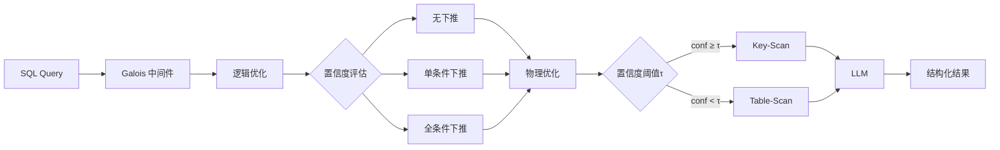

# 精读笔记：Galois — Logical and Physical Optimizations for SQL over LLMs (SIGMOD 2025)

---

## ▎第一层 · 基本信息

| 字段 | 内容 |
|------|------|
| **论文** | Satriani, Veltri, Santoro, Rosato, Varriale, Papotti. *Logical and Physical Optimizations for SQL Query Execution over Large Language Models.* SIGMOD 2025. DOI:10.1145/3725411 |
| **来源级别** | CCF-A 会议论文（University of Basilicata + EURECOM） |
| **链接** | DOI:10.1145/3725411 / 本地 PDF：`raw/papers/3725411.pdf` / 代码：https://github.com/dbunibas/galois |
| **阅读日期** | 2026-07-22 |
| **状态** | 精读完成 |
| **相关论文组** | DB4AI（数据库 AI 算子） |

### 一句话核心结论

Galois 作为 SQL 查询和 LLM 之间的中间件，将 LLM 视为"存储层"，设计了 LLM 专用的 Table-Scan / Key-Scan 物理算子 + 基于置信度的逻辑/物理优化，比直接 NL 提问质量提升 144%，比直接 SQL 质量提升 29%，且比同类多步 baseline 节省 11 倍 token 成本。

`#DB4AI` `#LLM-as-storage` `#cost-qualitytradeoff` `#SQL-over-LLM` `#SIGMOD2025`

---

## ▎第二层 · 论文结构分析

### 1. 问题拆解

| 问题 | 论文的回答 |
|------|-----------|
| 要解决什么痛点？ | 直接向 LLM 提问（NL 或 SQL）获取结构化数据时，结果质量差——低精度、低召回，尤其是复杂查询（多条件、聚合、Join）|
| 之前的方法为什么不够？ | NL 提问有歧义；直接 SQL 提示语虽好但仍不够；传统查询优化假设（有 catalog、有直方图、I/O 成本可预测）在 LLM 场景不成立 |
| 论文的**核心论点** | 应该用数据库管理系统来处理查询执行，而把 LLM 当作存储层——两者各司其职 |
| 它的**关键假设** | LLM 内部确实存储了可提取的结构化知识（parametric knowledge），并且可以通过精心设计的 prompt 链逐步提取出来 |

### 2. 方法拆解

**核心技术要点**：

1. **LLMScan 逻辑算子族**：LLMScan（无条件数据获取）和 Filter-LLMScan（带条件下推的数据获取）。LLMScan 是唯一与 LLM 交互的算子，其他算子（Selection/Projection/Join/Agg）在内存中执行，不涉及 LLM。支持三种下推策略：无下推 / 单条件 / 全条件。
2. **Table-Scan vs Key-Scan 物理算子**：Table-Scan 直接迭代式 prompt 获取所有属性值，利用上下文记忆提高召回；Key-Scan 先获取所有 Key 值，再对每个 Key 获取其他属性——类似 CoT 的分解推理，质量更高但 token 成本更大。Key-Scan 的第二步可并行化。
3. **基于 LLM 自身置信度的逻辑/物理优化**：**核心创新**。利用 LLM 的分类能力评估每个 WHERE 谓词的置信度（high/low），只下推 high 置信度的条件；同时评估整体置信度分数（0-1），超过阈值 τ 则用 Key-Scan，否则用 Table-Scan。用 LLM 自己的判断来优化 LLM 的查询计划。
4. **选择性属性检索**：分析查询的 SELECT 子句，只让 LLM 输出相关属性而非全表，减少 token 消耗。

### 3. 实验拆解

| 维度 | 内容 |
|------|------|
| **数据集** | 7 个数据集：Flight/Geo/World/Scholar（IK 内参知识）+ Movies/Presidents/Premier/Fortune（MC 上下文知识）+ Geo-Test（阈值校准） |
| **Baseline** | NL（自然语言提问）、SQL（直接 SQL 提示语）、Galois_baseline（无优化的多步 cell-by-cell）、Palimpzest（RAG 场景） |
| **评价指标** | **质量**：F1-Cell、Cardinality、Tuple Constraint、AVG-Score（前三者平均）；**成本**：#Tokens、Time（秒） |
| **消融实验** | ✅ 分别评估逻辑优化（NO-PUSH vs ALL-PUSH vs CONFIDENCE）和物理优化（Table vs Key 选择） |
| **统计显著性** | ❌ 未报告方差/置信区间（但多数据集覆盖部分缓解此问题） |
| **复现条件** | 🟢 代码开源（GitHub: dbunibas/galois），使用公开 LLM API（GPT-4o mini / Together AI LLaMa） |

### 4. 关键数字

| Claim | 数字 | 条件 |
|-------|------|------|
| 质量提升 vs NL | 144% AVG-Score 提升（0.254 → 0.622） | LLaMa 3.1 70B，IK 场景 |
| 质量提升 vs SQL | 29% AVG-Score 提升（0.481 → 0.622） | 同上 |
| 物理优化准确率 | 75% 情况下选中最优物理计划 | GEO 数据集 |
| token 节省 vs baseline | Galois_baseline 的 11 倍 token 消耗（19.71M vs 1.72M） | 全数据集平均 |
| RAG 场景质量 | AVG-Score 0.711（vs Palimpzest 0.720，但 token 仅 1/11） | Premier + Fortune |
| 迭代次数 | 优化后平均 3.92 次 vs 无优化 6.82 次 | 全数据集 |

---

## ▎第三层 · 批判性评估

### 1. 假设检验

- **假设 1**：LLM 的 parametric knowledge 可以像数据库一样被"扫描"提取
  - 反例 / 边界：只有高频/常见数据容易被提取。论文自己的实验证实，关于 Venezuela 总统的数据质量远低于 USA 总统（AVG-Score 0.482 vs 0.862）——**实体流行度偏差（popularity bias）是一个根本性限制，论文没有深入讨论其影响**。
- **假设 2**：LLM 自身对查询条件的置信度估计是可靠的
  - 反例 / 边界：LLM 已知有过度自信问题（overconfidence）。论文用阈值 τ 来缓解，但 τ 的校准需要额外的 golden dataset（GEO-Test），且只对模型固定时才有效。
- **假设 3**：查询所涉及的知识全部或主要存在于 LLM 的预训练数据中
  - 反例 / 边界：对于时效性强的数据（如 2024 年的英超联赛），必须使用 RAG。论文确实考虑了 RAG 场景（MC），但性能明显低于 IK 场景。

### 2. 边界探查

- **方法适用边界**：仅适用于 LLM 中**存在且可提取**的结构化知识。对高度专业化、稀缺或时效性强的数据，效果急剧下降。
- **扩展性限制**：Key-Scan 需要为每个 Key 值调用一次 LLM——如果表有数千个 Key，token 成本爆炸。论文实验中最多的数据集也仅 267.5 个单元，未测试大规模场景。
- **复现难度**：🟢 代码已开源，使用公开 API，实验可复现。

### 3. 可信度评估

| 维度 | 评价 | 依据 |
|------|------|------|
| 实验公平性 | 🟢 较公平 | 4 种 baseline（含 NL/SQL/baseline/PZ），7 个数据集，IK + MC 双场景 |
| 结果显著性 | 🟢 显著 | 144% / 29% 提升 + 11× token 节省，数字一致且有实际意义 |
| 开源/可复现 | 🟢 全开 | 代码 + 数据公开，使用标准 API |
| 论文自身局限 | 🟡 一般 | 讨论了 popular 数据偏差，未深入讨论扩展性问题 |

### 4. 与同行工作的对比

- 比 **Cortex AISQL**（SIGMOD 2026）：Galois 是学术系统（开源），Cortex 是工业系统（闭源）。两者目标相反——Cortex 把 AI 算子**塞进**数据库，Galois 把 LLM **当作**数据库。
- 比 **Smart**（VLDB 2025）：Smart 优化传统 ML 谓词（可分析决策边界），Galois 优化 LLM prompt（黑盒，靠置信度估计）。Smart 的方法更精确，但适用面更窄（只对传统 ML）。
- 比 **GaussML**（ICDE 2024）：GaussML 硬编码 20+ ML 算子进数据库，Galois 不硬编码任何模型——只要 LLM API 能调用就行。Galois 更灵活但更慢。
- 在 **[你的课题]** 的坐标系中：Galois 属于 **DB4AI 路线中"LLM 作为数据源"的分支**。它与你的课题（数据出数据库→外部执行→写回）的区别在于：Galois 是把 LLM 当成数据源来查询（读），你的课题是把数据从 DB 送到 LLM 推理再到 DB（写）。

---

## ▎第四层 · 与你课题的连接

### 1. 可引用的观点（配精确位置）

> §1 Introduction：将 LLM 作为存储层，用 DBMS 处理查询执行。
> → 这是一个新颖的论点——与你的课题（DB 数据→外部 LLM→写回 DB）形成有趣对照。Galois 认为 LLM 是"存储"，你把它当"计算引擎"。

> §3.2 Key-Scan：两步扫描——先取 Key 再取值，可并行化第二步。
> → 这个"分解式 scan 策略"的思路可以借鉴到你的 batch construction 中——将大批量请求分解为可并行处理的子任务。

> §4 Logical/Physical Optimization：用 LLM 自身置信度做优化决策。
> → 思路有参考价值：在外部链路中，也可以用模型服务的 confidence/logprob 来决定 batch size 或路由策略。

> §5 Exp-8：Galois_full 在所有数据集中最接近最优计划。
> → 证明基于置信度的优化策略是有效的。

### 2. ⚠️ 不能过度引用的地方

- ❌ **不声称** "Galois 证明 LLM 可以替代数据库存储"——它只证明在小规模、常见数据上可以提取结构化信息
- ❌ **不声称** "Galois 的 Key-Scan 适合你的外部执行链路"——Key-Scan 是为 LLM 作为数据源设计的，你的场景是 LLM 作为推理引擎
- ❌ **不声称** "144% 质量提升在 AI_FILTER/AI_CLASSIFY 场景也成立"——实验针对的是语义数据提取，不是语义过滤

### 3. 对本课题的实际用途

| 用途类型 | 具体方式 | 优先级 |
|----------|----------|--------|
| ✅ 对照区分 | 开题 §2 中作为 DB4AI 路线的最新代表（2025 年，支持 LLM） | ⭐⭐⭐ |
| ✅ 空白论证 | 与 Cortex AISQL 一起说明"DB4AI 路线都在数据库内部"，外部执行是空白 | ⭐⭐⭐ |
| ⚠️ 设计参考 | Key-Scan 的分解思路可借鉴，但需适配外部推理场景 | ⭐⭐ |

### 4. 不足 → 你的机会

| 论文的不足 | 你的课题可能如何填补 |
|-----------|---------------------|
| LLM 用作"存储"（读数据），不涉及"推理后写回" | 你的课题是推理后写回——这是完全不同的方向 |
| Key-Scan 第二步可并行但受限于 Key 数量 | 你的 vLLM continuous batching 可以更高效地批量处理大批量请求 |
| 质量受限于实体流行度（USA 总统远好于 Venezuela） | 你的场景是推理而不是"已知知识检索"，不依赖 LLM 预训练数据 |
| 未考虑大规模表（实验最大 267 个单元） | 你的链路天然面对数据库表（万/百万级行），必须考虑扩展性 |

### 5. 可论文化的措辞

> 与 Satriani et al. [Galois, SIGMOD 2025] 将 LLM 视作可 SQL 查询的"存储层"不同，本课题研究的是另一方向——将 LLM 作为外部推理引擎，数据经由 Arrow/Ray 传输至模型服务完成推理后写回数据库。两条路线互补：Galois 回答"如何从 LLM 中读数据"，本课题回答"如何向 LLM 送数据再写回结果"。

> Galois 提出的基于模型置信度的物理算子选择策略（§4）与 Smart 的推理重写（VLDB 2025）共同表明，在 AI/ML 算子的执行优化中，"感知 AI 算子特征"是核心思路。本课题将这一思路延续到外部执行场景，提出 token-budget-aware batch construction 和 queue-adaptive flush。

### 6. 后续待读

- [ ] [[cortex_aisql_sigmod2026]] — 已精读，同方向产业对照
- [ ] [[smart_vldb_journal_2025]] — 已精读，更早的 ML 谓词优化
- [ ] **LOTUS** (Patel et al., 2024) — 另一语义查询系统，Galois 引用中提及
- [ ] **TAG** (Biswal et al., 2024) — "Text2SQL is Not Enough"，Galois 引用中提及

---

## 元反思

- **精读收益**：🟢 高（本文是同方向最新论文，与你的课题对照价值大）
- **是否纳入核心文献库**：是
- **计划复习周期**：4 周后复习
- **一句话自评**：理解到位。Galois 的"LLM 作为存储层"视角与你的"LLM 作为推理引擎"视角恰好对称，是开题 §2 中论证"DB4AI 路线多样性"的绝佳案例。

---

## 相关笔记

- [[cortex_aisql_sigmod2026]] — 同方向产业代表
- [[gaussml_icde2024]] — 同方向更早代表
- [[smart_vldb_journal_2025]] — 同方向 ML 谓词优化
- [[文献地图]] — 文献全景
