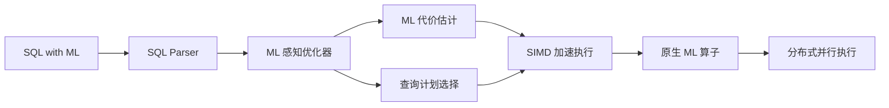

# 精读笔记：GaussML (ICDE 2024)

---

## ▎第一层 · 基本信息

| 字段 | 内容 |
|------|------|
| **论文** | Li, Sun, Li, Wang, Nie, Xu. *GaussML: An End-to-End In-database Machine Learning System.* ICDE 2024. |
| **来源级别** | CCF-A 会议论文（华为 + 清华大学） |
| **链接** | 本地 PDF：`raw/papers/PDFs/gaussmlicde.pdf` |
| **阅读日期** | 2026-07-15 |
| **状态** | 精读完成 |
| **相关论文组** | DB4AI（数据库 AI 算子） |

### 一句话核心结论

华为 openGauss 中将 20+ ML 算子以原生 SQL 语法直接集成进查询引擎，替代 ML-as-UDF 方案，配合 ML 感知优化器和 SIMD 加速，比 Apache MADlib 快 2-6×。

`#DB4AI` `#in-database-ML` `#openGauss` `#Huawei` `#native-SQL-operator`

---

## ▎第二层 · 论文结构分析

### 1. 问题拆解

| 问题 | 论文的回答 |
|------|-----------|
| 要解决什么痛点？ | 传统 ML-as-UDF 方法有安全风险（UDF 可能引入漏洞代码）和性能瓶颈（无法利用 SIMD、无法做 ML 感知优化） |
| 之前的方法为什么不够？ | UDF 受限于 SQL 查询算子的数据访问与执行模式约束，优化器看不到 ML 算子的语义和代价 |
| 论文的**核心论点** | ML 算子应作为数据库原生算子（first-class citizen），而非 UDF |
| 它的**关键假设** | ML 算子的种类和计算模式相对固定（传统 ML，非 LLM），可以预先集成到查询引擎中 |

### 2. 方法拆解

**核心技术要点**：

1. **原生 SQL 接口**：20+ ML 算子直接集成进查询引擎——优化器能理解 ML 算子的语义和代价，而非黑盒 UDF
2. **ML 感知优化器**：引入 ML 感知的基数与代价估计器，优化 SQL+ML 查询计划
3. **SIMD 与数据预取**：利用 SIMD 加速 ML 算子训练，利用数据预取减少缓存 miss
4. **分布式并行**：利用 openGauss 自身的并行和分布式能力进行训练与推理

### 3. 实验拆解

| 维度 | 内容 |
|------|------|
| **数据集** | 论文未详细列出（典型 ML benchmark） |
| **Baseline** | Apache MADlib（业界标准 ML-in-database 框架） |
| **评价指标** | 执行时间（加速比）；**missing**：F1/模型质量指标——只比性能不比精度 |
| **消融实验** | ❌ 未明确报告各模块单独贡献 |
| **统计显著性** | ❌ 未报告 |
| **复现条件** | 🟡 部分可复现（openGauss 开源，但 ML 算子集成代码未必公开） |

### 4. 关键数字

| Claim | 数字 | 条件 |
|-------|------|------|
| ML 算子支持 | 20+ 常用 ML 算法 | 分类、回归、聚类等传统 ML |
| 相比 MADlib 加速 | 2-6× | openGauss 环境 |
| 实现平台 | openGauss | 华为自研数据库 |

---

## ▎第三层 · 批判性评估

### 1. 假设检验

- **假设 1**：ML 算子的种类有限且稳定，可以硬编码进查询引擎
  - 反例 / 边界：**本课题场景不满足**。LLM/embedding 模型日新月异，不可能预编译进数据库。这一假设恰恰说明了传统 DB4AI 路线与 LLM 时代的脱节。
- **假设 2**：SIMD 和数据预取是主要的性能瓶颈
  - 反例 / 边界：对于传统 ML（决策树、线性回归）成立；但对于 LLM 推理，瓶颈在 GPU memory bandwidth 和 KV cache，而非 CPU SIMD

### 2. 边界探查

- **方法适用边界**：仅限于传统 ML 算法（分类、回归、聚类），不支持 LLM embedding 或生成
- **扩展性限制**：分布式并行依赖 openGauss 自身架构，无法轻松迁移到 Ray/Spark 等外部框架
- **复现难度**：🟡 部分可复现，但需要搭建 openGauss 环境

### 3. 可信度评估

| 维度 | 评价 | 依据 |
|------|------|------|
| 实验公平性 | 🟡 有疑点 | 只比了 MADlib，缺少其他 SOTA baseline |
| 结果显著性 | 🟢 显著 | 2-6× 在有意义的 workload 上成立 |
| 开源/可复现 | 🟡 部分 | openGauss 开源，但 GaussML 代码层未必 |
| 论文自身局限 | 🟡 一般 | 未深入讨论 LLM/embedding 场景的局限性 |

### 4. 与同行工作的对比

- 比 **Cortex AISQL**（SIGMOD 2026）早了两年，但只覆盖传统 ML，不支持 LLM 时代的新算子
- 比 **Smart**（VLDB 2025）多了数据库内训练能力，少了查询优化深度（Smart 的推理重写更精细）
- 在 **[你的课题]** 的坐标系中：**DB4AI 路线的学术代表**之一，用于开题 §2 中论证"DB4AI 路线已有多条探索，但都止步于数据库内部"

---

## ▎第四层 · 与你课题的连接

### 1. 可引用的观点（配精确位置）

> §1 Introduction：ML-as-UDF 存在安全风险和性能瓶颈，原生 ML 算子可以解决这些问题。
> → 用于说明"DB4AI 路线的出发点"——但本课题走的是相反方向。

> §3 ML-aware Optimizer：引入 ML 感知的基数与代价估计。
> → 与 Cortex AISQL 的 AI-aware 优化形成呼应，说明"ML/AI 感知的查询优化"是 DB4AI 领域的共识方向。

### 2. ⚠️ 不能过度引用的地方

- ❌ **不声称** "GaussML 证明 ML 算子应该硬编码进数据库"——对于 LLM 时代这不现实
- ❌ **不声称** "2-6× 加速适用于 AI 算子"——实验基于传统 ML，不是 embedding/LLM
- ❌ **不声称** "GaussML 的方案可用于本课题的外部执行链路"——它完全是数据库内路线

### 3. 对本课题的实际用途

| 用途类型 | 具体方式 | 优先级 |
|----------|----------|--------|
| ✅ 对照区分 | 开题 §2 中作为 DB4AI 路线的代表之一 | ⭐⭐⭐ |
| ✅ 动机证据 | 侧面证明"ML/AI 进数据库"是趋势，但**有局限** | ⭐⭐ |
| ❌ Baseline | 不直接可比（传统 ML 场景不同） | — |

### 4. 不足 → 你的机会

| 论文的不足 | 你的课题可能如何填补 |
|-----------|---------------------|
| 只支持传统 ML，不支持 LLM/embedding | 你的课题专门针对 LLM/embedding 场景 |
| ML 算子硬编码进查询引擎，无法扩展 | 你的外部执行架构天然支持新模型接入（模型服务 + Ray actor） |
| 优化范围限制在数据库内部 | 你的课题拓展到外部全链路（数据库→传输→推理→写回） |
| ML 模型执行受限于数据库进程资源 | 你的执行在 GPU 集群上，资源弹性更大 |

### 5. 可论文化的措辞

> 与 Li et al. [GaussML, ICDE 2024] 将 ML 算子嵌入数据库内核的 DB4AI 路线不同，本课题采用外部执行路线——数据经 Arrow 传输至独立的 GPU 推理集群，计算完成后写回数据库。两条路线适用于不同的资源与延迟约束场景。

### 6. 后续待读

- [ ] [[entities/galois|Galois]] (SIGMOD 2025) — 同方向最新，支持 LLM 风格算子
- [ ] [[entities/neurdb|NeurDB]] (CIDR 2025) — 另一 DB4AI 路线，架构更有弹性

---

## 元反思

- **精读收益**：🟡 中（这篇主要是对照区分价值，技术细节与本课题场景差距较大）
- **是否纳入核心文献库**：是（作为 DB4AI 对照路线的代表）
- **计划复习周期**：8 周后复习（只需要记住核心定位即可）
- **一句话自评**：理解到位。这篇论文对本课题的核心价值不是技术借鉴，而是**差异化论证**——证明"现有 DB4AI 方案不覆盖 LLM/embedding + 外部执行场景"。

---

## 相关笔记

- [[cortex_aisql_sigmod2026]] — 同方向，更贴近 LLM 时代
- [[smart_vldb_journal_2025]] — 同方向，查询优化更深入
- [[文献地图]] — 文献全景
