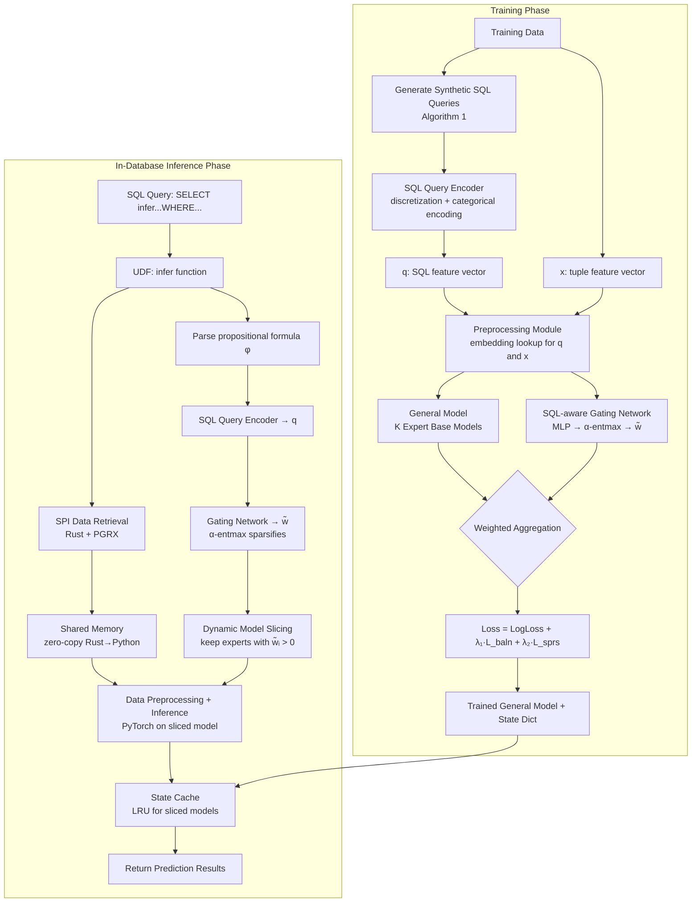

# 精读笔记：LEADS — Powering In-Database Dynamic Model Slicing for Structured Data Analytics (PVLDB 2024)

---

## ▎第一层 · 基本信息

| 字段 | 内容 |
|------|------|
| **论文** | Lingze Zeng, Naili Xing, Shaofeng Cai, Gang Chen, Beng Chin Ooi, Jian Pei, Yuncheng Wu. *Powering In-Database Dynamic Model Slicing for Structured Data Analytics.* PVLDB, 17(13): 4813-4826, 2024. DOI:10.14778/3704965.3704985 |
| **来源级别** | CCF-A 会议论文（NUS + Zhejiang Univ. + Duke Univ. + Renmin Univ. of China） |
| **链接** | DOI:10.14778/3704965.3704985 / 本地 PDF：`opening/literature/reference/p4813-zeng.pdf` / 代码：https://github.com/NLGithubWP/indices |
| **阅读日期** | 2026-07-22 |
| **状态** | 精读完成 |
| **相关论文组** | DB4AI（数据库 AI 算子）；In-Database ML |

### 一句话核心结论

LEADS 提出 SQL-aware dynamic model slicing 技术——用 Mixture-of-Experts (MoE) 扩展模型容量，通过 SQL-aware gating network 根据 WHERE 条件的 predicate 动态激活专家子模型，实现对不同 subdataset 的定制化推理。以 UDF 形式集成到 PostgreSQL 内，配合 Rust+Python 混合执行、共享内存、状态缓存三项优化，相比外部分离式推理最高提速 2.06x。

`#DB4AI` `#MoE` `#in-database-inference` `#model-slicing` `#structured-data` `#SQL-aware-gating` `#UDF-optimization`

---

## ▎第二层 · 论文结构分析

### 1. 问题拆解

| 问题 | 论文的回答 |
|------|-----------|
| 要解决什么痛点？ | 传统 structured data analytics 只做统计聚合；引入 DNN 后，分析师通常关注特定 subdataset（如"某地区某年龄段的男性"），需要为每个 subdataset 训练专用模型——但 subdataset 的组合数是指数级的，逐个训练不现实 |
| 之前的方法为什么不够？ | 单一大模型（general model）在所有 subdataset 上取折中效果差，尤其是小 subdataset（训练数据占比 <1%）上预测质量很差；而将数据从 DB 导出到外部推理系统又引入数据搬运开销和安全风险 |
| 论文的**核心论点** | 利用 SQL 查询中的 meta-information（WHERE 条件、predicate 组合）作为信号，通过 MoE + SQL-aware gating network 动态"切片"出一个针对该 subdataset 的子模型——既享受大模型容量（多专家），又保持推理效率（只激活必要专家） |
| 它的**关键假设** | SQL 的 propositional formula（WHERE 条件）所描述的 attribute 子空间确实对应着需要不同 model specialization 的数据分布差异；且训练时可以用 synthetic query 模拟真实 workload |

### 2. 方法拆解

**核心技术要点**：

1. **SQL Query Encoder + Discretization**：将 primitive SQL query（每个 attribute 最多一个 predicate，全用 AND 连接）的 WHERE 条件转换为 categorical feature vector q。数值属性通过 supervised discretization（OptBinning，最大化 Information Value）转为 category。每个 attribute 的 predicate 值做 embedding lookup，无 predicate 的 attribute 赋予 default embedding。这个 encoder 是整个系统的前提——SQL 查询必须能被表达为固定维度的向量。

2. **General Model + SQL-aware Gating Network (MoE)**：将 base model 复制 K 份作为 experts（默认 K=16）。Gating network 是 MLP，输入是 concat 后的 SQL 嵌入向量 q̂，输出经过 α-entmax（而非 softmax）产生稀疏 gating weights w̃。α-entmax 的关键在于将大量 gating weight 置零，从而只激活少数 expert。与固定 top-k 路由不同，α 是 learnable parameter，可根据当前 query 动态决定激活多少 expert。最终输出是所有 activated expert 的加权平均。

3. **Balance Loss + Sparsity Loss 双重正则化**：L_baln（coefficient of variation of expert utilization across batch）防止 gating network 只偏爱少数 expert 导致训练崩塌；L_sprs（negative L2 of gating weights）鼓励权重集中在少数 expert 上以降低计算量。两者互相制衡——L_baln 推高 expert 利用率（偏向均匀），L_sprs 拉低利用率（偏向集中），最终达到"适中数量的 expert 被均匀使用"的效果。

4. **In-Database Inference Extension（三项系统优化）**：
   - **Efficient Execution Allocation**：Rust（PGRX + SPI）做 data retrieval，Python（PyTorch）做 preprocessing + inference。各取所长。
   - **Memory Sharing**：Rust 过滤后的数据直接写共享内存，Python 端零拷贝读取，消除跨语言数据拷贝开销。
   - **State Caching**：general model 和频繁使用的 sliced model 做 session-level LRU 缓存，避免重复加载模型（model loading 占 IDS 总耗时 ~10%）。

### 3. 实验拆解

| 维度 | 内容 |
|------|------|
| **数据集** | 5 个真实数据集：Payment（30K 行）、Credit（244K 行）、Census（269K 行）、Diabetes（102K 行）、Avazu（40M 行）。覆盖金融、社会学、医疗、广告领域 |
| **Baseline** | 4 种 base model：DNN（基础全连接）、CIN（压缩交互网络）、AFN（自适应阶数特征交互）、ARMNet（多头注意力，SOTA for structured data）。每个模型分别评估 with/without LEADS |
| **评价指标** | **Effectiveness**：Workload-AUC（平均 AUC）、Worst-AUC（最差查询 AUC）；**Efficiency**：FLOPs（模型级）、Response Time（系统级端到端）；**系统对比**：IIS（In-database）vs IDS（Inference-Decouple，数据导出到外部系统） |
| **消融实验** | ✅ 完整：SQL-aware gating network 移除对比、α-entmax vs softmax、expert 数量（2→256）敏感性、正则化项 L_baln 和 L_sprs 的各自贡献、SPI/共享内存/状态缓存各自对响应时间的贡献 |
| **统计显著性** | ❌ 未报告方差/置信区间（5 个数据集 + 50 query workload 部分弥补） |
| **复现条件** | 🟢 代码开源（GitHub: NLGithubWP/indices），PyTorch 1.6.0 + CUDA 10.2，RTX 3090 Ti，PostgreSQL 14 + PGRX |

### 4. 关键数字

| Claim | 数字 | 条件 |
|-------|------|------|
| Workload-AUC 提升 | 最高 +3.95%（DNN on Credit） | 50 query workload, LEADS vs base DNN |
| Worst-AUC 提升 | 最高 +55.76%（DNN on Credit，0.385→0.600） | 最差查询场景，LEADS 对极小 subdataset 效果最显著 |
| IIS vs IDS 提速 | 最高 2.06x（Credit），最低 1.53x（Avazu） | 100K 预测记录，端到端响应时间 |
| 三项优化整体收益 | 3x speedup（vs w/o all optimizations） | Payment 100K 记录 |
| Expert 数敏感度 | 2→32 experts AUC 显著提升，>32 边际递减 | Payment + Credit |
| FLOPs 节省 | α-entmax 使得 FLOPs 随 expert 数增长远慢于 softmax（近乎平坦 vs 线性增长） | 256 experts 时对比最明显 |
| 数据插入鲁棒性 | LEADS 在 50%→90% 数据增长区间持续优于 baseline | Credit + Diabetes, 5 阶段插入实验 |
| 小 subdataset 场景 | query #1 仅用 0.13% 训练数据（~130 tuples），LEADS 显著提升 | Diabetes DNN analysis |

---

## ▎第三层 · 批判性评估

### 1. 假设检验

- **假设 1**：SQL WHERE 条件的 predicate 组合确实编码了"需要不同模型 specialization"的数据分布差异
  - 反例 / 边界：如果 subdataset 之间的差异主要由 attribute 间的非线性交互（而非 predicate 指定的显式分组）决定，则 gating network 基于 query embedding 的 expert 选择可能无效。论文未讨论"predicate 组合与模型 specialization 需求之间不匹配"的情况。
- **假设 2**：训练阶段的 synthetic query 能代表推理阶段的真实 workload
  - 反例 / 边界：Algorithm 1 从 dataset 中随机采样 tuple 构造 query——这意味着训练 query 的 predicate 值必然存在于训练数据中。如果推理时出现训练数据中未出现的 predicate 值（如新城市、新年龄段），discretization 可以将数值归入已有 bin，但 categorical 属性可能落入 unseen value，此时 embedding lookup 会失效（论文未说明 OOV 处理策略）。
- **假设 3**：primitive SQL query（每个 attribute 最多一个 predicate，全 AND）算子足以覆盖实际使用场景
  - 反例 / 边界：论文明确将查询限制为"primitive SQL query"，不支持 OR、range query（age > 25 AND age < 40 涉及同一 attribute 两个 predicate）、子查询等。real-world 分析场景中，分析师经常使用范围条件和 OR 逻辑。论文未讨论如何扩展到这些场景。
- **假设 4**：推理效率瓶颈在于 data movement（DB→外部系统），而不是模型计算本身
  - 反例 / 边界：在 Avazu 数据集（40M 行、150 万特征）上 IIS vs IDS 的提速最低（1.53x），暗示当模型本身计算量非常大时，data movement 的相对占比下降，in-database 方案的优势缩小。

### 2. 边界探查

- **方法适用边界**：仅适用于 structured data 上的分类/回归任务，且 SQL 查询必须能表达为 primitive AND-only 形式。对于文本、图像等非结构化数据不适用。对于需要在 LLM 上进行推理的 AI_COMPLETE/AI_EMBED 等场景，LEADS 的 MoE 思路可以借鉴但无法直接套用（预测目标不同）。
- **扩展性限制**：Avazu 40M 行已测试，但 expert 数最多 256。对于更大规模（百亿行级别、上千 expert），gating network 训练和 LRU cache 管理都面临挑战。此外，每次 schema 变更（attribute 删除）性能急剧下降（图 16），意味着 LEADS 对 schema 稳定性有较高要求。
- **复现难度**：🟢 代码开源，但依赖 PostgreSQL 14 + PGRX（Rust 扩展框架），环境搭建有一定复杂度。

### 3. 可信度评估

| 维度 | 评价 | 依据 |
|------|------|------|
| 实验公平性 | 🟢 较公平 | 4 种 base model × 5 个数据集，IIS vs IDS 系统级对比，所有优化项单独消融 |
| 结果显著性 | 🟢 显著 | Worst-AUC 提升幅度（+55.76%）和 IIS 提速（2.06x）均有实际意义，但缺少方差/置信区间 |
| 开源/可复现 | 🟢 全开 | 代码 + 数据公开，使用标准 ML 框架和 PostgreSQL |
| 论文自身局限 | 🟡 一般 | 诚实地讨论了 schema 变更的性能衰减，但未深入讨论 query 类型限制（OR/range/子查询不支持）的根本原因和扩展可能 |

### 4. 与同行工作的对比

- 比 **Cortex AISQL**（SIGMOD 2026）：LEADS 是学术系统（开源，PostgreSQL UDF），Cortex 是工业系统（闭源，Snowflake 内置）。两者都走"in-database ML"路线，但技术路线不同——LEADS 用 MoE + SQL-aware gating 优化模型效果，Cortex 用 UDF 抽象 + 模型级联 + 语义优化处理多样的 AI 算子。LEADS 更聚焦于"一个模型的定制化"，Cortex 更聚焦于"多模型的统一管理"。
- 比 **Galois**（SIGMOD 2025）：Galois 把 LLM 当"存储层"来查询已有知识，LEADS 用传统 DNN 在 structured data 上做预测。两者的"推理"含义完全不同——Galois 推理 = LLM 从预训练参数中提取结构化数据，LEADS 推理 = 传统 ML forward pass。但两者都强调利用 SQL 中的 meta-information 做优化决策，这一思路有共通之处。
- 比 **TRAILS**（VLDB 2024，同组）：TRAILS 是同一团队提出的 in-database model selection 技术，与 LEADS 互补——TRAILS 选模型，LEADS 定制模型。论文 §6 提到后续会整合两者。
- 在 **[你的课题]** 的坐标系中：LEADS 是纯粹的 **"ML inside DB"** 路线代表——模型训练、推理全在数据库内部完成，UDF 封装，不涉及外部计算系统。你的课题走的是相反方向——数据出 DB 经过外部推理引擎再写回。两条路线各有适用场景：LEADS 适合传统 ML 预测任务且模型较小（<=256 experts 的 DNN），你的课题适合 LLM/VLM 等大模型推理且需要外部 GPU 集群。

---

## ▎第四层 · 与你课题的连接

### 1. 可引用的观点（配精确位置）

> §1 Introduction："exporting data from the database introduces security risks and may violate compliance regulations; managing two separate systems complicates the analytics workflow."

> → 这为你的课题提供了一个"需要承认"的背景——in-database ML 路线的主要动机（安全、简化运维）与你的外部执行路线形成张力。你的开题报告需要明确解释：为什么在你的场景（LLM 推理）中，外部执行是合理甚至必要的选择。

> §1 + §4：Figure 4 展示 Inference-Decouple Strategy 的时间分解——model loading 10%、data retrieval 33%、preprocessing + inference 56%。

> → 外部推理链路中，data movement（DB→外部）的开销是你的课题需要优化的核心对象之一。LEADS 通过 in-database 消除这笔开销，你的课题则通过 batch organization + 调度提交控制来摊薄这笔开销。两者是不同的解题思路，但在开题中对比这两种策略可以增强论证。

> §3.2 SQL-aware Gating Network：通过 α-entmax 实现动态 expert 选择，α 本身是 learnable parameter。

> → **设计参考价值高**。"用模型自身的输出来决定激活多少计算资源"这一范式可以迁移到你的课题——例如用 vLLM 的 queue 状态、token backlog 来动态调整 batch size 或决定是否 flush。区别在于 LEADS 用 SQL query 做 routing signal，你的课题用模型服务的运行时状态做调度 signal。

> §4.1 三项系统优化：Rust+Python 混合执行、共享内存消除数据拷贝、LRU 状态缓存。

> → 你的 Daft（Rust core + Arrow zero-copy）+ Ray actor 本身就是更彻底的 Rust+Python 混合方案。LEADS 的三项优化经验可以作为你系统设计时的参考基线——如果你的 Arrow 零拷贝 + Ray actor pool 方案在 data movement 开销上还不如 LEADS 的共享内存方案，说明你的设计有问题。

> §5.2 Worst-AUC 分析：小 subdataset（训练数据占比 <1%）上 base model 效果极差，LEADS 通过 query-guided model slicing 显著缓解。

> → 这与你课题中的一个隐性问题相关：如果用户的 SQL 查询选出的数据量很小（几十行），你的外部执行链路的 batch construction 策略如何处理？LEADS 的方案是模型侧自适应，你的方案可以是 batch 侧自适应（如 minimum batch threshold + padding 或跨查询合并）。

### 2. ⚠️ 不能过度引用的地方

- ❌ **不声称** "LEADS 证明 in-database ML 对所有场景都最优"——论文只验证了传统 DNN 分类任务，不涉及 LLM/VLM 推理。LLM 模型大小（7B+）远超 LEADS 实验中的模型（hidden size 仅 16-32），不可能在 PostgreSQL 进程内高效运行。
- ❌ **不声称** "LEADS 的 MoE + gating 可以直接用于你的 LLM batch construction"——LEADS 的 gating 依赖 SQL query embedding 和 structured data feature，而你的场景是自然语言 prompt 和图像输入的 batch 组织，gating signal 完全不同。
- ❌ **不声称** "in-database 方案总是比外部执行快"——Figure 12(c) 显示 JOIN 查询时 IIS 的优势缩小（query planning 主导耗时），且 Avazu 大模型场景下 IIS 优势也仅 1.53x。当模型计算量足够大或查询本身很重时，in-database vs 外部执行的差距缩小。
- ❌ **不声称** "LEADS 支持 LLM 推理"——论文的 base model 是 DNN/CIN/AFN/ARMNet，全部是传统 MLP 或其变体，不涉及 Transformer 或 LLM。
- ❌ **不声称** "SQL-aware model slicing 这个想法适用于你的场景"——LEADS 的"切片"是按 predicate 组合选 expert，你的场景中不同 SQL 查询（不同数据子集）可能调用同一个 LLM 推理任务（如全表做 AI_COMPLETE），"切片"的信号来源不同。

### 3. 对本课题的实际用途

| 用途类型 | 具体方式 | 优先级 |
|----------|----------|--------|
| ✅ 对照区分 | 开题 §2 Related Work 中作为 in-database ML 路线的最新学术代表（2024 PVLDB），与 Cortex AISQL（产业）共同构成"ML inside DB"的完整图景 | ⭐⭐⭐ |
| ✅ 空白论证 | LEADS 的 base model 全部是轻量 DNN（hidden size 16-32），明确不涉及 LLM/VLM——论证"in-database 路线无法处理 LLM 推理，外部执行是必要路径" | ⭐⭐⭐ |
| ✅ 设计参考 | α-entmax + dynamic expert selection 的"用模型自身输出决定计算量"范式，可迁移到 queue-adaptive flush 和 K_max 动态控制 | ⭐⭐ |
| ✅ 设计参考 | Rust+Python 混合执行 + 共享内存的设计经验，可对照验证 Daft Arrow 零拷贝设计是否足够高效 | ⭐⭐ |
| ⚠️ 动机证据 | Figure 4 的 data movement 开销分解可作为外部链路优化的动机引用（但注意这是 IDS 场景，你的场景更复杂——多了一条 GPU 推理链路） | ⭐⭐ |

### 4. 不足 → 你的机会

| 论文的不足 / 未回答的问题 | 你的课题可能如何填补 |
|--------------------------|---------------------|
| 只支持 primitive SQL query（AND-only，每个 attribute 最多一个 predicate） | 你的课题作用于 SQL 查询选出数据之后的"外部推理"阶段，对 SQL 复杂度不敏感——只要是合法查询，数据选出来后一律走 Daft→Ray→vLLM 链路 |
| 模型必须是轻量 DNN（hidden size 16-32），无法支持 LLM/VLM | 你的课题以 vLLM 为部署平台，天然支持大模型推理，这正是外部执行相对于 in-database 的核心优势 |
| Base model 需要针对每个 database + task 重新训练，不适用于预训练大模型 | 你的课题使用的是预训练 LLM/VLM（Qwen2.5 等），不需要针对特定数据库训练模型 |
| MoE 的 expert 数固定（16），无法根据 workload 动态调整模型容量 | 你的 actor pool 可以动态扩缩容（Ray autoscaling），天然支持根据负载调整并行度 |
| 在 schema 变更（attribute 删除）时性能急剧下降，需要重新训练 | 你的链路使用 LLM 处理自然语言 prompt 或图像，对 database schema 变更不敏感（只要 SQL 能选出正确数据） |
| 未讨论多模型协同（如同时使用 LLM + 传统 ML） | 你的 Daft pipeline 可以定义多个下游算子——同一批数据可以同时送 vLLM（AI_COMPLETE）和 CLIP（AI_EMBED），这是 LEADS 未涉及的场景 |

### 5. 可论文化的措辞

> 与 Zeng et al. [LEADS, PVLDB 2024] 将轻量 DNN 推理嵌入数据库内部的路线不同，本课题研究的是大模型（LLM/VLM）推理场景下的外部执行优化。LEADS 的 MoE + SQL-aware gating 方案要求 base model 在数据库内部训练且模型规模受限（hidden size 仅 16-32），而本课题以 vLLM 部署的预训练大模型为推理引擎，模型规模可达 7B 参数级别，远超出数据库进程内执行的可行范围。两条路线适用不同场景：LEADS 适合传统表格数据的分类/回归预测，本课题适合需要大模型语义理解和生成能力的 AI_COMPLETE/AI_EMBED/AI_CLASSIFY 场景。

> LEADS 提出的三项系统优化——Rust+Python 混合执行、共享内存消除数据拷贝、LRU 状态缓存——代表了 in-database ML 在数据搬运消除上的设计空间上限。本课题在外部执行架构中采用 Arrow 零拷贝 + Ray actor pool 的设计，虽然在数据搬运上的绝对开销高于 in-database 方案，但通过 token-budget-aware batch construction 和 queue-adaptive flush 等调度策略来摊薄相对开销。

> LEADS 中"利用任务元信息（SQL predicate）指导模型行为"的思路值得借鉴：正如 LEADS 用 SQL query embedding 动态选择 expert，本课题用 token 量/frame 量（而非固定行数）来动态组织 batch。两者的共同理念是——AI 算子的执行优化不应与数据本身的语义特征脱节。

### 6. 后续待读

- [ ] [[cortex_aisql_sigmod2026]] — 已精读，同方向产业对照（in-database AI 算子）
- [ ] [[TRAILS, VLDB 2024]] — 同组论文，in-database model selection，与 LEADS 互补，arXiv: 未提供
- [ ] [[NeurDB, CIDR 2025]] — LEADS 的承载平台，AI-powered autonomous database，理解其完整架构有助于判断 LEADS 在整个 NeurDB 生态中的位置
- [ ] **Switch Transformer** (Fedus et al., 2022) — MoE 的 sparse routing 经典，LEADS 引用中提及作为 MoE 基础
- [ ] **ARMNet** (Cai et al., SIGMOD 2021) — LEADS 实验中最强 baseline，同一团队的前序工作

---

## 元反思

- **精读收益**：🟢 高（本文是 in-database ML 路线的前沿学术代表，与你的外部执行路线形成最直接的对照，对开题 §2 Related Work 的论证至关重要）
- **是否纳入核心文献库**：是
- **计划复习周期**：4 周后复习
- **一句话自评**：理解到位。LEADS 的"用 SQL meta-information 做 model customization"思路精巧，但它的基座是轻量 DNN，这恰好是你论证"in-database 路线不足以处理 LLM 推理"的突破口。论文的三项系统优化（Rust+Python 混合、共享内存、状态缓存）可以作为你系统设计的质量对照线。

---

## 相关笔记

- [[cortex_aisql_sigmod2026]] — 同方向产业代表（in-database AI）
- [[galois_sigmod2025]] — LLM-as-storage 路线，另一 DB+AI 视角
- [[gaussml_icde2024]] — 同方向更早代表（in-database ML）
- [[smart_vldb_journal_2025]] — ML 谓词优化，同方向不同技术路线
- [[文献地图]] — 文献全景
