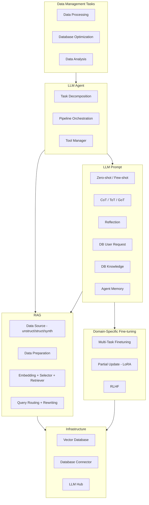

# 精读笔记：LLM for Data Management (VLDB 2024 Tutorial)

---

## ▎第一层 · 基本信息

| 字段 | 内容 |
|------|------|
| **论文** | Guoliang Li, Xuanhe Zhou, Xinyang Zhao. *LLM for Data Management.* PVLDB, 17(12): 4213-4216, 2024. DOI:10.14778/3685800.3685838 |
| **来源级别** | CCF-A 会议 Tutorial（VLDB 2024，清华大学） |
| **链接** | DOI:10.14778/3685800.3685838 / 本地 PDF：`opening/literature/reference/p4213-li.pdf` / Artifacts: https://github.com/code4DB/LLM4DB |
| **阅读日期** | 2026-07-22 |
| **状态** | 精读完成 |
| **相关论文组** | LLM4DB（LLM 用于数据库管理） |

### 一句话核心结论

本 Tutorial 提出了 LLM 驱动的数据库管理系统五层架构（RAG、领域微调、Prompt 管理、LLM Agent、向量数据库），将 LLM 能力系统化地集成到数据库管理任务中。其核心洞察是：面对 LLM 的 hallucination、高成本、复杂任务低准确率三大挑战，单一技术（如仅用 RAG 或仅用 prompt）不够，需要一套分层协作的技术栈——RAG 消除幻觉、向量数据库加速检索、微调注入领域知识、Agent 编排多步推理、Prompt 管理提升单轮质量。

### 关键词 / 标签

`#LLM4DB` `#Tutorial` `#RAG` `#LLM-Agent` `#System-Architecture` `#DB4AI-Infrastructure` `#VLDB2024`

---

## ▎第二层 · 论文结构分析

### 1. 问题拆解

| 问题 | 论文的回答 |
|------|-----------|
| 要解决什么痛点？ | 传统小模型难以泛化到新场景、缺乏上下文理解能力、无法支持多步推理（如数据库诊断、根因分析）。LLM 虽能克服这些问题，但直接使用面临 hallucination、高调用成本、复杂任务低准确率三大挑战。 |
| 之前的方法为什么不够？ | 传统 ML 方法（小模型）只能处理有限特征、难以迁移到不同系统/负载/硬件环境。早期的 LLM 方案（CoT、tool-calling）过度依赖 LLM 自身能力，导致不稳定和高错误率；tool-calling 还需大量 API 微调数据，对 API 变更脆弱。LLM Agent 仍缺乏从多源知识中提取和利用的能力。 |
| 论文的**核心论点**是什么？ | 应该构建一套分层的、互相协作的技术栈来将 LLM 系统化地集成到数据管理中——不是某一种技术（RAG 或微调或 Agent）单独解决所有问题，而是每个层次解决不同维度的挑战。 |
| 它的**关键假设**是什么？ | LLM 的能力（上下文理解、泛化、多步推理）是真实可用的，通过正确的分层架构可以系统化地释放这些能力；每个数据管理任务都可以通过"理解用户意图 → 检索相关知识 → 生成执行流水线 → 执行并反馈"的四阶段流程来处理。 |

### 2. 方法拆解

本 Tutorial 的核心贡献不在于提出新的单一算法，而在于提出一套**系统架构蓝图**（Figure 1），将已有的 LLM 技术组织为五层协作架构：

**核心技术要点**：

1. **RAG（Retrieval Augmented Generation，~20min）**：通过检索外部知识（文档、API 描述、schema 信息）增强 LLM 输入，消除幻觉。核心流程：知识/API 文本 → 语义分块 → embed → 写入向量数据库 → 在线查询时检索 top-k 相关知识块 → 构造增强 prompt → 送入 LLM。例如在 NL2SQL 中，RAG 检索本地 schema 和表的具体值来增强 prompt。

2. **LLM Agent（~20min）**：将复杂任务分解为多步执行流水线。三个核心技术：Task Decomposition（将复杂问题分解为子任务）、Pipeline Orchestration（生成多个计划并选出最优执行流水线）、Tool Management（为每个算子选择合适的工具/模型）。

3. **LLM Prompt 管理（~20min）**：管理 prompt 模板和推理策略。技术栈包括 Zero-shot/Few-shot、Chain/ Tree/Graph of Thought、Reflection（模型自我审查和修正）、Memory 机制（保留跨轮次上下文）。

4. **领域微调（~10min）**：用领域数据更新 LLM 参数。三种技术：Multi-task fine-tuning（多任务联合训练提升泛化）、Partial update / LoRA（只更新小部分参数以减少计算成本）、RLHF（从人类反馈中学习提升准确度）。

5. **向量数据库（~10min）**：加速知识检索和相似度搜索。支持混合搜索（predicate filter + vector search）。还可缓存热点查询及回复，相似请求直接返回缓存结果，避免重复调用 LLM。

### 3. 实验拆解

**注意：本 Tutorial 未包含原创实验**——它是一篇综述/教程，总结已有技术并对典型的 data management 任务进行系统化分类。

| 维度 | 内容 |
|------|------|
| **数据集** | 未提供统一数据集（Tutorial 按任务分类介绍已有工作和方法） |
| **Baseline** | 无（Tutorial 综述，不涉及实验对比） |
| **评价指标** | 未定义统一指标（各子任务有自己的指标，如 NL2SQL 的 execution accuracy、诊断的 root cause identification rate） |
| **消融实验** | 无 |
| **统计显著性** | 无 |
| **复现条件** | Artifacts 仓已公开（https://github.com/code4DB/LLM4DB），但 Tutorial 本身无可复现实验 |

**注**：Tutorial 引用了作者团队的相关系统论文（如 D-Bot [31]、DB-GPT [32]、query rewrite [30]），这些论文有独立的实验结果，但本 Tutorial 仅做综述引用。

### 4. 关键数字

本 Tutorial 不报告新的实验数字。关键的架构指标（来自 Tutorial 的结构定义）：

| Claim | 数字 | 条件 |
|-------|------|------|
| 架构层次 | 5 个关键组件（RAG + Fine-tuning + Prompt + Agent + Vector DB） | Figure 1 定义 |
| Tutorial 时长分配 | RAG 20min + Prompt/Agent 20min + Fine-tuning 10min + Vector DB 10min + Applications 10min + Open Challenges 10min = 1.5h | §1 末尾 |
| 核心挑战 | 3 个（hallucination, high cost, low accuracy for complex tasks） | §1 Introduction |
| 开放问题 | 4 个（Domain LLM, Standardized Interfaces, Lightweight Model, Generalization） | §2.3 |
| 覆盖的应用领域 | 3 大类（Data Processing, Database Optimization, Data Analysis） | Figure 1 |

---

## ▎第三层 · 批判性评估

### 1. 假设检验

- **假设 1**：传统的、非 LLM 的方法已经走到天花板，LLM 是数据管理技术迭代的合理下一步。
  - 反例 / 边界：对于确定性的、无需语义理解的系统任务（如 B-tree 索引、buffer pool 管理），传统方法仍然高效且可解释性强。用 LLM 替代这些任务可能"杀鸡用牛刀"甚至引入不确定性。
- **假设 2**：五层架构（RAG + Fine-tuning + Prompt + Agent + Vector DB）是完备的——所有 LLM4DM 问题都可以在这个框架内被解决。
  - 反例 / 边界：该架构聚焦于"LLM 如何辅助数据库管理"，但**未涵盖数据库 AI 算子外部执行的执行与调度**——数据从数据库出发到外部推理服务再写回的完整链路、batch 策略、并发控制、actor 路由等"执行基础设施"层面的问题在架构图中没有对应层。
- **假设 3**：LLM 调用是成本瓶颈，但通过缓存（Vector DB 缓存热点请求）和减少迭代轮次可以解决。
  - 反例 / 边界：该假设只关注了"减少不必要的 LLM 调用次数"这一个维度。实际上，对于必须调用的推理请求，如何组织 batch、控制并发、选择路由同样会影响端到端吞吐和成本——这些"执行优化"维度在本 Tutorial 架构中未涉及。

### 2. 边界探查

- **方法适用边界**：本 Tutorial 的架构适用于"用 LLM 优化数据库自身的管理任务"——调优、诊断、查询优化、NL 接口。它**不是**为"数据库作为 AI 负载的调度与执行平台"设计的。如果你的关注点是：数据库如何高效地驱动外部 AI 推理服务、如何管理批处理请求的吞吐与延迟、如何将推理结果写回，这个架构提供的是"上层应用蓝图"而非"执行层优化方案"。
- **扩展性限制**：架构讨论的是技术和组件，但未讨论在**大规模推理场景**下（万/百万级行需要批处理送到模型服务）的扩展性问题——这些已经在它的 scope 之外。
- **复现难度**：N/A（无实验）。Artifact 仓库提供了工具链代码，但 Tutorial 本身不涉及独立实验。

### 3. 可信度评估

| 维度 | 评价 | 依据 |
|------|------|------|
| 实验公平性 | N/A | Tutorial 无原创实验 |
| 结果显著性 | N/A | Tutorial 综述已发表工作，不提供新数据 |
| 开源/可复现 | 🟢 Artifact 已公开 | GitHub: code4DB/LLM4DB |
| 论文自身局限 | 🟢 诚实 | Tutorial 明确列出 4 个开放挑战，作者承认当前技术（如 LLM Agent）仍缺乏多源知识有效利用的能力 |

### 4. 与同行工作的对比

- 比 **Cortex AISQL**（SIGMOD 2026）：Cortex 是工业系统，将 AI 算子直接嵌入 SQL 引擎，涉及真正的 AI 算子执行。本 Tutorial 是学术综述，提供了一个分析框架，但未涉及具体执行引擎设计。
- 比 **Galois**（SIGMOD 2025）：Galois 是本 Tutorial 中"LLM Agent + Prompt Management"思想在 SQL-over-LLM 场景的直接应用实例——将 LLM 视为存储，用 Agent 编排扫描策略。本 Tutorial 的架构提供了理解 Galois 的框架。
- 比 **Smart**（VLDB 2025）：Smart 的 ML 谓词优化可以映射到本 Tutorial 架构中的"Database Optimization"任务类别，但其方法（可分析决策边界）与本 Tutorial 的 LLM 路线不同。
- 在 **[你的课题]** 的坐标系中：本 Tutorial 定义了"LLM 用于数据管理"的研究版图。你的课题（数据库 AI 算子外部执行优化）位于这张版图的**边缘——执行基础设施层**。Tutorial 架构的五层都在回答"如何用 LLM 做好数据库管理任务"，而你的课题在回答"数据库管理任务涉及 AI 算子时，数据如何流出去、执行完、写回来"——这是 Tutorial 架构**未覆盖的层面**。

---

## ▎第四层 · 与你课题的连接

### 1. 可引用的观点（配精确位置）

> §1 Introduction 第三段："There are three main challenges... how to effectively utilize data sources to reduce LLM hallucination... how to efficiently manage these operations and optimize pipelines... how to reduce the LLM overhead?"

> §1 "It is rather expensive to call LLMs for every request."
> → 这句话直接支持你课题的动机——需要优化 LLM 调用的效率。你的贡献不在"减少不必要调用"（Tutorial 已覆盖），而在"必要调用如何组织得更高效"（Tutorial 未覆盖）。
> → 这是开题 §1 中可以直接引用的权威痛点陈述。

> §2.1 Five-component architecture (Figure 1)：RAG、Fine-tuning、Prompt Management、LLM Agent、Vector Database。
> → 该架构可用于在开题 §2 中定位：已有工作集中在"如何用 LLM 增强数据库"，五层架构完备覆盖了 LLM4DM 的上层。但**执行基础设施层（数据如何高效送到模型服务）**在架构中缺位——这是你的课题填补的空白。

> §2.2 Applications："configuration tuning" "query rewrite" "database system diagnosis" "data processing" "data analysis"
> → 典型应用清单可以用于开题 §1 证明 LLM+DB 是活跃研究领域；同时指出这些应用都假设 LLM 调用是"原子操作"，不关注调用本身的执行效率——你的课题在这一维度上做补充。

> §2.3 Open Challenges：(3) Model Lightweighting — "deploy distilled large models into database kernels... efficiently run within the limited computational resources of database environments"
> → 这个开放挑战与你的课题有交集：都关注"在数据库环境中高效运行 AI 模型"。但 Tutorial 关注的是让模型变轻（压缩/蒸馏），你关注的是让**数据组织和提交策略优化**——两者互补。

### 2. ⚠️ 不能过度引用的地方

- ❌ **不声称** "Li et al. 的 Tutorial 架构已覆盖所有 LLM+DB 问题"——其在执行基础设施层（数据→外部推理→写回）有空白
- ❌ **不声称** "VLDB 2024 Tutorial 定义的开放挑战包含了外部执行优化"——其 4 个开放挑战聚焦于模型自身（domain LLM, lightweight, interface, generalization），不涉及执行调度
- ❌ **不声称** "Vector Database 缓存热点请求的技术可以直接用于你的 batch 调度"——Tutorial 的缓存机制是语义相似度匹配的请求级缓存，你的项目是推理请求的批组织与提交控制，两者机制不同
- ❌ **不声称** "LLM Agent 的 pipeline orchestration 可以替代你的调度策略"——Agent orchestration 面向任务级流水线编排，你的调度策略面向数据级（batch 内数据如何组织、batch 间如何提交）的并发控制

### 3. 对本课题的实际用途

| 用途类型 | 具体方式 | 优先级 |
|----------|----------|--------|
| ✅ 空白论证 | 该 Tutorial 定义了 LLM4DM 的研究版图（五层架构+典型任务），但未涵盖"外部推理执行与调度"——这是你课题的空白切入点 | ⭐⭐⭐ |
| ✅ 动机证据 | §1 明确陈述"LLM 调用成本高"作为核心挑战之一，为你的"上游调度优化以减少端到端推理成本"提供权威动机支撑 | ⭐⭐⭐ |
| ✅ 对照区分 | 在开题 §2 中引用该架构作为 LLM4DM 的权威蓝图，然后说明你的课题位于该蓝图的"执行基础设施"延伸层 | ⭐⭐⭐ |
| ✅ 设计参考 | LLM Agent 的 task decomposition 思路可以类比借鉴到你的 batch construction 中（按 token 量分解而非按固定行数） | ⭐⭐ |
| ⚠️ 设计参考 | Vector DB 的混合搜索（predicate filter + vector search）在处理 selectivity-aware 场景时与你的课题有交集，但不在同一层次 | ⭐ |

### 4. 不足 → 你的机会

| 论文的不足 / 未回答的问题 | 你的课题可能如何填补 |
|--------------------------|---------------------|
| 五层架构聚焦"LLM 辅助数据库管理"，未涉及"数据库数据 → 外部推理 → 写回"的执行链路 | 你的课题研究的就是这条执行链路的优化——数据组织策略 + 提交控制策略 |
| 未讨论批量推理请求的组织方式（batch size、按 token 量分组、动态 flush 策略） | 你提出的 token-budget / length-align / prefix-aware batch construction 和 queue-adaptive flush 直接填补此空白 |
| "减少 LLM 调用成本"只讨论了减少不必要调用（缓存、RAG），未讨论必要调用的执行效率优化 | 你的课题研究必要 LLM 调用的效率优化：如何组织数据以减少延迟、控制并发以平衡吞吐 |
| 未涉及 Ray/Daft/vLLM 等现代分布式执行与推理基础设施的具体集成 | 你的课题以 Ray 为架构设计空间、Daft 为数据引擎、vLLM 为部署平台，提供具体的工程实现路径 |

### 5. 可论文化的措辞

> 正如 Li et al. [VLDB 2024 Tutorial] 所指出的，将 LLM 集成到数据管理系统中面临三类核心挑战：幻觉、高调用成本和复杂任务的低准确率。该 Tutorial 提出了 RAG、微调、Prompt 管理、LLM Agent 和向量数据库五层协作架构来系统化地应对这些挑战，覆盖了数据库调优、诊断、数据处理和数据分析等典型任务。

> Li et al. [VLDB 2024 Tutorial] 的五层架构为 LLM4DM 研究提供了系统化的分类框架，但其关注点集中于"如何用 LLM 增强数据库管理任务"，未涉及"数据库 AI 算子的外部执行与调度优化"。本课题在此基础上延伸，聚焦于数据从数据库流向外部推理服务再写回的执行链路优化——一个在现有 LLM4DM 架构中的空白层面。

> Li et al. 明确指出"对每个请求调用 LLM 成本很高"是该领域的核心挑战之一。现有方案主要通过缓存热点请求和减少迭代轮次来降低调用次数，但未讨论**必要调用本身的执行效率如何优化**。本课题从数据组织和提交控制两个维度研究这一问题，填补了 LLM4DM 执行基础设施层的空白。

### 6. 后续待读

- [ ] [[cortex_aisql_sigmod2026]] — 已精读，工业界 DB4AI 代表，关注 AI 算子嵌入 SQL 引擎
- [ ] [[galois_sigmod2025]] — 已精读，LLM Agent + prompt 管理在 SQL-over-LLM 场景的应用实例
- [ ] [[gaussml_icde2024]] — 已精读，更早的 DB ML 算子硬编码方案
- [ ] **D-Bot** (Zhou et al., VLDB 2024) — 本 Tutorial 作者团队的系统论文，LLM-based 数据库诊断，本 Tutorial 大量引用的实例系统
- [ ] **DB-GPT** (Zhou et al., 2024) — 作者团队的 LLM+DB 框架，可能包含 Agent 编排的具体实现
- [ ] **LLMTune** (Huang et al., 2024) — LLM-based knob tuning（本 Tutorial 引用的实例）
- [ ] **Query Rewriting via LLMs** (Liu & Mozafari, 2024) — LLM 用于查询改写（本 Tutorial 引用的实例）

---

## 元反思

- **精读收益**：🟢 高（作为 VLDB 2024 Tutorial，由清华李国良团队撰写，权威性高；提供了 LLM4DM 的系统化蓝图，对定位课题和为开题 §2 提供"已解决/未解决"边界极有价值）
- **是否纳入核心文献库**：是
- **计划复习周期**：8 周后复习（开题 §2 写作时重点参考）
- **一句话自评**：理解到位。本 Tutorial 的关键价值不在于提供新算法，而在于提供一张 LLM4DM 的"地图"。理解这张地图后，你的课题定位非常清晰：地图上标记了 RAG、微调、Agent、Prompt、向量数据库五个核心区域，但**执行基础设施（数据如何高效送到模型服务再写回）**是整张地图的盲区——这正是你的课题要补充的。

---

## 相关笔记

- [[galois_sigmod2025]] — LLM Agent 在 SQL-over-LLM 场景的直接应用
- [[cortex_aisql_sigmod2026]] — 工业界 DB4AI 代表
- [[gaussml_icde2024]] — 更早的 DB ML 算子方案
- [[smart_vldb_journal_2025]] — ML 谓词优化（非 LLM 路线）
- [[tpl-文献精读-深度版]] — 本模板
- [[文献地图]] — 文献全景
