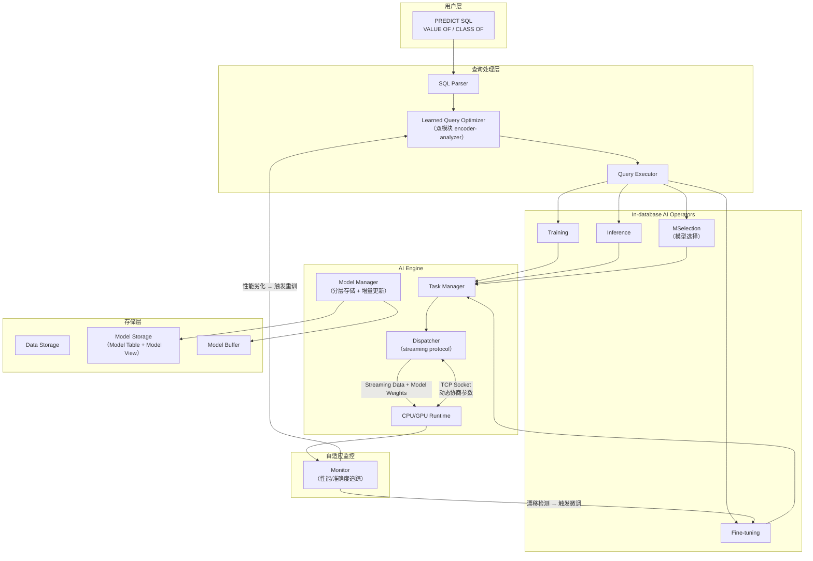

# 精读笔记：NeurDB — On the Design and Implementation of an AI-powered Autonomous Database (CIDR 2025)

---

## ▎第一层 · 基本信息

| 字段 | 内容 |
|------|------|
| **论文** | Zhanhao Zhao, Shaofeng Cai, Haotian Gao, Hexiang Pan, Siqi Xiang, Naili Xing, Gang Chen, Beng Chin Ooi, Yanyan Shen, Yuncheng Wu, Meihui Zhang. *NeurDB: On the Design and Implementation of an AI-powered Autonomous Database.* CIDR 2025. |
| **来源级别** | CIDR（Conference on Innovative Data Systems Research）— 数据库领域顶级系统会议，16 页上限的 vision/position paper 传统，非传统 CCF-A 长文，但社区影响力极高 |
| **链接** | https://github.com/neurdb/neurdb / 本地 PDF：`opening/literature/reference/p29-zhao.pdf` |
| **阅读日期** | 2026-07-22 |
| **状态** | 精读完成 |
| **相关论文组** | DB4AI（数据库 AI 算子）/ AI-in-DB（AI 内置于数据库）/ Autonomous DBMS |

### 一句话核心结论

NeurDB 提出了一种将 AI 深度内置于数据库架构的自主数据库设计——通过在查询执行器中新增训练、推理、微调等 in-database AI 算子，配合 AI Engine 的数据流式传输协议和分层模型增量更新机制，实现 AI 分析与数据库组件自适应的一体化融合，在数据与负载漂移场景下显著优于"PostgreSQL + 外部 AI runtime"的叠加方案。

### 关键词 / 标签

`#In-database AI` `#Autonomous DBMS` `#Data-Drfit-Adaptation` `#Workload-Drift` `#AI-Operator` `#CIDR2025` `#Vision-Paper`

---

## ▎第二层 · 论文结构分析

### 1. 问题拆解

| 问题 | 论文的回答 |
|------|-----------|
| 要解决什么痛点？ | 现有 AI+DB 集成方案主要把 AI 叠在 DBMS 上层（外部训练/推理），无法感知和适应数据库内部持续发生的**数据漂移**和**负载漂移**。一旦数据或查询模式变化，模型迅速过时，需要人工触发完整重训练，效率低且滞后 |
| 之前的方法为什么不够？ | （1）in-database analytics 方案（MindsDB、PostgresML 等）仍需要用户在数据库外手动管理模型重训练；（2）autonomous optimization 方案（Bao、Lero、Polyjuice 等）只针对单一组件做漂移适应，无法泛化到所有组件；（3）所有这些方案都是"叠上去的"而非"内建的"，无法访问内部、实时、细粒度性能指标来检测漂移 |
| 论文的**核心论点** | 要真正实现 AI 与 DB 的深度融合，必须从数据库架构地基开始重设计——把 AI 工作流（训练/推理/微调/模型选择）作为一等公民（in-database AI operators）嵌入查询执行器，让模型管理和自适应成为数据库的内建能力而非外挂 |
| 它的**关键假设** | 数据库是动态系统（数据和负载持续变化），AI 模型必须随数据/负载漂移而持续自适应，且这种自适应必须由数据库自动管理——不能被外包给外部系统或人工流程 |

### 2. 方法拆解

**核心技术要点**：

1. **In-database AI Operators（内建 AI 算子）**：在查询执行器中原生集成 Training、Inference、Fine-tuning、MSelection（模型选择）等算子，作为与传统 scan/join 同等级别的一等公民。AI 工作流不再由外部脚本编排，而是作为数据库查询计划的一部分被解析、优化、执行。这使得自适应流程（检测到精度下降 → 触发微调 → 用新数据更新模型 → 继续服务）完全自动化和透明化。

2. **AI Engine + Data Streaming Protocol**：AI Engine 采用 event-driven 分布式架构，Task Manager 解析 AI 请求后为每个 task 创建 Dispatcher。Dispatcher 通过 TCP socket 直连外部节点的 AI Runtime，在握手阶段协商模型参数（结构、batch size）和流式参数（buffer 大小、每次传输的 batch 数），之后通过流式 pipeline 传输数据和模型权重，去除传统批量加载中的数据拷贝和序列化开销。参数可在任务运行中**动态更新**（data-driven dispatcher），使 AI Engine 成为自驱动的自适应组件。

3. **Layered Model Storage + Incremental Update**：模型按 DNN 层结构拆解存储（Model Table: `MID, LID, Timestamp, Data`），支持版本化管理。当数据漂移需要更新模型时，只微调最后若干层、冻结前层，仅持久化更新后的层。新模型版本通过从 Model Storage 中取出最新层的组合来组装（如图 3 所示）。共享冻结层的参数避免了每次漂移都全量重训练的存储和计算开销。

4. **FRP（Filter-and-Refine Principle）驱动的自适应模型设计**：两个 learned 组件——并发控制（Learned CC）和查询优化器（Learned QO）——都遵循"先过滤后精炼"的两阶段原则。Learned CC 先用 Bayesian optimization 过滤候选模型、再用 RL reward-based feedback 精炼；Learned QO 使用双模块（encoder + analyzer），encoder 通过 cross-attention 融合候选计划和系统条件（buffer 信息 + 数据统计），analyzer 用 multi-head attention + MLP 选择最优计划。

### 3. 实验拆解

| 维度 | 内容 |
|------|------|
| **数据集** | **AI Analytics**：E-Commerce（Avazu CTR 预测，~40.4M 记录，22 属性）+ Healthcare（UCI Diabetes，~5.2M 记录，43 属性）；**Learned Components**：YCSB（事务型，1M 记录表）+ STATS（OLAP，8 表）+ TPCC（漂移负载） |
| **Baseline** | PostgreSQL+P（PG + batch loading + PyTorch external runtime）for AI analytics；PostgreSQL / Polyjuice for CC；PostgreSQL / Bao / Lero for query optimizer |
| **评价指标** | 端到端延迟（latency）、训练吞吐（throughput）、训练 loss 曲线（适应速度）、事务吞吐（Txns/s）；**缺少**：模型推理延迟单独拆解、GPU 利用率、微调相对于重训练的 token/时间成本对比 |
| **消融实验** | 部分有——对比了 with/without incremental update 的 loss 收敛速度（Figure 6c），验证增量更新对漂移适应速度的贡献 |
| **统计显著性** | ❌ 未报告方差/置信区间或多次运行的 error bar |
| **复现条件** | 🟡 部分开源：代码地址 https://github.com/neurdb/neurdb，基于 PostgreSQL v16.3；实验使用 ARM-Net（SIGMOD 2021）作为底层分析模型；需要 3 块 RTX 2080 Ti GPU |

### 4. 关键数字

| Claim | 数字 | 条件 |
|-------|------|------|
| 端到端延迟降低 | 41.3%（E-Commerce）/ 48.6%（Healthcare） | vs PostgreSQL + PyTorch external runtime |
| 训练吞吐提升 | 1.96x（E）/ 2.92x（H） | 同上，归因于 data streaming protocol |
| 并发控制吞吐提升 | up to 1.44x vs PostgreSQL，up to 2.05x vs Polyjuice | TPCC 漂移负载，8 threads，2 warehouses |
| 查询优化器延迟降低 | up to 20.32% avg latency | vs Bao / Lero，STATS 数据集上 8 条 SPJ 查询，含 mild + severe drift |
| 增量更新带来的适应加速 | loss 在新数据集群切换后立即更低且更快收敛 | E-Commerce，每 81,920 samples 切换 cluster（k-means 5 类） |

---

## ▎第三层 · 批判性评估

### 1. 假设检验

论文中有哪些**没有明说但实际依赖的假设**？在什么条件下这些假设不成立？

- **假设 1**：所有 AI 模型的计算都可以在数据库进程/节点内高效执行
  - 反例 / 边界：论文使用 ARM-Net（自适应关系建模网络），是一种轻量级结构化数据模型。但当代 AI 负载——尤其是 LLM（数十 GB 模型权重）和 VLM（视觉语言模型）——其推理计算量远超"数据库内嵌 GPU runtime"可以承载的范围。论文未讨论大模型场景下"AI inside DB"的物理可行性。
- **假设 2**：数据漂移主要通过"微调最后几层"即可应对
  - 反例 / 边界：对 LLM 等 foundation model 场景，微调（fine-tuning）需要大量 GPU 显存和长训练时间，远非"更新几个 layer 权重"的轻量操作。而且 foundation model 的输入是自然语言/图像等非结构化数据，与 NeurDB 假设的结构化数据（关系表 + 数值特征）有根本差异。
- **假设 3**：数据库能独揽 AI 生命周期管理（训练/推理/微调/模型选择）的所有复杂度
  - 反例 / 边界：生产环境中模型服务有独立的部署、扩缩容、版本管理、A/B 测试需求，这与数据库的事务性 SLA 和资源管理模式可能发生根本冲突。GPU 资源分配（数据库查询抢 GPU vs AI 推理抢 GPU）的隔离与优先级问题论文未涉及。
- **假设 4**：分布式 AI 推理节点可以被数据库内部的 Task Manager/Dispatcher 高效管理
  - 反例 / 边界：论文的 AI Engine 架构本质上是在数据库内部实现了一个简化版分布式任务调度器。当外部 AI runtime 节点数扩展到几十/上百时，数据库内核是否适合承担这个角色是个开放式问题。

### 2. 边界探查

- **方法适用边界**：适合结构化数据上的传统 ML 模型（分类/回归/推荐）——训练数据是关系表、模型是 DNN 或 tree-based、推理结果是标量或小向量。当模型变为 LLM（文本生成）、VLM（多模态理解）、embedding model（向量生成）时，模型规模、计算范式、数据传输模式全部不同，NeurDB 的 streaming protocol 和 incremental update 设计不直接适用。
- **扩展性限制**：实验最大数据集 40.4M 行（Avazu），使用 3 块 RTX 2080 Ti。一个 GPT-2（1.5B）级别的 LLM 推理任务，其 GPU 显存和计算需求远超本实验中的所有场景。论文未测试真正的"AI 计算密集"场景。
- **与现有数据库的兼容性**：NeurDB 基于 PostgreSQL v16.3，但修改了查询执行器、存储层、事务管理器——是 fork 而非 extension。这意味着用户无法在现有 PG 实例上"启用 NeurDB"，必须迁移至 NeurDB 分支。
- **复现难度**：🟡 中等。代码开源（GitHub），但依赖特定的 CUDA 11.8 + Docker 环境 + 3 GPU 配置。论文并未提供端到端复现的 Docker compose 或脚本。

### 3. 可信度评估

| 维度 | 评价 | 依据 |
|------|------|------|
| 实验公平性 | 🟡 有疑点 | PostgreSQL+P baseline 用 batch loading + PyTorch，未使用 Arrow/zero-copy 等优化；对比不够公平——NeurDB 的 data streaming 优化在外部方案中也可以通过更高效的序列化/传输协议获得 |
| 结果显著性 | 🟡 勉强 | 数字虽然改善明显（41-49% 延迟，2-3x 吞吐），但单次运行无方差报告、基于特定模型 ARM-Net、数据集规模有限 |
| 开源/可复现 | 🟢 部分开源 | 代码公开，但依赖特定硬件和 Docker 环境；论文的实验结果能否严格复现待验证 |
| 论文自身局限 | 🟡 一般 | 讨论了数据漂移是核心挑战、坦诚声明是 vision paper；但未讨论大模型/LLM 场景边界、GPU 资源隔离、与外部模型服务的互操作性 |

### 4. 与同行工作的对比

- 比 **Cortex AISQL**（SIGMOD 2026）：Cortex 是 Snowflake 的工业方案，把 6 类 AI 算子嵌入 SQL 引擎（AI_EMBED、AI_COMPLETE 等），走的是"在成熟的云数仓架构上加 AI"路线。NeurDB 则从零开始设计数据库架构以原生支持 AI——两者目标一致（AI inside DB），但 NeurDB 更激进（重构内核而非叠加）、Cortex 更务实（生产系统优先）。
- 比 **GaussML**（ICDE 2024）：GaussML 硬编码 20+ ML 算子进 openGauss，NeurDB 通过 AI Engine 的 task-dispatcher 抽象支持任意 AI 任务——NeurDB 更灵活但更复杂。
- 比 **Galois**（SIGMOD 2025）：Galois 把 LLM 当"存储层"来 SQL 查询，NeurDB 把 AI 当"数据库内建能力"来原生执行。两者代表了"DB + AI"的两个极端方向——Galois 是"DB 查询 AI"，NeurDB 是"AI 嵌入 DB"。
- 在 **[你的课题]** 的坐标系中：NeurDB 是 **"AI inside DB"路线的 vision paper 标杆**。它与你的课题（数据出数据库 → 外部 Daft/Ray → vLLM 推理 → 写回）构成最直接的路线对照：NeurDB 认为 AI 应该进入数据库内核，而你的课题认为 AI 推理（尤其是大模型）天然应该发生在数据库外部的专用模型服务上。两者的分歧点——大模型场景下"库内推理"的物理可行性——正是你的课题的立论空间。

---

## ▎第四层 · 与你课题的连接

### 1. 可引用的观点（配精确位置）

> §1 Introduction："The dynamic nature of databases, characterized by data and workload drift, poses a fundamental challenge... AI models typically derive intelligence from static datasets and thus can become outdated quickly."
> → **动机证据**：NeurDB 从"数据库内"视角承认数据和负载漂移是核心挑战——这与你从"数据库外"观察到的同一个问题（查询量波动、模型服务队列积压、并发变化）形成跨路线的共识。可用以论证"漂移适应"是全栈问题而非局部问题。

> §2.2 Design Goals — Adaptability/Reliability/Scalability："Adaptability is the capability of a DBMS to evolve autonomously in response to drifting data and workloads."
> → **设计目标参考**：你课题中的 K_max 自适应、queue-adaptive flush、异构 actor pool 本质上也是一种"adaptability"机制——只不过作用在外部执行链路而非数据库内部。NeurDB 的 adaptability 三级定义（adaptability / reliability / scalability）可作为你定义自己系统设计目标的模板。

> §4.1 AI Engine — Data Streaming Protocol："the data is transferred in a streaming and pipelining manner to minimize the delay in the data preparation steps...parameters can be dynamically updated for an ongoing AI task through a data-driven dispatcher."
> → **设计参考**：streaming pipeline + 动态参数更新的思路与你的 Daft streaming → Ray actor → vLLM 链路高度相关。NeurDB 在库内用 TCP socket 做流式传输，你可以在外部用 Arrow Flight/gRPC 做类似的事。

> §4.2 — Filter-and-Refine Principle："FRP employs a two-stage strategy: a filtering stage quickly eliminates less promising objects... followed by a more resource-intensive refinement stage."
> → **方法参考**：FRP 两阶段策略可迁移到你的 actor pool 分池路由设计——第一层粗粒度过滤（按 token 预算/模态分流），第二层精调度（按 queue depth 或 GPU 利用率动态分配）。

> §5.2 Figure 6(b)：NeurDB 的数据量 scalability 曲线呈现线性趋势。
> → **对比证据**：如果 NeurDB 的 streaming protocol 已经能做到线性扩展，你的外部链路需要在至少同等条件下展示不弱于库内方案的 scalability，否则"外部执行更优"的 claim 就不成立。

### 2. 不能过度引用的地方

- **不声称** "NeurDB 证明了 AI 应该放在数据库内部"——它只展示了一个 vision 系统在轻量 ML 场景下的可行性，未涉及 LLM/VLM 大模型
- **不声称** "NeurDB 的 data streaming protocol 优于 Arrow/gRPC"——论文只比较了 PostgreSQL+P（batch loading + PyTorch），未与 modern data exchange 方案（Arrow Flight、gRPC streaming）对比
- **不声称** "NeurDB 的自适应机制可以直接用于外部执行场景"——它的 incremental update / model manager 依赖于数据库内部的模型存储和管理，外部执行链路没有这个条件
- **不声称** "NeurDB 代表了 AI+DB 融合的最终答案"——它是 CIDR vision paper，定位是"提出愿景和初步验证"，不是"成熟的生产系统"。论文自己说"will gradually introduce new modules"和"are exploring flexible model structure"
- **关键区分**：NeurDB 的场景是**结构化数据上的传统 ML 推理**（CTR 预测、疾病分类），你的场景是**非结构化数据上的 LLM 推理**（文本生成、embedding、VLM 推理）——计算量级、模型生命周期、基础设施需求不在同一个数量级

### 3. 对本课题的实际用途

| 用途类型 | 具体方式 | 优先级 |
|----------|----------|--------|
| ✅ 对照区分 | 开题 §2 文献综述中作为"AI inside DB"路线的最新 vision paper 标杆——说明这条路有人在做且发在 CIDR 上，但你的路线（AI outside DB）针对的是大模型场景，计算量级和基础设施需求根本不同 | ⭐⭐⭐ |
| ✅ 动机证据 | "数据漂移和负载漂移是 AI+DB 融合的核心挑战"这个观点被 NeurDB（库内视角）和你的实验（库外观角）共同验证——可跨路线论证这个问题的普遍性 | ⭐⭐⭐ |
| ✅ 空白论证 | NeurDB 承认模型规模带来的挑战是"future work"——大模型（LLM/VLM）场景正是你的课题填补的空白：当模型大到无法嵌入数据库时，外部执行链路是必然选择 | ⭐⭐⭐ |
| ⚠️ 设计参考 | Streaming protocol + dynamic parameter update 的思路可借鉴到 Daft → Ray → vLLM 的数据传输层设计，但需要适配外部执行的特点（Arrow 零拷贝 vs TCP socket） | ⭐⭐ |
| ⚠️ 设计参考 | FRP（Filter-and-Refine）两阶段策略可迁移到 actor pool routing 和 batch construction 决策 | ⭐⭐ |

### 4. 不足 → 你的机会

| 论文的不足 / 未回答的问题 | 你的课题可能如何填补 |
|--------------------------|---------------------|
| 只处理结构化数据上的轻量 ML 模型（ARM-Net），不涉及 LLM/VLM 大模型 | 你的课题天然面向 LLM（AI_COMPLETE）+ VLM（多模态泛化验证），补上了"大模型外部推理"这个 NeurDB 完全回避的场景 |
| 数据在库内流转——NeurDB 认为"数据不出库"是优势，但忽视了 GPU 模型服务的物理部署约束 | 你的课题承认"数据必须出库去模型服务"是现实，研究的是怎么出得高效——数据组织 + 调度提交控制 |
| AI Engine 的 Task Manager/Dispatcher 在数据库内部充当"分布式任务调度器"——复杂度被移入了内核 | 你的课题利用 Ray（成熟分布式框架）做调度——不重新发明调度器，专注研究调度策略本身 |
| 缺乏对"模型服务"（model serving）这个独立概念的处理——推理被当作普通算子调用 | 你的课题明确区分"数据库触发的请求"和"vLLM 模型服务的处理能力"，在两者之间做自适应协调 |
| 实验未涉及 token-aware / prefix-aware / length-align 等 LLM-specific batching 策略 | 你的两项策略设计（数据组织 + 提交控制）正是针对 LLM 推理的 token 量特征和 batch 效率的优化 |
| Streaming protocol 是 TCP socket 级别的工程优化，不是调度策略研究 | 你的 queue-adaptive flush、K_max 自适应、actor pool 分池路由是调度策略层面的学术贡献 |

### 5. 可论文化的措辞

> 正如 Zhao et al. [NeurDB, CIDR 2025] 所指出的，数据漂移与负载漂移是 AI 与数据库融合的核心挑战。NeurDB 通过在数据库内核中嵌入 AI 算子（训练/推理/微调）来解决这一问题，代表了"AI inside DB"路线的最新进展。

> 与 NeurDB [CIDR 2025] 将 AI 推理置于数据库内核的设计理念不同，本课题研究的是"AI outside DB"路线——当模型规模超出数据库可承载范围（如 LLM、VLM），数据必须出库送至外部模型服务（vLLM）完成推理后写回。两条路线互补：NeurDB 适用于轻量 ML 场景（库内高效），本课题面向大模型场景（库外必需）。

> NeurDB [CIDR 2025] 在数据库内部实现了一个分布式 AI 任务调度器（AI Engine + Task Manager + Dispatcher），但该设计基于结构化数据上的轻量 ML 模型。当 AI 算子变为需要数十 GB 显存、数百 GFLOPs 计算量的 LLM 推理时，库内推理的物理可行性存疑——这正是本课题选择外部执行链路（Daft + Ray + vLLM）的根本理由。

> Zhao et al. [NeurDB, CIDR 2025] 提出的 Filter-and-Refine Principle（FRP）为自适应系统设计提供了通用框架。本课题在 actor pool 分池路由设计中借鉴了这一思想：第一层按 token 预算/模态粗粒度过滤候选 actor，第二层按 queue depth / GPU 利用率精炼路由决策。

### 6. 后续待读

- [ ] [[cortex_aisql_sigmod2026]] — 已精读，"AI inside DB"路线的工业代表（Snowflake），与 NeurDB 形成学术 vs 工业对照
- [ ] [[gaussml_icde2024]] — 已精读，"AI inside DB"路线的更早代表（openGauss），20+ 硬编码 ML 算子
- [ ] [[galois_sigmod2025]] — 已精读，同属 DB4AI 大方向但路线不同（LLM as storage），用于论证 DB4AI 内部的多样性
- [ ] **Singa / nsDB** — NeurDB 团队的前置工作，了解该团队的学术演进线索
- [ ] **SageDB [CIDR 2019]** — Tim Kraska 的 learned database vision paper，NeurDB 的"AI 嵌入数据库"这条线的早期思想源头

---

## 元反思

- **精读收益**：🟢 高（本文是"AI inside DB"路线的 vision paper 标杆，与你的"AI outside DB"课题形成最直接的路线对照；其承认的局限（轻量 ML 模型、大模型未验证）恰好是你的课题的立论空间）
- **是否纳入核心文献库**：是
- **计划复习周期**：4 周后复习（开题 §2 文献综述写作前再精读一次）
- **一句话自评**：理解到位。NeurDB 的"数据不出库、AI 嵌入内核"设计哲学与你的"数据出库、外部专用推理"恰好构成 thesis-antithesis 关系——在开题 §2 中要精准表述：不是谁对谁错，而是场景决定架构。轻量 ML 走库内（NeurDB 路线），大模型走库外（你的路线），两者共同构成 AI+DB 融合的完整图景。

---

## 相关笔记

- [[cortex_aisql_sigmod2026]] — 同路线（AI inside DB）工业代表
- [[gaussml_icde2024]] — 同路线更早代表
- [[galois_sigmod2025]] — DB4AI 另一分支（LLM as storage）
- [[smart_vldb_journal_2025]] — DB4AI ML 谓词优化
- [[文献地图]] — 文献全景
