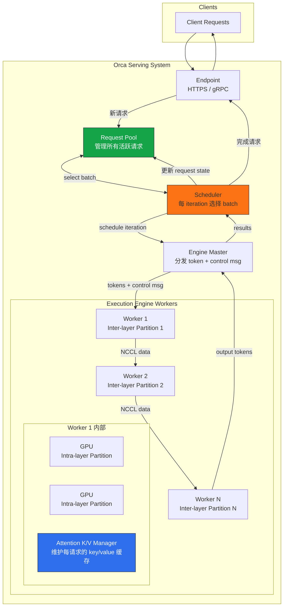

# 精读笔记：Orca — A Distributed Serving System for Transformer-Based Generative Models (OSDI 2022)

---

## ▎第一层 · 基本信息

| 字段 | 内容 |
|------|------|
| **论文** | Gyeong-In Yu, Joo Seong Jeong, Geon-Woo Kim, Soojeong Kim, Byung-Gon Chun. *Orca: A Distributed Serving System for Transformer-Based Generative Models.* OSDI 2022. |
| **来源级别** | CCF-A 会议论文（OSDI，操作系统顶级会议） |
| **链接** | USENIX: https://www.usenix.org/conference/osdi22/presentation/yu / 本地 PDF：`opening/literature/reference/orca_osdi2022.pdf` |
| **阅读日期** | 2026-07-22 |
| **状态** | 精读完成 |
| **相关论文组** | LLM 推理服务 / Continuous Batching / GPU 推理系统 |

### 一句话核心结论

Orca 提出 **iteration-level scheduling**（以 iteration 而非 request 为调度粒度）和 **selective batching**（仅对非 Attention 操作做 batch，Attention 按请求独立执行），解决了现有推理服务系统在处理自回归生成模型时，因 request-level 调度导致的"早完成请求无法返回、新请求必须等待"问题。在 GPT-3 175B 上，Orca 相比 NVIDIA FasterTransformer 在同延迟下吞吐提升 36.9 倍。

### 关键词 / 标签

`#LLM-serving` `#iteration-level-scheduling` `#selective-batching` `#continuous-batching-precursor` `#distributed-inference` `#OSDI2022`

---

## ▎第二层 · 论文结构分析

### 1. 问题拆解

| 问题 | 论文的回答 |
|------|-----------|
| 要解决什么痛点？ | 现有推理服务系统（Triton + FasterTransformer）使用 **request-level scheduling**：serving system 把一整批请求发给 engine，engine 处理完所有请求后一次性返回。但自回归生成模型中不同请求需要不同数量的 iteration（输出 token 数不同），这导致：(1) 早完成的请求被"扣押"在 batch 中无法返回客户端，(2) 新到达的请求必须等整个 batch 结束才能被处理 |
| 之前的方法为什么不够？ | 现有系统的 scheduler-engine 接口设计过于僵化——两者只在 (1) engine 空闲时 dispatch 新 batch、(2) engine 完成整个 batch 时才交互。这种 request-level 的调度粒度无法应对 generative model 的 multi-iteration 特性 |
| 论文的**核心论点** | 将调度粒度从 **request** 降至 **iteration**——每次 model iteration 后 scheduler 都可以重新决定 batch 构成（加入新请求、移除已完成请求），同时通过 selective batching 让任意组合的请求仍能享受 batching 的效率收益 |
| 它的**关键假设** | (1) GPU 的 bottleneck 在于读取 model parameters（memory-bound），而非 Attention 计算本身；(2) 请求之间不需要按相同 token index 对齐即可共享一次 parameter read；(3) 请求到达模式遵循 Poisson 过程，且 max_tokens 属性可以在请求到达时预知 |

### 2. 方法拆解

**核心技术要点**：

1. **Iteration-Level Scheduling（迭代级调度）**：Scheduler 不再将整个请求的处理作为一个不可分割的调度单元，而是每次只让 engine 执行 **一次 model iteration**（一层 forward pass 处理一个 token）。Scheduler 在每次 iteration 返回后：(a) 检查哪些请求已完成（生成了 \<EOS\> 或达到 max_tokens），立即返回客户端；(b) 从 request pool 中选择新请求加入下一 iteration 的 batch。这等价于将 FCFS 的公平性定义从 request-level 重构为 iteration-level——早到达的请求保证运行了更多或相等的 iteration 次数。

2. **Selective Batching（选择性批处理）**：解决 iteration-level scheduling 带来的 batching 难题——不同请求可能处于不同 phase（initiation 处理多个 input token vs increment 每次一个 token）、处理不同 token index，导致 input tensor shape 不一致。Selective batching 的核心洞察：**Attention 操作没有 model parameters**，因此 batching Attention 不会带来 parameter reuse 的收益。于是将操作分为两类：
   - **Non-Attention ops**（Linear, LayerNorm, Add, GeLU, MLP）：将所有请求的 token flatten 成 `[total_tokens, H]` 的 2D tensor，统一 batch 处理——所有请求共享一次 parameter read。
   - **Attention op**：通过 Split 操作将 flatten tensor 拆回 per-request tensors，各自独立执行 Attention（从 K/V Manager 获取历史 key/value），再用 Merge 操作拼回统一 tensor。Split Attention 的多个 CUDA kernel 通过 thread block 拼接进一步 fuse，提高 GPU utilization。

3. **Distributed Architecture（分布式架构）**：采用 training 系统已有的 intra-layer parallelism（矩阵乘法切分到多 GPU）和 inter-layer parallelism（Transformer layers 分组分配到不同 worker）。关键创新在于 **control-data plane separation**——control messages（batch size、sequence length、请求是否完成等元数据）通过 CPU 侧的 gRPC 传递，而 tensor data 通过 GPU 间的 NCCL 传递。这避免了 FasterTransformer 等系统每次 iteration 在 CPU-GPU 同步上的开销，在跨机器场景下提升最高 47%。

4. **Pipeline Parallelism without Microbatching**：由于 iteration-level scheduling 天然允许在上一 batch 未完成时注入新 batch，Orca 的 pipeline parallelism 不需要像 FasterTransformer 那样将 batch 拆分为 microbatch（microbatch 会降低 batching 效率）。Scheduler 维持 `n_workers` 个并发 batch（等于 worker 数量），每个 worker 始终在处理某个 batch 的某一层，无 pipeline bubble。

5. **GPU Memory Management with Slot Reservation**：Scheduler 在首次调度一个请求时，根据其 `max_tokens` 属性预留在 Attention K/V Manager 中的 GPU memory slot 数量。`n_slots` 参数由 operator 根据可用 GPU memory 直接设定（不需要实验调参），避免因 K/V cache 空间不足导致的 deadlock。

### 3. 实验拆解

| 维度 | 内容 |
|------|------|
| **数据集** | 合成 trace：input tokens ~ U(32, 512)，max_gen_tokens ~ U(1, 128)。请求到达时间按 Poisson 过程生成。**无真实请求 trace**（论文承认当时没有公开的 LLM 推理 trace） |
| **Baseline** | NVIDIA FasterTransformer（当时唯一支持分布式推理的 Transformer 推理引擎）+ 自建 custom scheduler（按 max_batch_size 从 queue 取请求，类似 Triton 的行为） |
| **评价指标** | Throughput（req/s）、Median Latency normalized by #generated tokens（ms/token）。**缺失指标**：P99 latency、token-level throughput（tokens/s）、GPU 利用率、memory 使用量 |
| **消融实验** | Engine microbenchmark（单独测 engine 性能，不涉及 scheduler）：Orca engine vs FasterTransformer engine。End-to-end：不同 max_batch_size（1/8/16/32/128）、不同模型规模（13B/101B/175B/341B）、homogeneous vs heterogeneous request trace |
| **统计显著性** | ❌ 未报告方差/置信区间。使用 median latency 而非 mean，对 outlier 更稳健 |
| **复现条件** | 🔴 代码未开源（论文来自 FriendliAI 公司，Orca 后来商业化为 FriendliAI 的推理服务产品）。13K lines C++/CUDA。需要 1-32 块 NVIDIA A100 40GB GPU |

### 4. 关键数字

| Claim | 数字 | 条件（什么设置下） |
|-------|------|-------------------|
| 端到端吞吐提升 vs FasterTransformer | **36.9x**（6.81 req/s vs 0.185 req/s） | GPT-3 175B，16 GPU，median normalized latency = 190ms（orca(128) 执行时间的 2x） |
| Engine-only 性能对比（同 batch 内请求相同） | Orca 与 FT 性能接近（差异在几个百分点内），175B 跨机器时 Orca 领先 **47%** | 因 control-data plane separation 避免 CPU-GPU sync |
| 更大 max_batch_size 对 Orca 延迟的影响 | **几乎不增加延迟**，仅提升吞吐 | iteration-level scheduling 消除"扣押"效应 |
| FasterTransformer 最优配置 | (max_bs, mbs) = (1,1) 或 (8,8) | 更大的 max_bs 反而导致性能下降（因为请求间 input length / gen length 差异增大时，FT 处理效率低） |
| Orca pipeline parallelism bubble | **0**（无 bubble） | iteration-level scheduling 天然允许注入新 batch 填满 pipeline |

---

## ▎第三层 · 批判性评估

### 1. 假设检验

论文中有哪些**没有明说但实际依赖的假设**？在什么条件下这些假设不成立？

- **假设 1**：GPU 推理的瓶颈在于 memory read（读取 model parameters），而非 Attention 计算
  - 反例 / 边界：对于小模型（参数少，memory read 不是瓶颈）或极长序列（Attention 计算量 O(L²) 成为瓶颈），selective batching 不 batch Attention 的设计可能反而成为劣势。论文在 13B 模型上的 engine microbenchmark 已显示 Orca engine 略慢于 FT。
- **假设 2**：每个请求的 `max_tokens` 在到达时可以预知，且可用于 GPU memory slot 预留
  - 反例 / 边界：真实应用场景中 `max_tokens` 是一个 safety cap，实际生成的 token 数通常远小于此值。Slot reservation 会导致 GPU memory 利用率低——大量预留给未生成 token 的空间被浪费。这正是后来 **vLLM (SOSP 2023) 用 PagedAttention 解决的核心问题**。
- **假设 3**：请求到达遵循 Poisson 过程，且调度目标是 FCFS 公平
  - 反例 / 边界：现实中 LLM 推理负载有明显的 burst 特征（如 chatbot 用户活跃时段），且不同请求可能有不同的优先级/SLA（如 online vs offline batch inference）。Orca 的 FCFS 调度没有提供优先级或抢占机制。
- **假设 4**：所有 Attention 操作的计算量可以忽略不计（因为无 parameters）
  - 反例 / 边界：这只在 sequence length 较小时成立。对于长 context（如 32K+ tokens）的 LLM，Attention 的 O(L²) 计算量和 K/V cache I/O 成为瓶颈，不 batch Attention 会显著损害效率。FlashAttention (Dao et al., 2022) 的出现也改变了 Attention 的性能特征。

### 2. 边界探查

- **方法适用边界**：适用于 based on Transformer decoder 的自回归生成模型（GPT 系列），且 sequence length 在 moderate 范围内（实验最大 2048）。对 encoder-decoder 模型（T5）、非生成式 Transformer（BERT）、或非 Transformer 架构不直接适用。
- **扩展性限制**：(1) K/V slot 预留机制在 max_tokens 分布方差大时浪费 GPU memory，限制并发请求数；(2) FCFS 调度在异构请求混合（长/短 generation）时可能导致 head-of-line blocking；(3) 分布式架构假设 NVLink + Infiniband 高速互联，在普通网络条件下 control-data plane separation 的优势可能减弱。
- **复现难度**：🔴 代码未开源（FriendliAI 商业产品）。实验使用 Azure ND96asr A100 v4 VM，1-4 节点（8-32 GPU），对普通学术实验室不友好。

### 3. 可信度评估

| 维度 | 评价 | 依据 |
|------|------|------|
| 实验公平性 | 🟡 有疑点 | Baseline 的 custom scheduler 实现细节未充分说明；FT 的 microbatch 参数搜索完整，但 scheduler 可能不是 FT 的最优搭配（FT 本来就应该配合 Triton 使用） |
| 结果显著性 | 🟢 显著 | 36.9x 提升在同延迟条件下，量级足够大，即使考虑 scheduler 差异也足以支撑核心 claim |
| 开源/可复现 | 🔴 闭源 | 代码未开源，实验使用合成 trace（无真实 workload），在公有云特定硬件上完成 |
| 论文自身局限 | 🟢 诚实 | 明确讨论了 (a) 无真实 request trace（合成 trace 的局限）、(b) max_batch_size 对延迟的影响不是无条件的（取决于硬件/模型/workload）、(c) interface design 留待 future work |

### 4. 与同行工作的对比

- 比 **BatchMaker (EuroSys 2018)**：BatchMaker 对 RNN 做 cell-level 调度和 batching——与 Orca 的 iteration-level 思路一致，但 RNN cell 在所有 token index 都是identical 的，而 Transformer 每 token index 需要不同的 Attention K/V——因此 BatchMaker 无法直接用于 Transformer。
- 比 **FasterTransformer**：FT 是 execution engine（不包含 scheduler），Orca 是 integrated system（scheduler + engine）。Orca 的核心贡献不在 CUDA kernel 层面（两者性能接近），而在 scheduler 的调度粒度创新。
- 比 **vLLM (SOSP 2023)**：Orca 是 **vLLM 的直接前驱**。vLLM 继承了 iteration-level scheduling + selective batching 的思路，并在此基础上提出 **PagedAttention**——将 K/V cache 从连续 slot reservation 改为分页管理（类似 OS 虚拟内存），解决了 Orca 的 K/V memory 浪费问题。Orca 的作者（Gyeong-In Yu, Joo Seong Jeong, Byung-Gon Chun）与 vLLM 的作者（Woosuk Kwon et al.）来自同一研究组（SNU + FriendliAI）。
- 在 **[你的课题]** 的坐标系中：Orca 属于 **模型服务内部调度优化**——它关注的是推理引擎如何高效地在一个 batch 内调度多个请求的 token generation。你的课题关注的是 **上游数据组织与提交控制**——数据如何从数据库组织、以什么节奏发送到模型服务。两者处于执行链路的不同位置：Orca 在服务端内部，你在服务端上游。

---

## ▎第四层 · 与你课题的连接

### 1. 可引用的观点（配精确位置）

> §1 Introduction — 现有推理系统的 request-level scheduling 导致 (a) 早完成请求无法提前返回、(b) 新请求必须等待当前 batch 结束。这是 generative model 的 multi-iteration 特性与僵化的 scheduler-engine 接口之间的矛盾。
> → 直接支持你课题的动机：模型服务端的 batch 行为不是透明的——它内部的调度策略会显著影响上游看到的效果。上游的数据组织（batch 大小、请求间长度对齐度）直接决定了 Orca/vLLM 的 batching 效率。

> §2 Background, Figure 1 — GPT 推理的 initiation phase（处理所有 input tokens）与 increment phase（逐 token 生成）的区别。initiation phase 的 compute 量与 input token 数量成正比。
> → 这是你课题中 **token-budget** 策略的理论基础：不同请求的 compute 量（token 数）不同，按 token-budget 而非 fixed row count 组织 batch，可以让每个 batch 的 compute 量更均衡，减少"短板请求拖累整个 batch"的问题（Orca 通过 iteration-level scheduling 在服务端解决此问题，你可以在上游预防它）。

> §3, S1 Iteration-Level Scheduling — Scheduler 每次 iteration 后都可以重新选择 batch 成员。如果上游能保证同一 batch 的请求具有相近的 compute 量（token 数），则 iteration-level scheduling 的效率最高（所有请求几乎同时完成，无"扣押"）。
> → 支持你课题中 **length-align** 策略的动机——按 token length 相似度分组发送到 vLLM，让 vLLM 的 continuous batching 发挥最大效率。

> §3, S2 Selective Batching — 不同请求的 input tensor shape 不一致时，non-Attention ops 仍可通过 flatten 实现 batch，但 Attention ops 必须 split 后独立执行。batch 的 token 总量（而非请求数）是决定 GPU utilization 的关键因素。
> → 支持你课题中 token-budget（而非 fixed request count）作为 batch 组织原则的合理性。

> §4.1 Distributed Architecture, Figure 7 — Control-data plane separation：control message 走 gRPC（CPU），tensor data 走 NCCL（GPU）。跨机器时避免 CPU-GPU 同步开销。
> → 可作为多 GPU 场景下 actor pool 设计的参考——不同 GPU 上的 vLLM instance 之间的协调信号与 tensor data 走不同通道。

> §6.2 End-to-End Performance, Figure 10 — 增大 max_batch_size 可提升吞吐但边际递减；更大 batch 对 Orca 的延迟影响远小于 FT（因为 iteration-level scheduling 消除了"扣押"）。
> → 支持你课题中 K_max 动态控制的必要性——batch size 不是越大越好，需要根据当前队列压力和模型服务状态动态调整。

> §6.2, "Varying batch size configurations" — "the increase of the max batch size of ORCA results in a higher throughput without affecting the latency"——这是只有在 iteration-level scheduling 下才成立的属性。
> → 这意味着如果你的上游数据组织能保证 batch 内请求的 compute 量相近，Orca/vLLM 端的连续 batching 可以在不增加延迟的情况下提升吞吐。这是你课题的核心优化逻辑。

### 2. ⚠️ 不能过度引用的地方

- ❌ **不声称** "本课题使用 Orca 作为部署平台"——Orca 是闭源商业产品（FriendliAI），你的课题部署平台是 **vLLM**（开源的 Orca 后继者）。
- ❌ **不声称** "Orca 的 selective batching 是你的创新点"——selective batching 是 Orca 的核心贡献，你课题的研究对象是"如何在上游数据组织层面最大化 Orca/vLLM 类 continuous batching 的效率"，而非改进 batching 算法本身。
- ❌ **不声称** "Orca 的实验数据直接适用你的场景"——Orca 实验在合成 trace 上完成（无真实 DB→LLM workload），且使用 175B 级别模型，你的场景（1.5B-7B 模型 + 数据库出数）在 scale 和 workload pattern 上有本质差异。
- ❌ **不声称** "Orca 解决了 batch organization 问题"——Orca 解决的是服务端"如何高效地处理一个已经形成的 batch"，而你的课题解决的是"上游如何构建和提交一个适合服务端处理的 batch"。两者是上下游分工关系。
- ❌ **不声称** "iteration-level scheduling 不需要上游做任何优化"——虽然 Orca/vLLM 在服务端做了灵活的调度，但如果上游发送的 batch 内部 token 量差异过大（极端：1 个 512-token 请求 + 127 个 1-token 请求），仍然会导致 continuous batching 内部出现"长请求扣押短请求"的效果——Orca 只在 iteration boundary 调度，仍在单 iteration 内无法拆分。

### 3. 对本课题的实际用途

| 用途类型 | 具体方式 | 优先级 |
|----------|----------|--------|
| ✅ 动机证据 | Orca 的 §1/§3 系统性地论证了 generative model 推理中 batch 构成对效率的决定性影响——这正是你课题的 motivation 基础 | ⭐⭐⭐ |
| ✅ 设计参考 | Iteration-level scheduling 的运行机制为你设计上游 batch 策略提供"下游会如何处理这些请求"的知识：token-budget、length-align、prefix-aware 三种策略的合理性均可从 Orca 的机制推导 | ⭐⭐⭐ |
| ✅ Baseline 理解 | 你的下游 baseline 是 vLLM（Orca 的直接演进），理解 Orca 是理解 vLLM continuous batching 的基础 | ⭐⭐⭐ |
| ✅ 空白论证 | Orca 关注的是服务端"拿到 batch 后如何高效处理"，但"batch 本身如何构成"这个上游问题没有被研究——这是你的课题的贡献空间 | ⭐⭐⭐ |
| ✅ 对照区分 | 开题 §2 中将 Orca/vLLM 归类为"模型服务内部优化"，与本课题的"上游数据组织与提交控制"形成清晰的上下游分工 | ⭐⭐ |

### 4. 不足 → 你的机会

| 论文的不足 / 未回答的问题 | 你的课题可能如何填补 |
|--------------------------|---------------------|
| Orca 假设 batch 已经由上游 scheduler 构成（FCFS），不关心"如何在上游组织数据以最大化服务端效率" | 你的三种数据组织策略（token-budget, length-align, prefix-aware）直接回答"如何在上游构建更优的 batch" |
| Orca 没有考虑请求之间存在共享 prefix 的情况（如 system prompt 相同） | prefix-aware batching 可减少 redundant K/V computation |
| Orca 的调度是纯 FCFS，没有按 compute 量或 deadline 做优先级调度 | 你的 queue-adaptive flush 和 K_max 动态控制引入 workload-aware 的调度决策 |
| Orca 的 K/V slot reservation 浪费 GPU memory（后被 vLLM PagedAttention 解决） | 不直接相关，但说明模型服务层的 memory 约束会影响上游的 batch size 上限 |
| Orca 的调度不考虑"请求从数据库来的场景"——请求不是独立到达的，而是以 DataFrame batch 形式成组出现 | 你的课题天然处理这种"数据库出数 → 批量推理"的模式，这是 Orca（面向在线服务）没有覆盖的场景 |

### 5. 可论文化的措辞

> 正如 Yu et al. [Orca, OSDI 2022] 所示，自回归生成模型的 multi-iteration 特性使得请求间的 token 量差异成为影响 batch 效率的核心因素——不同请求的完成时间不同会导致"扣押"效应，降低吞吐并增加尾延迟。Orca 在服务端通过 iteration-level scheduling 缓解了此问题，但从上游视角来看，如果能在数据组织阶段就按计算量（token 量）而非固定行数构造 batch，可以进一步减少服务端调度的无效开销。

> Orca 提出的 selective batching (Yu et al., OSDI 2022) 揭示了 Transformer 推理的一个关键性质：non-Attention 操作可以通过 flatten 实现跨请求共享 parameter read，而 Attention 操作的 batch 效率取决于请求间的 token index 对齐程度。这一性质启发本课题的 length-align 策略——在上游按序列长度相近度分组提交请求，使下游 Attention 操作中处于相近 token index 的请求可以共享 K/V cache 的 memory read。

> 与 Orca 关注服务端内部调度优化不同（Yu et al., OSDI 2022），本课题关注的是上游数据组织与提交控制——即数据从数据库出发、经过 Arrow/Ray 传输、到达 vLLM 之前的组织方式和提交节奏。两者是执行链路上的上下游分工：Orca/vLLM 决定"拿到 batch 后如何高效处理"，本课题决定"以什么样的 batch 送过去"。

### 6. 后续待读

- [ ] **vLLM (Kwon et al., SOSP 2023)** — Orca 的直接后继，增加了 PagedAttention 解决 K/V memory 浪费，是本课题的部署平台。必读。
- [ ] **BatchMaker (Gao et al., EuroSys 2018)** — RNN cell-level batching，Orca 的思想前驱
- [ ] **Sarathi (Agrawal et al., OSDI 2024)** — 将 prefill 和 decode 解耦调度的 continuous batching 改进
- [ ] **Splitwise (Patel et al., ISCA 2024)** — 将 prefill 和 decode 分配到不同 GPU 的异构推理架构

---

## 元反思

- **精读收益**：🟢 高（Orca 是 vLLM continuous batching 的理论基础，理解它才能准确理解你的下游服务端行为，这是设计上游优化策略的前提）
- **是否纳入核心文献库**：是
- **计划复习周期**：4 周后复习（在读 vLLM 论文前先复习 Orca）
- **一句话自评**：理解到位。Orca 的 iteration-level scheduling + selective batching 的设计逻辑已经完全理清，特别是 selective batching 中"Attention 无 parameters 故不需 batch"这一核心洞察。与本课题的连接点也明确：Orca 解决"拿到 batch 后怎么高效处理"，你解决"怎么构造更好的 batch 送过去"。

---

## 相关笔记

- [[vllm_sosp2023]] — Orca 的直接后继，本课题部署平台（待精读）
- [[galois_sigmod2025]] — 同为"LLM + 数据系统"方向的精读
- [[cortex_aisql_sigmod2026]] — DB4AI 产业代表
- [[文献地图]] — 文献全景
