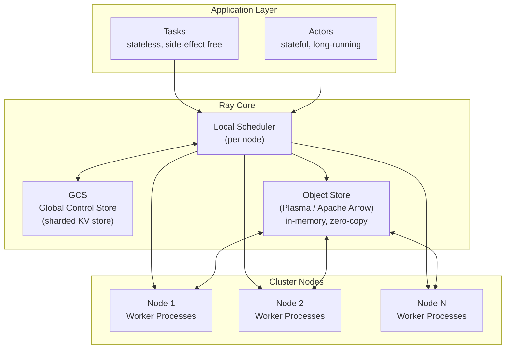

# 精读笔记：Ray — A Distributed Framework for Emerging AI Applications (OSDI 2018)

---

## ▎第一层 · 基本信息

| 字段 | 内容 |
|------|------|
| **论文** | Philipp Moritz, Robert Nishihara, Stephanie Wang, Alexey Tumanov, Richard Liaw, Eric Liang, Melih Elibol, Zongheng Yang, William Paul, Michael I. Jordan, Ion Stoica. *Ray: A Distributed Framework for Emerging AI Applications.* OSDI 2018. |
| **来源级别** | CCF-A 会议论文（UC Berkeley RISELab） |
| **链接** | arXiv:1712.05889 / 本地 PDF：`opening/literature/reference/osdi18-moritz.pdf` |
| **阅读日期** | 2026-07-22 |
| **状态** | 精读完成 |
| **相关论文组** | 分布式计算框架（Ray ecosystem）；外部 AI 算子执行调度 |

### 一句话核心结论

Ray 通过无状态 task + 有状态 actor 的统一编程模型、自底向上的分布式调度器、基于 Arrow 的零拷贝内存对象存储，实现了对强化学习、在线 serving、模拟等"新兴 AI 应用"的高性能支持——百万级 task/s 吞吐、亚毫秒级 task 启动延迟、线性扩展到数百节点。

`#distributed-framework` `#actor-model` `#task-scheduling` `#bottom-up-scheduler` `#zero-copy-object-store` `#OSDI2018` `#RISELab`

---

## ▎第二层 · 论文结构分析

### 1. 问题拆解

| 问题 | 论文的回答 |
|------|-----------|
| 要解决什么痛点？ | 新兴 AI 应用（强化学习、在线推理 serving、模拟）在并行度和执行模式上与传统的 MapReduce/数据流框架根本不同——它们需要**百万级低延迟 task**、**异构计算**（CPU+GPU）、**有状态执行**（actor），而 Spark/Hadoop 等以粗粒度数据并行、无状态执行为设计前提 |
| 之前的方法为什么不够？ | Spark/Hadoop 的 task 粒度太大（秒级启动），不适合 RL 的毫秒级交互；MPI all-or-nothing 模型不能支持弹性伸缩和部分故障；专用 RL 框架（如 RLLib 之前的状态）不通用，每种应用需要单独实现分布式逻辑 |
| 论文的**核心论点** | 通过一个**统一的 task+actor 编程模型** + **自底向上调度** + **分布式内存对象存储**，可以让多种新兴 AI 应用在一个通用框架上获得接近手写专用系统的性能 |
| 它的**关键假设** | (a) 新兴 AI 应用可以用动态 task graph 表达（task 间有数据依赖，graph 在运行时动态展开）；(b) 有状态 actor 可以覆盖 serving/simulation/训练等场景；(c) 任务完成时间远大于调度决策时间（否则调度开销会主导） |

### 2. 方法拆解

**系统架构总览**：

**核心技术要点**：

1. **Task + Actor 统一编程模型**：Task 是无状态函数，返回 future（`f = f.remote()` → `ray.get(f)`），数据流通过 futures 隐式表达为动态 task graph。Actor 是有状态长期服务（`@ray.remote class Counter`），方法调用保证每个 actor 实例的 FIFO 顺序，不同 actor 间无顺序保证。这是 Ray 区别于传统 MapReduce 框架的最核心差异——后者只有无状态 task，无法表达 serving / RL 策略更新等有状态模式。

2. **自底向上分布式调度器（Bottom-up Scheduler）**：Ray 使用两级调度但不设中央调度器。Local scheduler 在每个节点上运行，优先在**本地**调度 task（数据本地性 + 低延迟）。只有当本地节点过载或本地没有所需数据时，task 才转发（spill-over）到全局调度器——全局调度器的实现实际上是 GCS 的某个 shard，而不是独立组件。所谓"自底向上"是指：调度决策首先在叶子节点（local scheduler）做出，只在必要时才上升到全局层。这与 Spark/Mesos 的"自顶向下"（中央调度器→executor）形成鲜明对比。

3. **分布式内存对象存储（Plasma, based on Apache Arrow）**：Task 的输入输出通过共享内存对象存储（Plasma Object Store）传递，而非通过网络拷贝。对象是不可变的（immutable）——创建后只能读取不能修改，天然支持零拷贝共享。当 task A 产出对象 O、task B 需要 O 时，如果两者在同一节点，O 的内存页直接映射到 task B 的地址空间（zero-copy）。Arrow 列式格式在序列化/反序列化路径上消除了额外的格式转换开销。

4. **Lineage-based 容错而非 Checkpoint**：对于 task（stateless），Ray 记录每个对象的 **lineage**——产生该对象的 task 链。如果对象丢失（节点故障），系统从 lineage 重算。这比 Spark 的 RDD lineage 更细粒度（per-object 级别），但前提是 task 是确定性的。对于 actor（stateful），actor 状态不在 lineage 覆盖范围内——论文对此的处理是：actor 由其创建者负责恢复（重建 actor 并重放方法调用）。

5. **GCS（Global Control Store）作为元数据中心而非数据面**：GCS 是一个 sharded key-value store（基于 Redis 或 Raylet 内置存储），存储系统元数据——task table、object table、actor table、节点心跳。GCS 本身不参与数据传输或调度决策，只是让所有组件能查看全局状态。这个低耦合设计是 Ray 水平扩展的关键——GCS 的压力与 task 数量线性增长，但与数据传输量无关。

### 3. 实验拆解

| 维度 | 内容 |
|------|------|
| **数据集** | 强化学习任务（ES/PPO/A3C on OpenAI Gym: Humanoid, Hopper, Walker2d, HalfCheetah, Swimmer, Ant, Reacher）+ 微观 benchmark（task launch 延迟、actor 吞吐、对象存储开销） |
| **Baseline** | 在 RL 任务上对比专用分布式 RL 实现（Redis-based reference）、OpenMPI；微观 benchmark 对比 gRPC bare-metal 调用 |
| **评价指标** | **RL 任务**：累积 reward 收敛速度、wall-clock time；**微观 benchmark**：task launch latency（ms）、task throughput（task/s）、actor method invocation throughput、object store get/put 延迟 |
| **消融实验** | ❌ 无明显组件消融（全文是**系统设计论文**，不是算法消融论文——贡献在于架构设计而非组件对比） |
| **统计显著性** | ❌ RL 任务基于累积 reward（高方差），但未报告置信区间——RL benchmark 的常规做法 |
| **复现条件** | 🟢 Ray 完全开源（GitHub: ray-project/ray），实验使用标准 RL 环境（OpenAI Gym），硬件需求可配置 |

### 4. 关键数字

| Claim | 数字 | 条件（什么设置下） |
|-------|------|-------------------|
| Task launch 延迟 | ~200 μs（本地） / ~1 ms（跨节点） | 单 task，空函数，60-node cluster |
| Task 吞吐 | 超过 1M tasks/s | 60 nodes，每个 node 16 cores，总计 960 cores |
| Actor 方法吞吐 | ~20K calls/s（单 actor） | 单 actor，无状态空方法 |
| ES RL 收敛加速 | ~60× wall time 缩短（vs 单机） | Humanoid-v1，8192 workers |
| Object store get 延迟 | ~100 μs（同节点，零拷贝） | 小对象，shared memory |
| Object store put+get | ~1 ms（跨节点，含网络传输） | 小对象，同一 cluster |

---

## ▎第三层 · 批判性评估

### 1. 假设检验

论文中有哪些**没有明说但实际依赖的假设**？在什么条件下这些假设不成立？

- **假设 1**：Task 执行时间远大于调度决策时间（≥ ms 级 task 才有意义）
  - 反例 / 边界：如果 task 是微秒级操作（如 trivial arithmetic），调度开销（200 μs local）会成为瓶颈。Ray 不适用于 micro-task 并行——论文的 RL 场景中 task 通常 ≥ 10ms（一次 policy evaluation），因此调度开销占比很低。
- **假设 2**：Task 是确定性的（lineage-based 容错的前提）
  - 反例 / 边界：如果 task 内部有随机性（如 RL rollout 中的随机动作采样），从 lineage 重算会得到不同结果。Ray 对非确定性 task 的容错不提供精确恢复保障——这在 RL 中是可接受的（rollout 本就有随机性），但在精确计算场景中不可接受。
- **假设 3**：Actor 状态可以由上层逻辑恢复
  - 反例 / 边界：论文将 actor 容错的责任推给应用层（"reconstructed by the application"）。对于长时间训练的大型模型（NN 权重以 GB 计），从零重建 actor 的成本巨大。Ray 未在框架层解决 stateful actor 的持久化和恢复——这是后续 Ray Tune/Ray Serve 等上层库要解决的问题。
- **假设 4**：所有节点的 GCS shard 都可达（网络分区假设不成立）
  - 反例 / 边界：如果 GCS shard 所在节点故障且未做持久化备份，系统元数据丢失——所有正在执行的 task、未完成的 object 引用均不可恢复。论文未深入讨论 GCS fault tolerance。

### 2. 边界探查

- **方法适用边界**：Ray 的架构假设 task 间有显著的**计算量与调度开销比**。对于极短 task（< 100 μs），scheduler 开销主导——Ray 不适合向量化 micro-operation 或 GPU kernel 级并行。对于**完全无共享状态**的 bulk synchronous 数据处理（如 SQL scan+aggregation），Spark 的粗粒度调度可能更高效。
- **扩展性限制**：GCS 的 sharding 允许线性扩展到数百节点，但当 task/actor 数量超过千万级时，GCS 元数据查询压力成为瓶颈——论文在 60 节点 / 960 cores 上测试，未验证千节点级场景。Ray 1.0+ 的后续演进中确实发现了 GCS 瓶颈（改用 Redis cluster 替代单实例）。
- **复现难度**：🟢 Ray 完全开源且已成为广泛使用的工业级框架（2026 年现状），原始实验在标准 RL 环境上可完全复现。

### 3. 可信度评估

| 维度 | 评价 | 依据 |
|------|------|------|
| 实验公平性 | 🟢 公平 | RL benchmark 使用标准 OpenAI Gym 任务，对比了专用系统（Redis-based RL）和通用框架（MPI） |
| 结果显著性 | 🟡 中等 | RL 收敛曲线展示了 clear trend（60× wall time 缩短），但 RL reward 天然高方差且未报告 std/CI |
| 开源/可复现 | 🟢 全开 | 完整开源 + 标准 benchmark，可完全复现 |
| 论文自身局限 | 🟡 一般 | 讨论了 task 调度粒度的局限，但未深入讨论 actor 容错和 GCS 持久化的边界 |

### 4. 与同行工作的对比

- 比 **Spark**（Zaharia, NSDI 2012）：Spark 的 RDD 模型是粗粒度数据并行，task 秒级启动（Spark 调度 + executor JVM 开销）。Ray 将粒度降到微秒-毫秒级（task 200 μs 启动），且支持有状态 actor。但 Ray 不提供 Spark 的 SQL/Catalyst 优化器——两者适用场景互补。
- 比 **TensorFlow distributed runtime**（2017）：TF 的 distributed runtime 与其 dataflow graph 紧耦合，表达 RL/serving 等模式需要 workaround。Ray 通过 actor 抽象将这些模式提升为一等公民。
- 比 **Dask**（2016）：Dask 也提供 task graph + futures，但没有 actor 抽象——不能原生表达有状态模型 serving / policy 更新。Dask 更偏向数据科学，Ray 偏向 AI 训练+推理。
- 在 **[你的课题]** 的坐标系中：Ray 是**架构设计空间**——本课题研究的调度策略（queue-adaptive flush、actor pool 分池路由、K_max 动态控制）均在 Ray actor + task 模型上实现。Ray 提供了 actor 异步能力、自底向上调度、对象存储基础能力，本课题在此基础上做**上游调度优化**（数据组织 + 提交控制）。

---

## ▎第四层 · 与你课题的连接

### 1. 可引用的观点（配精确位置）

> §2 Programming Model：Ray 的 task 模型通过 futures 表达数据依赖，隐式形成动态 task graph。T1 返回 future F，T2 以 F 为参数时系统自动推断 T1→T2 依赖。
> → 这与本课题的 Arrow → Ray task chain 逻辑一致：Daft 组织数据 → `ray.put`/object store → task 消费。Ray 的 future 机制解释了为何 fan-in 阶段是瓶颈——大量 worker task 的 futures 集中在 writeback 节点 `ray.get`。

> §3.2 Bottom-up Scheduler：local scheduler 优先本地调度，只在过载时 spill-over 到全局。两级调度中"全局"实际上只是 GCS 的一个 shard，而非独立调度器。
> → 这个 low-overhead 设计启发了本课题的去中心化调度方案——可以类比为"local actor pool 优先消费本地队列，负载高时 spill-over 到全局 pool"。论文证明了这种模式在 AI workload 下的有效性和扩展性。

> §4.1 In-memory Object Store：对象不可变（immutable），通过 shared memory 和 Apache Arrow 实现零拷贝传递。同一节点内的对象传递没有序列化开销。
> → 这是本课题数据链路的基础假设：Daft（Rust 核心 + Arrow）→ Ray object store → vLLM worker 的三段链路中，Arrow 格式保证了无格式转换开销，与 Ray 论文的设计理念一致。

> §4.3 Actor State and Scheduling：Actor 方法调用按 per-actor FIFO 顺序执行，不同 actor 间无顺序保证。Actor 可指定资源需求（CPU/GPU）。
> → 这是本课题 actor pool 设计的理论依据：(a) 每个 vLLM actor 的状态是独立的（模型副本 + KV cache），(b) 不同 actor 可配置不同 GPU 资源（异构 actor pool），(c) 本课题的 queue-adaptive flush 利用了 actor 异步调用的非阻塞特性。

> §5.1 End-to-End RL：RL workload 的 task 执行时间分布不均（不同轨迹长度不同），Ray 的动态 task graph + bottom-up scheduler 能自动适应这种异构性。
> → 直接支持本课题的核心 motivation——AI 算子的 token 量/frame 量天然不均衡（不同 prompt 长度不同），按固定行数 batch 而非按计算量 batch 会导致 straggler。Ray 的 scheduler 设计天然容忍 task 执行时间差异。

### 2. 不能过度引用的地方

- **不声称** "Ray 证明了 bottom-up scheduling 在所有场景优于 centralized scheduling"——论文只在 RL workload 上证明，且不提供与 centralized Ray scheduler 的 A/B 对比（这是架构决策，不是消融实验）。
- **不声称** "Ray 解决了 stateful actor 的容错"——论文明确将 actor 恢复责任推给应用层（§4.3: "the application must reconstruct the actor"）。本课题的 vLLM actor 故障恢复需要自行设计，不能引用 Ray 论文作为容错方案。
- **不声称** "Ray 的 object store 延迟即为本课题链路的 object store 延迟"——本课题的 Daft→Ray→vLLM 链路涉及 Arrow RecordBatch 的大对象传输，与论文中 microbenchmark 的小对象场景不同。实际延迟需要通过 profiling 实测，不能直接引用论文数字。
- **不声称** "本课题修改 Ray scheduler"——本课题在 Ray 的 actor model 和 task model **之上**设计调度策略（actor pool routing、queue-adaptive flush），不修改 Ray 内核调度逻辑。论文的 §3 描述的是 Ray 的内部调度器，不是本课题修改的对象。
- **不声称** "Ray 是本课题的唯一可行平台"——Ray 提供了 actor/task/object-store 基础能力，但方案设计不一定绑定 Ray。其他 actor 框架（如 Akka/Orleans）理论上也可承载类似设计，只是 Ray 的异步能力 + Arrow 原生集成使其成为最适合当前课题的平台。

### 3. 对本课题的实际用途

| 用途类型 | 具体方式 | 优先级 |
|----------|----------|--------|
| ✅ 动机证据 | Ray 论文验证了"动态 task graph + bottom-up scheduler 在 AI workload 上有效"（RL 场景，60× wall-time 缩短）——这为本课题在 Ray 上做 DB AI 算子的调度优化提供了平台可行性证据 | ⭐⭐⭐ |
| ✅ Baseline | Ray 的 local-only scheduling（不 spill-over）和 default FIFO actor scheduling 作为本课题的 baseline 之一，对比 queue-adaptive flush、actor pool routing 等策略的增量收益 | ⭐⭐⭐ |
| ✅ 设计参考 | §3.2 bottom-up 的"local-first + spill-over"模式直接启发 actor pool 分池路由设计；§4.1 的 immutable object + Arrow zero-copy 作为数据链路的工程基础 | ⭐⭐⭐ |
| ✅ 对照区分 | 在开题 §2 中引用 Ray 论文，说明 Ray 提供了 Actor/Task/Object-Store 基础架构，本课题在其**之上**设计**数据库 AI 算子特定的**数据组织和提交控制策略 | ⭐⭐ |
| ⚠️ 空白论证 | Ray 论文不涉及"数据库触发 → 数据组织 → 提交控制 → 模型服务 → 数据库写回"的**完整链路**——这正是本课题填补的空 | ⭐⭐ |

### 4. 不足 → 你的机会

| 论文的不足 / 未回答的问题 | 你的课题可能如何填补 |
|--------------------------|---------------------|
| Task 调度策略是通用的（FIFO + load-based spill-over），不感知 task 的计算量（token 量/帧数） | 本课题的 token-budget batch construction 按计算量动态调整 task 粒度，比 Ray 的 fixed FIFO 更适合 AI_EMBED/AI_COMPLETE |
| Actor 间负载均衡靠 spill-over 到全局，策略简单（只基于请求数，不基于 actor 负载深度） | 本课题的 queue-adaptive flush 基于 actor 队列深度 + token backlog 做动态提交控制，比 spill-over 的二元决策（local/global）更精细 |
| 不支持异构 actor pool 的显式路由——actor 创建时指定资源，但调用方不感知 actor 能力差异 | 本课题的 actor pool 分池路由根据模型服务能力（不同 GPU 型号、不同 max_batch_size）显式路由请求 |
| 容错对 stateful actor 是弱保障（推给应用层） | 本课题不修改此边界——actor 容错在 vLLM 和 Ray 框架已有保障内解决 |
| 不是为数据库场景设计的——没有"数据从表到 task"、"推理结果写回表"的机制 | 本课题补齐了完整的 PostgreSQL→Daft→Ray→vLLM→PostgreSQL+pgvector 闭环，并针对此链路设计了上游优化策略 |

### 5. 可论文化的措辞

> 正如 Moritz et al. [Ray, OSDI 2018] 所示，AI workload 的执行具有任务执行时间异构、百万级低延迟调度需求等特征，传统的粗粒度数据并行框架（如 Spark）无法有效支持。Ray 通过 stateful actor + bottom-up scheduler 提供了适合此类 workload 的基础平台。本课题在此基础上，针对数据库 AI 算子这一特定场景，设计了 token-budget-aware 的数据组织策略和 queue-adaptive 的提交控制策略。

> Ray 的 bottom-up scheduler（§3.2）证明了"local-first + spill-over"的两级调度模式对 AI workload 有效。本课题将这一原则从 task 调度层拓展到数据提交控制层：actor pool 优先消费本地队列，仅在队列深度或 token backlog 超过阈值时调整提交速率或跨池路由。

> 与 Ray 的通用 scheduling（不感知 task 计算量差异）不同，本课题的核心贡献之一是**计算量感知**的 batch construction——利用 Daft 的 lazy execution + Arrow 零列式统计，在 batch 构造阶段即按 token 预算/frame 数量组织数据，而非依赖运行时 spill-over 被动均衡。

> Ray 论文未覆盖的状态——数据库 AI 算子的完整执行闭环（SQL→数据引擎→外部推理→向量写回）——正是本课题填补的系统空白。Ray 提供了 task/actor/object-store 基础机制，本课题在此基础上进行了两大扩展：上游感知算子特征的数据组织策略，以及面向模型服务负载的提交与调度控制策略。

### 6. 后续待读

- [ ] **Ray 1.0 Architecture Paper** (Ray Project Blog / OSDI follow-up) — 了解 Ray 在 2018 后的架构演进（ownership-based object store, distributed ref counting, Raylet 重构）
- [ ] **Ray Serve** (Ray Project docs) — model serving 的 Ray 原生支持，与本课题的 vLLM serving 方案对照
- [ ] **Daft documentation — Ray integration** — 理解 Daft 如何在底层与 Ray actor/task 集成
- [ ] **vLLM paper** (Kwon et al., SOSP 2023) — vLLM continuous batching 和 PagedAttention，理解本课题的模型服务端点
- [ ] **Orca** (OSDI 2022) — 与本课题更接近的 scheduling+serving 工作，已下载 PDF

---

## 元反思

- **精读收益**：🟢 高（Ray 是本课题的架构设计空间——课题在 Ray 的 actor/task/object-store 之上进行调度策略研究，理解 Ray 的底层机制对策略设计至关重要）
- **是否纳入核心文献库**：是
- **计划复习周期**：4 周后复习（在实施 actor pool routing 和 queue-adaptive flush 时回读 §3-§4）
- **一句话自评**：理解到位。Ray 论文的核心价值是定义了 AI workload 的分布式平台需求（low-latency task, stateful actor, bottom-up scheduling, zero-copy object sharing），这为课题的"在 Ray 之上做调度优化"提供了坚实的基础验证和设计约束。论文的局限（通用调度不感知计算量、actor 路由不区分异构能力）恰好是本课题的创新空间。

---

## 相关笔记

- [[galois_sigmod2025]] — DB4AI 同方向对照（LLM 作为存储层视角）
- [[cortex_aisql_sigmod2026]] — DB4AI 产业代表（AI 算子嵌入数据库内部）
- [[smart_vldb_journal_2025]] — ML 谓词优化（感知算子特征的早期工作）
- [[orca_osdi2022]] — 模型 serving 调度
- [[文献地图]] — 文献全景
