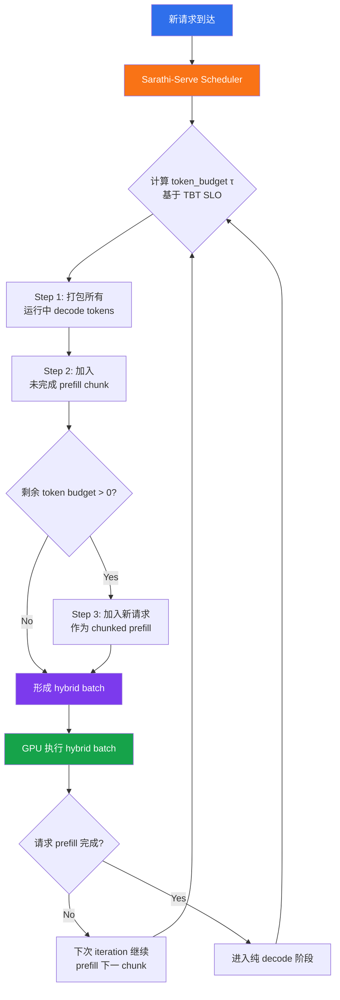

# 精读笔记：Sarathi-Serve — Taming Throughput-Latency Tradeoff in LLM Inference with Sarathi-Serve (OSDI 2024)

---

## ▎第一层 · 基本信息

| 字段 | 内容 |
|------|------|
| **论文** | Agrawal, Kedia, Panwar, Mohan, Kwatra, Gulavani, Tumanov, Ramjee. *Taming Throughput-Latency Tradeoff in LLM Inference with Sarathi-Serve.* OSDI 2024. |
| **来源级别** | CCF-A 会议论文（Georgia Tech + Microsoft Research India） |
| **链接** | https://www.usenix.org/conference/osdi24/presentation/agrawal / 代码：https://github.com/microsoft/sarathi-serve / 本地 PDF：`opening/literature/reference/osdi24-agrawal.pdf` |
| **阅读日期** | 2026-07-22 |
| **状态** | 精读完成 |
| **相关论文组** | LLM 推理服务调度 / vLLM 生态 / Prefill-Decode 干扰 |

### 一句话核心结论

Sarathi-Serve 通过 **chunked-prefills**（将 prefill 拆为等大 chunk 跨多个 iteration 执行）和 **stall-free batching**（在 token budget 约束下将 decode + prefill chunk + 新请求混合组 batch），解决了 prefill-prioritizing 调度器（vLLM/Orca）的 generation stall 问题和 decode-prioritizing 调度器（FasterTransformer）的吞吐浪费问题，在 Yi-34B 上实现 vLLM 的 3.7x serving capacity，在 Falcon-180B pipeline parallel 部署上实现 5.6x 提升。

`#LLM-inference` `#prefill-decode-interference` `#chunked-prefills` `#stall-free-scheduling` `#throughput-latency-tradeoff` `#OSDI2024`

---

## ▎第二层 · 论文结构分析

### 1. 问题拆解

| 问题 | 论文的回答 |
|------|-----------|
| 要解决什么痛点？ | LLM 推理系统中 prefill（计算密集、不依赖 batch）和 decode（内存密集、强依赖 batch）两阶段行为完全不同，现有调度器偏向任一端都会严重损害另一端：prefill-prioritizing（vLLM/Orca）导致 decode 的 generation stall（停顿数秒），decode-prioritizing（FasterTransformer）导致吞吐浪费 |
| 之前的方法为什么不够？ | 两类调度器各自优化一个维度：prefill-prioritizing 追求高吞吐但 TBT 尾延迟极高，decode-prioritizing 追求低 TBT 但 batch 利用率低。即使 vLLM + PagedAttention 能支持大 batch，在 latency SLO 约束下也无法发挥 |
| 论文的**核心论点** | decode batch 处于 memory-bound 区间，有大量"空闲"计算能力——可以在不显著增加延迟的前提下，将 prefill 拆成小 chunk 混入 decode batch，做到既不 stall decode 也不浪费 GPU |
| 它的**关键假设** | (1) prefill 的计算可以在不显著增加 decode TBT 的前提下被 chunk 化混入；(2) 用户指定的 TBT SLO 可以作为 token budget 的上限；(3) 大多数请求的 prompt 足够长（中位数 1730~7059 tokens），chunking 有空间 |

### 2. 方法拆解

**核心技术要点**：

1. **Chunked-prefills（prefill 分块）**：将一个长 prompt 的 prefill 拆成多个等大 chunk（如 512/1024/2048 tokens），跨多个 iteration 执行。两个关键洞察支撑此设计：(a) prefill 在 512 tokens 左右就开始饱和 GPU 计算（图 4），chunk 不需要很大即可高效利用 GPU；(b) 真实 workload 中 prompt 往往数千 tokens（openchat_sharegpt4 中位数 1730，arxiv_summarization 中位数 7059），拆分空间充足。chunking 的代价是 KV-cache 重复读取（第一个 chunk 的 KV-cache 被后续 N-1 个 chunk 读取），但 attention 在 chunk size 较小时仍是 compute-bound，实际开销可控（~25% for 512 chunk, negligible for 2048）。

2. **Stall-free batching（无停顿组 batch）**：调度器每轮按三步填充 batch：先放入所有运行中 decode tokens（每个 decode 贡献 1 token），再放入未完成的 prefill chunk，最后在剩余 token budget 内放入新请求的 prefill chunk。token budget τ 由用户指定的 TBT SLO 反推（通过一次 profiling 确定最大不违反 SLO 的 token 数）。关键效果：decode 永远不会因为新 prefill 的到来而被 stall。

3. **Uniform batch for pipeline parallelism**：传统 iteration-level batching 中，不同 iteration 的 batch 构成差异巨大（纯 prefill vs 纯 decode vs 混合），导致 micro-batch 执行时间波动——在 pipeline parallel 部署中产生大量 pipeline bubble。Sarathi-Serve 的 hybrid batch 让每次 iteration 的 token 数接近 token budget 上限，执行时间趋于均匀，显著减少 pipeline bubble。

4. **Arithmetic intensity 分析（理论支撑）**：论文用 Roofline 模型分析了 decode batch 的 arithmetic intensity——decode 操作处于 memory-bound 区间（低算术强度），而 prefill 处于 compute-bound 区间（高算术强度但带宽利用不充分）。将 prefill chunk 混入 decode batch，可以在不改变 memory fetch 时间的前提下利用空闲计算单元，使 batch 整体进入 "balanced" 区间（图 5）。

### 3. 实验拆解

| 维度 | 内容 |
|------|------|
| **数据集** | openchat_sharegpt4（对话，中位 prompt 1730 tokens）+ arxiv_summarization（论文摘要，中位 prompt 7059 tokens）；请求到达时间用 Poisson 分布生成；过滤掉 total length > 8192/16384 的 outlier |
| **Baseline** | vLLM（prefill-prioritizing, iteration-level batching + PagedAttention，不支持 hybrid batch）、Orca（prefill-prioritizing, iteration-level batching + hybrid batch，不支持 PagedAttention） |
| **评价指标** | **Capacity**：满足 P99 TBT SLO 下的最大 QPS；**Latency**：P50 TTFT + P99 TBT；SLO 分 strict（5x baseline decode latency）和 relaxed（25x）两档 |
| **消融实验** | ✅ chunked-prefills-only vs hybrid-batching-only vs combined（Table 4），token budget 变化实验（512 vs 2048），chunking overhead 实验（不同 chunk size 和 prompt length，图 14） |
| **统计显著性** | ❌ 未报告方差/置信区间（但覆盖 4 个模型 + 2 个数据集 + 多个 GPU 配置，趋势一致性提供了一定可信度） |
| **复现条件** | 🟢 代码开源（GitHub: microsoft/sarathi-serve），基于 vLLM fork，需 A100/A40 GPU + CUDA 12.1 |

### 4. 关键数字

| Claim | 数字 | 条件 |
|-------|------|------|
| Capacity 提升 vs vLLM | 3.7x（strict SLO）| Yi-34B, 2 A100 (TP-2), openchat_sharegpt4 |
| Capacity 提升 vs vLLM | 2.6x | Mistral-7B, 1 A100 |
| Capacity 提升 vs vLLM (PP) | 5.6x | Falcon-180B, 8 A100 (TP4-PP2), openchat_sharegpt4 |
| TBT SLO 严格时 capacity | 3.5x higher capacity at 100ms P99 TBT | Mistral-7B, Sarathi-Serve token budget 512 vs vLLM |
| Pipeline bubble 改善 | 1.48x (relaxed) / 3.6x (strict) capacity increase | Falcon-180B, TP4-PP2 hybrid vs vLLM TP8 |
| Chunking overhead（最坏情况）| ~25%（chunk size 512）| Yi-34B TP-2, prefill length 8K；chunk size 2048 时 overhead negligible |
| Generation stall 时长 | 数秒级别 | Yi-34B on 2 A100, arxiv_summarisation trace（图 1a） |
| Decode batch 可混入额外 token | 128 decode tokens 的 batch 仍有显著空闲计算 | LLaMA2-70B 线性层 arithmetic intensity 分析（图 5） |

---

## ▎第三层 · 批判性评估

### 1. 假设检验

- **假设 1**：token budget 可以通过一次 profiling 确定并在运行时保持不变
  - 反例 / 边界：token budget 与 GPU 型号、模型结构、tensor parallel 度、输入长度分布均相关。论文实验中针对 strict SLO 统一用 512、relaxed 用 2048——在实际动态负载下，固定 token budget 可能要么保守浪费吞吐，要么激进违反 SLO。论文承认了这一点（"system performance can be further enhanced by dynamically varying the token budget"）但留给 future work。
- **假设 2**：decode 阶段的 KV-cache 访问模式不受 prefill chunk 混入的影响
  - 反例 / 边界：chunked-prefill 需要加载所有之前 chunk 的 KV-cache，增加了 HBM 读取量。论文用 arithmetic intensity 论证开销可控（§5.4.1 测到 ~25% 最坏开销），但这假设 KV-cache 不会因为 chunking 而产生额外的 cache miss 或带宽争用——在更大模型或更长 context 下可能恶化。
- **假设 3**：用户的 TBT SLO 是已知且稳定的
  - 反例 / 边界：实际部署中 SLO 可能随应用场景变化（聊天 vs 文档摘要对 TBT 的敏感度不同）。论文只在两种固定 SLO 设置下评测，未讨论 SLO 未知或多租户 mixed SLO 场景。

### 2. 边界探查

- **方法适用边界**：仅适用于 prefill 阶段足够长的场景（chunk 才有拆分空间）。对于短 prompt 场景（如分类任务 prompt 只有几十 tokens），chunked-prefills 退化为 full prefill，优势消失；stall-free batching 的 token budget 机制仍然有效，但提升幅度会缩小。
- **扩展性限制**：(a) 模型规模继续增长（如 400B+）时，chunking 导致的 KV-cache 重复读取开销可能放大；(b) 超长 context（如 128K+）下 attention 复杂度 O(n²) 开始主导，论文的 "linear dominates" 分析可能失效；(c) MoE 模型的 expert 路由行为与 dense 模型不同，uniform batch 假设需要重新检验。
- **复现难度**：🟢 代码已开源，但基于 vLLM fork——如果 vLLM 主线 API 发生大变更，Sarathi-Serve 的 patch 可能失效。需要 A100/A40 GPU 才能完全复现。

### 3. 可信度评估

| 维度 | 评价 | 依据 |
|------|------|------|
| 实验公平性 | 🟢 较公平 | 与 vLLM（最广泛使用的开源方案）和 Orca（学术代表）对比；覆盖 4 种模型规模和 2 种 workload；SLO 定义参照 Patel et al. (Splitwise) |
| 结果显著性 | 🟢 显著 | 3.7x / 5.6x 级别的 capacity 提升，且在不同模型/workload/SLO 下趋势一致 |
| 开源/可复现 | 🟢 全开 | GitHub 完整代码 + 实验脚本 + trace 数据 + artifact appendix |
| 论文自身局限 | 🟢 诚实 | 讨论了 disaggregation 路线的对比缺失（§6 Related Work），承认 token budget 的静态设定问题，标注了 Sarathi-Serve 是 research prototype 不保证 feature parity |

### 4. 与同行工作的对比

- 比 **vLLM (Kwon et al., SOSP 2023)**：Sarathi-Serve 核心代码基于 vLLM fork，共享 PagedAttention 内存管理。但 vLLM 的调度器是 prefill-prioritizing——Sarathi-Serve 替换了调度逻辑，加入 chunked-prefills + stall-free batching。两者在调度策略上是对立设计。
- 比 **Orca (Yu et al., OSDI 2022)**：Orca 首次提出 iteration-level batching，支持 hybrid batch（prefill + decode 混在同一 iteration），但没有 chunking 机制——长 prefill 直接全量混入导致 decode 严重 stall。Sarathi-Serve 可以看作 Orca + chunking + token-budget control 的进化版。
- 比 **Splitwise (Patel et al., ISCA 2024) / DistServe (Zhong et al., OSDI 2024)**：Disaggregation 路线将 prefill 和 decode 分配到不同 GPU replica，彻底消除干扰。优点是 prefill 以最大效率执行（TTFT 更优），缺点是需要 KV-cache 跨 replica 迁移（高带宽需求），且 prefill replica 的 GPU 内存利用不充分。Sarathi-Serve 在同一 replica 内解决问题，更轻量但对 TTFT 有一定妥协。
- 在 **[你的课题]** 的坐标系中：Sarathi-Serve 是 **LLM 推理服务内部的调度优化**——它解决的是推理引擎内部的 prefill/decode 干扰问题。你的课题是 **推理服务上游的数据组织与提交控制优化**——解决的是数据如何从数据库到达推理服务的问题。两者处于"推理服务的内外两侧"：Sarathi-Serve 决定推理服务内部如何消化请求，你的课题决定请求以什么节奏、什么形态到达推理服务。Sarathi-Serve 的 token-budget 概念和 chunk 化思路可以直接启发你的 batch construction 策略设计。

---

## ▎第四层 · 与你课题的连接

### 1. 可引用的观点（配精确位置）

> §3.1 Takeaway-2：Decode batches operate in memory-bound regime leaving compute underutilized. This implies that more tokens can be processed along with a decode batch without significantly increasing its latency.
> → 这是本课题 **token-budget / length-align batching** 策略的核心理论支撑：既然 decode batch 有"空闲计算"，我们可以在组织数据时利用这个特征做数据量控制。

> §4.1 Chunked-prefills：A prefill request with modest sequence length can effectively saturate GPU compute ... input prompts contain several thousand tokens on average. This provides an opportunity to break large prefill requests into smaller units of compute.
> → 直接启发：你的 **按计算量（token 量）而非固定行数** 的动态数据组织策略。chunk 的大小不是任意的——需要足够大以饱和计算，又足够小以不违反延迟约束，这与你的 token-budget design space 完全对齐。

> §4.2 Stall-free batching：By restricting the computational load in every iteration, stall-free batching ensures that decodes never experience a generation stall due to a co-running prefill chunk.
> → 你的 **queue-adaptive flush** 策略可以借鉴同样的约束思想：不是固定频率 flush，而是根据推理服务的当前 batch 状态和 token budget 动态决定何时提交下一批请求。

> §4.3 Token budget determination：One needs to take into account the trade-offs between prefill overhead and decode latency while determining the token budget. This can be handled with a one-time profiling.
> → 你的 **K_max 自适应控制** 本质上是 token-budget 的外推：K_max 决定了同时提交给推理服务的最大请求数，而 token budget 决定了服务内部能消化的最大 token 数——两者需要联合考虑。

> §5.3 Making Pipeline Parallel Viable：Sarathi-Serve leverages chunked-prefills to reduce the variation in the execution time between microbatches to avoid pipeline bubbles.
> → 如果你的项目后续扩展到多 GPU pipeline parallel 部署，uniform batch 设计将是减少 pipeline bubble 的关键。

> §5.4.2 Ablation：hybrid-batching-only vs chunked-prefills-only vs combined —— 单独使用任一技术的效果都不如两者联合。
> → 这印证了你的课题也需要做组件级消融：数据组织策略和提交控制策略不仅要独立验证，还要测试联合效果（正是 PROJECT_OUTLINE.md 中规划的联合 vs 拼接对比实验）。

### 2. ⚠️ 不能过度引用的地方

- ❌ **不声称** "Sarathi-Serve 解决了 LLM 推理的全部瓶颈"——它只解决 prefill-decode 干扰问题，不涉及 KV-cache 管理、模型加载、通信优化等
- ❌ **不声称** "Sarathi-Serve 的 chunked-prefills 可以直接用于数据库场景"——Sarathi-Serve 的 chunk 拆分基于单个请求内部 token，你的场景是多个独立请求按计算量分组
- ❌ **不声称** "Sarathi-Serve 的 token budget = 你的 batch size"——Sarathi-Serve 的 token budget 控制的是推理引擎内部一次 iteration 处理的总 token 数，你的 batch 控制的是提交给推理引擎的请求数，两者在不同层面
- ❌ **不声称** "stall-free batching 替代 queue-adaptive flush"——stall-free 是推理引擎内部的调度机制，queue-adaptive flush 是上游的提交控制机制。两者结合（上游提交节奏匹配下游消化能力）才是完整的优化
- ❌ **不声称** "3.7x capacity 提升适用于你的 workload"——Sarathi-Serve 评测的是对话和摘要场景（长 prompt、短 output），你的 AI_COMPLETE / AI_EMBED 场景的 prompt-output 长度分布可能不同

### 3. 对本课题的实际用途

| 用途类型 | 具体方式 | 优先级 |
|----------|----------|--------|
| ✅ 设计参考 | token-budget 概念直接指导 RC1（数据组织策略）的 token-budget batch construction | ⭐⭐⭐ |
| ✅ 设计参考 | chunking 按计算量 split 的思路——对应你的 length-align / token-budget 分组策略 | ⭐⭐⭐ |
| ✅ 设计参考 | stall-free 的 "约束计算量 → 控制延迟" 逻辑——直接指导 RC2（提交控制）的 queue-adaptive flush | ⭐⭐⭐ |
| ✅ 动机证据 | Prefill-decode interference 证明即使在推理引擎内部也需要精细调度——外部数据提交同样需要 | ⭐⭐ |
| ✅ Baseline | 如果你的方案声称优于"直接将数据全部发给 vLLM"，则需要引用 Sarathi-Serve 说明 vLLM 默认调度的不足 | ⭐⭐ |
| ⚠️ 对照区分 | 你的项目不修改 vLLM 内部，而是优化上游——与 Sarathi-Serve 做内部优化的路线互补 | ⭐⭐ |

### 4. 不足 → 你的机会

| 论文的不足 / 未回答的问题 | 你的课题可能如何填补 |
|--------------------------|---------------------|
| 只优化推理引擎内部调度，不考虑外部数据到达的节奏和形态 | 你的课题研究数据如何组织（按计算量分组）和以什么节奏提交（queue-adaptive），填补上游空白 |
| 静态 token budget——需要针对 deployment 手工 profiling 确定 | 你的 K_max 自适应可以根据推理服务状态（队列长度、延迟反馈）动态调整 |
| 不考虑请求级别的计算量差异（不同 prompt/output 长度的请求对 token budget 贡献不同） | 你的 token-budget batching 正是按计算量相似度分组——把计算量相似的请求组织在一起，充分利用 token budget |
| 不考虑 batch 构成的数据来源（请求来自哪里、是否有 schema 约束） | 你的场景数据来自 PostgreSQL 表，有明确 schema——可以用来做 prefix-aware grouping（如相同 system prompt 的请求共享 KV-cache prefix） |
| 未解决短 prompt 场景的效率退化 | 你的 AI_EMBED 场景（embedding 通常固定长度 prompt）可能需要不同的优化策略——这正是多场景对比实验可以揭示的 |
| 只评测了 decoder-only transformer，未涉及 embedding/classification 类模型 | 你的多模态泛化验证（CLIP 图像 embedding、Qwen2.5-VL 分类）可以验证 chunking/token-budget 思想在非生成式模型上的适用性 |

### 5. 可论文化的措辞

> 正如 Agrawal et al. [Sarathi-Serve, OSDI 2024] 所示，LLM 推理服务内部的 prefill-decode 干扰是 throughput-latency tradeoff 的核心来源。Sarathi-Serve 通过 chunked-prefills 和 stall-free batching 将这一干扰控制到 token budget 约束之内。本课题延续这一"计算量约束"思路，但不进入推理引擎内部——而是在数据提交侧，按 token-budget 逻辑组织请求和调节提交节奏，使推理服务接收到的数据已经过"计算量预对齐"。

> Sarathi-Serve 的 token budget 机制（§4.3）和本课题的 token-budget batch construction 共享同一个核心洞察：decode batch 处于 memory-bound 区间，有大量空闲计算能力可供利用。不同的是，Sarathi-Serve 在推理引擎内部做 token 级调度，本课题在上游数据管线中做请求级分组——两者构成"内外协同"的端到端优化链路。

> Agrawal et al. 的消融实验（§5.4.2）表明，chunked-prefills 和 hybrid-batching 单独使用均不如联合使用。这印证了本课题的研究方法：数据组织策略（RC1）和提交控制策略（RC2）需要在独立验证后测试联合效果。

### 6. 后续待读

- [ ] **Splitwise** (Patel et al., ISCA 2024) — prefill/decode disaggregation 路线，与 Sarathi-Serve 的同一 replica 方案形成对比，评估哪种更适合 DB→推理的外部执行链路
- [ ] **DistServe** (Zhong et al., OSDI 2024) — 另一 disaggregation 方案，与 Splitwise 目标类似但设计不同
- [ ] **Vidur** (Agrawal et al., MLSys 2024) — Sarathi-Serve 同组工作，LLM 推理大规模仿真框架；可能用于本课题的调度策略仿真验证
- [ ] **Sarathi** (Agrawal et al., 2023) — Sarathi-Serve 的前身/preprint 版本，了解该方法的设计演进
- [ ] **vLLM** (Kwon et al., SOSP 2023) — PagedAttention 原论文，作为本课题部署平台的核心参考
- [ ] **APIServe** (Abhyankar et al., 2024) — 直接采用了 Sarathi-Serve 的 chunked prefill 技术用于 multi-turn API serving

---

## 元反思

- **精读收益**：🟢 高（本文是本课题最直接相关的推理服务调度论文，token-budget 概念是你 RC1/RC2 策略设计的关键参考）
- **是否纳入核心文献库**：是
- **计划复习周期**：2 周后复习（与 RC1 token-budget batch construction 实验设计前的重读同步）
- **一句话自评**：理解到位。Sarathi-Serve 的"约束计算量以控制延迟"思想是连接推理服务内部调度和你的上游数据组织的桥梁——你不需要在推理引擎内部做调度，但需要在数据提交侧做"计算量感知"的组织和节奏控制。这篇论文补充了 PROJECT_OUTLINE.md 中一直缺失的"为什么 token-budget 有效"的底层理论。

---

## 相关笔记

- [[galois_sigmod2025]] — 同方向 DB4AI，LLM 作为存储层的对照视角
- [[cortex_aisql_sigmod2026]] — 产业 DB4AI 代表
- [[smart_vldb_journal_2025]] — ML 谓词优化
- [[文献地图]] — 文献全景
