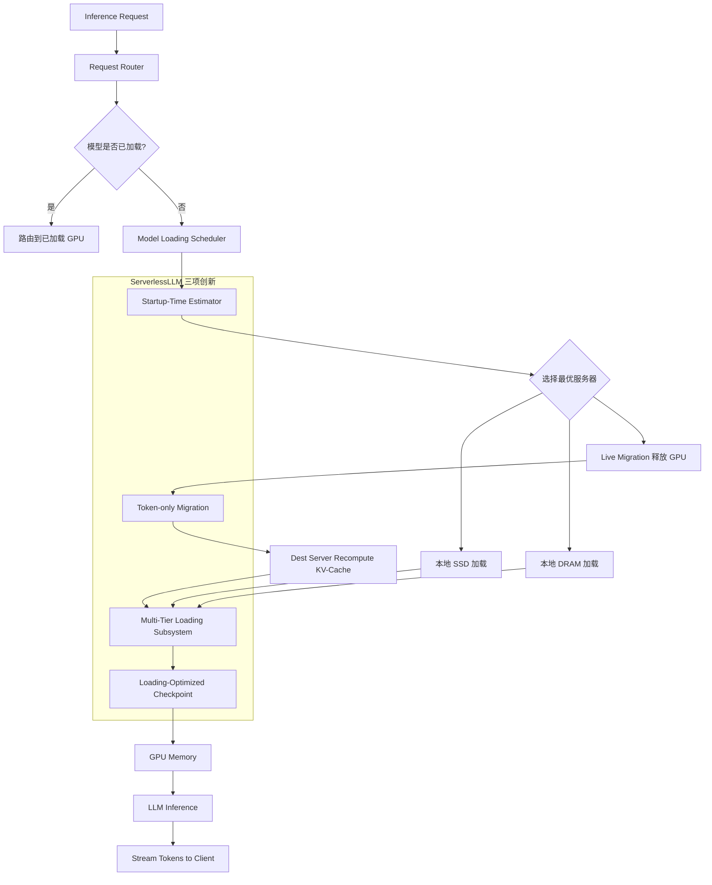

# 精读笔记：ServerlessLLM — Low-Latency Serverless Inference for Large Language Models (OSDI 2024)

---

## ▎第一层 · 基本信息

| 字段 | 内容 |
|------|------|
| **论文** | Yao Fu, Leyang Xue, Yeqi Huang, Andrei-Octavian Brabete, Dmitrii Ustiugov, Yuvraj Patel, Luo Mai. *ServerlessLLM: Low-Latency Serverless Inference for Large Language Models.* OSDI 2024. |
| **来源级别** | CCF-A 会议论文（University of Edinburgh + NTU Singapore） |
| **链接** | https://www.usenix.org/conference/osdi24/presentation/fu / 代码：https://github.com/ServerlessLLM/ServerlessLLM / 本地 PDF：`opening/literature/reference/osdi24-fu.pdf` |
| **阅读日期** | 2026-07-22 |
| **状态** | 精读完成 |
| **相关论文组** | LLM 推理服务 / Serverless 系统 / GPU 资源调度 |

### 一句话核心结论

ServerlessLLM 通过三项创新——加载优化的 checkpoint 格式与多级存储加载管线、基于 token 迁移（非 KV-cache）的 LLM 推理实时迁移、启动时间感知的 locality-aware 调度——将 serverless LLM 推理的 cold-start 延迟降低 10-200 倍，且 checkpoint 加载速度比 PyTorch/Safetensors 快 3.6-8.2 倍。

`#ServerlessLLM` `#cold-start-optimization` `#checkpoint-loading` `#live-migration` `#locality-aware-scheduling` `#OSDI2024` `#LLM-inference`

---

## ▎第二层 · 论文结构分析

### 1. 问题拆解

| 问题 | 论文的回答 |
|------|-----------|
| 要解决什么痛点？ | Serverless LLM 推理的 cold-start 延迟极高：大模型 checkpoint 动辄数百 GB，从远程存储下载需要数十秒；加载到 GPU 又需要数十秒（如 LLaMA-2-70B 在 8 GPU 上需 84s）。这对交互式 LLM 应用（first-token latency 通常 <100ms）是灾难性的。|
| 之前的方法为什么不够？ | (1) **GPU 超配**（over-subscription）对 LLM 太贵——GPU 成本远高于传统 DNN；(2) **Host memory 缓存 checkpoint** 容量不足——LLM 动辄几百 GB，host memory 只能缓存少数模型，cache miss 率高；(3) **部署额外存储服务器**成本高——100Gbps 网络下仍需 20s+，且额外服务器成本可能翻倍。 |
| 论文的**核心论点** | GPU 推理服务器的多级存储体系（GPU HBM、DRAM、NVMe SSD、SATA SSD）拥有巨大容量和带宽，但当前 serverless 系统严重未充分利用。应该用这些本地多级存储缓存 checkpoint，并通过加载优化、实时迁移、locality 感知调度最小化 startup latency。 |
| 它的**关键假设** | (1) GPU 服务器的本地多级存储（DRAM + SSD）有足够空间缓存多个 LLM checkpoint；(2) LLM 推理的 KV-cache 可以在目标 GPU 上高效重算（recomputing 远快于生成新 token）；(3) serverless workload 中 cold-start 频率足够高，优化 startup 有实际价值。 |

### 2. 方法拆解

**核心技术要点**：

1. **Loading-Optimized Checkpoint 格式（§4.1）**：将传统 checkpoint 转换为按 GPU partition 分组的顺序 chunk 格式，仅保留 tensor 二进制数据（去除 metadata），配合 tensor index file 实现直接寻址。创新在于将 checkpoint 加载与推理进程初始化解耦——Model Manager 负责加载数据到 GPU，推理进程仅设置 tensor data pointer，并行执行。

2. **Multi-Tier Loading Subsystem（§4.2）**：充分利用 GPU 服务器的多级存储带宽（8-GPU PCIe 5.0 聚合带宽 512 GB/s，NVMe RAID 0 ~60 GB/s）。核心技术：chunk-based 内存管理（利用并行 PCIe links 并发加载）、direct I/O（O_DIRECT 绕过 page cache，避免 Safetensors mmap 的 page fault）、pinned memory（消除 DRAM→GPU 冗余拷贝）、multi-tier pipeline（支持多种存储接口、intra-tier 并发、灵活 task queue）。

3. **Token-Based Live Migration（§5）**：**首次在 serverless 系统中实现 LLM 推理实时迁移**。核心洞察：迁移 tokens（10-100s KB）而非 KV-cache（1-10s GB），目标 GPU 重算 KV-cache 远快于生成新 token。采用多轮迁移流程——源服务器持续生成、目标服务器追赶 gap、gap 足够小时源停止并发送全部 token（最小中断）。这使得 locality-driven 推理可以在不牺牲正确性前提下实现——有 checkpoint 缓存的服务器即使 GPU 正忙，也可以通过迁移释放资源。

4. **Startup-Time-Optimized Scheduling（§6）**：Controller 维护每个服务器的 GPU/DRAM/SSD 状态，用 cost model 精确估计从不同 tier 的加载时间（queueing + model_size / bandwidth）和迁移时间（a * token_count + b）。基于动态规划选择最小化 startup time 的服务器。关键设计：per-server 顺序加载队列（避免带宽竞争）、基于 loading 历史持续校准 estimator、失败容错（etcd/ZooKeeper 持久化状态）。

### 3. 实验拆解

| 维度 | 内容 |
|------|------|
| **数据集** | GSM8K（数学问题，短推理）+ ShareGPT（多语言对话，3.7x 更长推理时间）+ Azure Serverless Trace（真实 serverless workload trace，Gamma 分布 bursty 请求，CV=8） |
| **Baseline** | PyTorch / Safetensors（checkpoint 加载）；Ray Serve / Ray Serve with Cache / KServe（端到端 serving）；Serverless scheduler / Shepherd*（调度器） |
| **评价指标** | **加载**：checkpoint 加载延迟、带宽利用率；**调度**：P50/P95/P99 延迟、CDF 分布；**端到端**：模型启动延迟（startup latency）、请求超时率（300s timeout） |
| **消融实验** | ✅ 加载性能拆解：ReadByTensor → +Bulk → +Direct → +Thread → +Pinned → +Pipeline，逐步分析每个优化的贡献（1.2x / 2.1x / 2.3x / 1.4x / 1.5x）|
| **统计显著性** | ✅ checkpoint 加载实验使用了 20 个复制副本取均值，清空 page/inode cache 保证 cold start |
| **复现条件** | 🟢 代码全开源（GitHub: ServerlessLLM/ServerlessLLM），使用公开 LLM（OPT/LLaMA-2/Falcon），测试环境详细描述 |

### 4. 关键数字

| Claim | 数字 | 条件 |
|-------|------|------|
| Checkpoint 加载加速 vs PyTorch | 6X（OPT-2.7B）~ 8.2X（LLaMA-2-70B） | NVMe RAID 0，FP16 checkpoint |
| Checkpoint 加载加速 vs Safetensors | 3.6X（OPT-2.7B）~ 4.7X（LLaMA-2-70B） | 同上；Safetensors 受 mmap page fault 影响（LLaMA-2-7B 时 112K page faults） |
| LoRA adapter 加载加速 | 4.4X（83.5ms vs 370ms） | LLaMA-70B，rank=32，1GB adapter |
| 带宽利用率 | 接近 100%（NVMe RAID 0: 100%；SATA RAID 0: 92%；MinIO 网络: 95%） | LLaMA-2-7B，对比 FIO 最优配置 |
| 端到端 serverless latency 减少 vs Ray Serve | 10X ~ 200X（OPT-6.7B：0.8s vs 12.1s / OPT-30B：7.5s vs 213s） | GSM8K + ShareGPT，真实 serverless workload |
| Locality-aware scheduling P99 latency 优势 | 1.27X ~ 1.95X vs Shepherd*/Serverless scheduler | GSM8K，RPS=1.4 |
| 资源效率 | 1 GPU/node 下 4s latency（vs Ray Serve w/ Cache 需 4 GPU/node 才达 12s） | 相同 workload |
| GPU 时间估计误差 | 网络 <5ms，SSD <40ms；CUDA 清理不稳定（worst 623ms） | 119 次迁移中 1 次出现异常 |

---

## ▎第三层 · 批判性评估

### 1. 假设检验

- **假设 1**：GPU 服务器本地存储足够缓存多个 LLM checkpoint
  - 反例 / 边界：实验中使用 512GB DRAM + 2TB NVMe。但单个 70B 模型（FP16）~130GB，Mixtral-8x22B ~280GB，Grok-1 ~600GB。当模型规模持续增长到 >1TB 级别时，即使多级存储也会不够。论文未讨论当模型数远超存储容量时的退化行为。
- **假设 2**：KV-cache recomputing 在目标 GPU 上总是足够快
  - 反例 / 边界：论文引用"recompute 1000 tokens 的 KV-cache ≈ generate 100 new tokens"。但这依赖于目标 GPU 的计算能力——如果目标 GPU 算力远低于源 GPU（异构集群），recompute 的时间可能超预期，导致迁移中断时间延长。论文未讨论异构 GPU 场景。
- **假设 3**：ServerlessLLM 的 scheduler cost model 足够精确
  - 反例 / 边界：论文承认 CUDA 状态清理（`torch.cuda.empty_cache()`）可能导致最坏 623ms 估计误差。在更高负载或更复杂的模型切换场景下，这种不确定性可能积累。此外，estimator 依赖 linear model（a * token_count + b），但 token 生成速度受 batch size、KV-cache 大小等动态因素影响，非严格 linear。
- **假设 4**：多轮 live migration 的收敛性
  - 反例 / 边界：论文设计假设源服务器生成的 token 数与目标服务器追赶的 gap 会收敛。但如果输出极长（如生成数千 tokens），两边的差距可能不收敛甚至振荡。论文未讨论非收敛场景下的 fallback 策略。

### 2. 边界探查

- **方法适用边界**：serverless 场景中 cold-start 占显著比例（Azure trace 显示 >40% function 的 cold-start rate >25%）。如果 workload 的 cold-start 率极低（如 always-on 模式），ServerlessLLM 的加载优化价值下降，live migration 的开销可能得不偿失。
- **扩展性限制**：(1) 实验最大 4 节点、16 GPU——未测试数十节点 cluster 的 scheduling 开销；(2) 最大测试模型 OPT-30B（66GB），未在 >100GB 模型（如 LLaMA-2-70B、Falcon-180B）上做 cluster 端到端实验；(3) per-server 顺序加载可以简化 cost estimation，但可能在大规模场景下成为瓶颈。
- **复现难度**：🟢 低——代码开源、模型公开、硬件描述详细。

### 3. 可信度评估

| 维度 | 评价 | 依据 |
|------|------|------|
| 实验公平性 | 🟢 较公平 | 与多种 SOTA baseline（Ray Serve/KServe/Safetensors/Shepherd）对比，使用真实 trace 和公开数据集 |
| 结果显著性 | 🟢 显著 | 10-200X 提升、3.6-8.2X 加载加速、接近 100% 带宽利用率——数字量级大且有物理机验证 |
| 开源/可复现 | 🟢 全开 | GitHub 开源、公开模型、详细实验设置描述 |
| 论文自身局限 | 🟢 较诚实 | 讨论了 CUDA 估计误差、GPU 资源极限下的退化、KServe 场景的适配问题；但对扩展性（节点数、模型数、模型大小）的边界讨论不足 |

### 4. 与同行工作的对比

- 比 **vLLM**（SOSP 2023）：vLLM 关注单 GPU 上推理效率（PagedAttention + continuous batching），ServerlessLLM 关注多 GPU 集群上的 startup latency。两者互补——vLLM 优化"推理中"，ServerlessLLM 优化"启动前"。
- 比 **AlpaServe**（OSDI 2023）：AlpaServe 用 model parallelism 提升 throughput，但未测 generative model 且未考虑 cold-start。ServerlessLLM 专门面向 LLM 的 serverless 场景，引入了 live migration 处理 locality-driven scheduling。
- 比 **Shepherd**（NSDI 2023）：Shepherd 也考虑了 checkpoint locality，但依赖 preemption（造成 downtime 和 redundant computation）。ServerlessLLM 的 live migration 避免了 preemption 的开销。
- 比 **ClockWork**（OSDI 2020）：ClockWork 依赖精确的模型推理时间预测做调度，但 LLM 推理时间受输出长度影响不可预测。ServerlessLLM 不依赖推理时间预测，改为用 live migration 动态调整资源分配。
- 在 **[你的课题]** 的坐标系中：ServerlessLLM 属于 **模型服务平台的 serverless 化**，本课题属于 **数据库场景下的 AI 算子外部执行调度**。两者的共同关注点是"如何高效地将数据和模型组织在一起以降低延迟"。ServerlessLLM 的 locality-aware scheduling 可以直接类比到本课题的 actor pool 分池路由——都是"请求应该路由到最适合的计算资源"。其 checkpoint 多级加载的设计思路也可以为本课题的"数据从 DB 到 GPU 的多级传输"提供参考。

---

## ▎第四层 · 与你课题的连接

### 1. 可引用的观点（配精确位置）

> §3.1 Design Intuitions：GPU 服务器的多级存储（HBM → DRAM → NVMe → SATA）拥有巨大且未充分利用的容量和带宽。利用这些本地存储可以避免远程 checkpoint 下载。
> → 与本课题的"数据从 DB 到 GPU 的执行链路"形成对照：Daft Dataframe 数据在进入 vLLM 前，同样可以受益于中间缓存层的设计。可以借鉴其"多级存储分层利用"的理念来优化数据搬移路径。

> §5.1 Need for Live Migration：availability-driven（选空闲 GPU，不顾 locality）vs locality-driven（选有 checkpoint 的 GPU，但可能排队）vs preemption-driven（抢占式）vs live-migration-supported（迁移式）四种策略的对比分析。
> → **直接可引用到本课题的 actor pool routing 设计**。本课题的异构 actor pool 同样面临"路由到有空闲 slot 的 actor"vs"路由到已预热模型的 actor"的 trade-off。ServerlessLLM 的四种 policy 对比分析是本课题 actor pool 分池路由设计的直接参考框架。

> §6.1 Estimating Model Loading Time：用 cost model（queueing time + model_size / bandwidth）估计从不同存储 tier 加载 checkpoint 的时间。
> → 本课题可借鉴这个思路：估计数据从 Daft → Arrow → Ray → vLLM 不同阶段的传输和处理时间，从而决定 batch size、并发度和路由策略。与 ServerlessLLM 的"多种存储 tier 多种带宽 → 精确估计 startup time"思路一致。

> §7.2 Experiment：ServerlessLLM checkpoint loading 的 bandwidth utilization 接近 100%（NVMe RAID 0: 100%; SATA: 92%）。
> → 证明"充分压榨硬件带宽是可行的"。本课题的数据传输链路（DB → Daft → Ray → GPU）同样需要最大化带宽利用率，ServerlessLLM 的多级 pipeline 设计（direct I/O + pinned memory + multi-thread + pipeline）可作为参考。

> §7.4 Resource Efficiency：ServerlessLLM 在 1 GPU/node 下达到 4s latency，而 Ray Serve with Cache 需 4 GPU 才达 12s。
> → 证明"优化 startup + locality-aware scheduling 可以显著节省 GPU 资源"。这支持本课题的一个论点：好的调度策略可以在不增加 GPU 的前提下提升整体吞吐。

### 2. ⚠️ 不能过度引用的地方

- ❌ **不声称** "ServerlessLLM 的 checkpoint 加载格式可以直接用于本课题"——ServerlessLLM 加载的是模型参数到 GPU，本课题传输的是推理请求数据到模型服务，对象不同。
- ❌ **不声称** "ServerlessLLM 的 live migration 机制适用于数据库场景"——live migration 是为 serverless 场景下释放 GPU slot 设计的，数据库场景不涉及"模型在 GPU 上迁移"。
- ❌ **不声称** "ServerlessLLM 的 scheduler 可以直接用于本课题的调度"——它的 scheduler 目标是选择有 checkpoint 缓存的服务器最小化启动时间，本课题的目标是组织数据批次、控制提交速率。
- ❌ **不声称** "ServerlessLLM 的实验数字（10-200X）适用于数据库 AI 算子场景"——它的 workload（serverless function cold-start）与本课题（数据库批量推理）完全不同。

### 3. 对本课题的实际用途

| 用途类型 | 具体方式 | 优先级 |
|----------|----------|--------|
| ✅ 设计参考 | locality-aware scheduling 四种 policy 对比（availability/locality/preemption/live-migration）→ 直接作为 actor pool 分池路由的设计空间参考 | ⭐⭐⭐ |
| ✅ 动机证据 | "LLM checkpoint loading 是 serverless 推理的主要瓶颈"→ 作为"数据到 GPU 的搬运在 AI 推理中是关键因素"的外围证据 | ⭐⭐⭐ |
| ✅ 设计参考 | 多级存储带宽压榨技术（direct I/O、pinned memory、pipeline）→ 借鉴到 Daft→Arrow→vLLM 的数据传输优化 | ⭐⭐ |
| ✅ 空白论证 | ServerlessLLM 解决的是"模型 checkpoint 到 GPU"的加载问题，未涉及"数据库数据到模型服务"的批处理传输优化 → 论证本课题的空白 | ⭐⭐ |
| ⚠️ 对照区分 | ServerlessLLM 的 cost model estimation 思路可借鉴，但对象不同（它估 checkpoint 加载，我们估数据 batch 处理） | ⭐⭐ |

### 4. 不足 → 你的机会

| 论文的不足 / 未回答的问题 | 你的课题可能如何填补 |
|--------------------------|---------------------|
| 优化的是"模型到 GPU"的搬移，不涉及"推理数据（query）到模型服务"的组织和提交 | 本课题的核心正是研究数据组织策略（token-budget batch construction）和提交控制（queue-adaptive flush） |
| Scheduler 的 cost model 假设 linear relationship，未考虑动态因素（可变 inference time、batch size 影响） | 本课题的 queue-adaptive flush 正是基于动态队列状态做自适应决策 |
| 仅考虑"选择哪个节点启动模型"，不考虑"启动后向模型提交请求的节奏和粒度" | 本课题研究内容二就是提交控制策略——什么时机、以什么并发度提交请求 |
| 实验中的 GPU 集群是同构的（A5000/A40），未讨论异构 GPU 场景 | 本课题明确设计了异构 actor pool——不同 GPU 可能运行不同 size 的模型或有不同显存容量 |
| 未讨论 batch construction 策略（同一批请求中 token 长度差异、KV-cache 复用机会） | 本课题的 length-align / prefix-aware batching 正是解决这个问题 |

### 5. 可论文化的措辞

> ServerlessLLM [Fu et al., OSDI 2024] 在 serverless LLM 推理场景中的四项策略对比（availability-driven / locality-driven / preemption-driven / live-migration）为本课题的 actor pool 路由设计提供了直接的设计空间参考。与本课题的异构 actor pool 分池路由类似，ServerlessLLM 同样面临"请求应路由到空闲资源还是已预热资源"的决策——区别在于，ServerlessLLM 的 locality 指的是"模型 checkpoint 在哪个服务器的本地存储中"，而本课题的 locality 指的是"哪个 actor 的模型已预热、更适合处理特定计算量（token 量/frame 量）的请求批次"。

> 与 ServerlessLLM 优化"模型 checkpoint 到 GPU 的加载路径"不同，本课题关注的是上游方向——"数据从数据库到模型服务的组织与提交"。ServerlessLLM 的 multi-tier loading pipeline（direct I/O + pinned memory + pipeline）压缩了 GPU 侧的数据搬移延迟，本课题的 token-budget-aware batch construction 和 queue-adaptive flush 则压缩了请求生成侧的数据提交延迟。两者在端到端链路中各占一段，共同目标是降低"从请求到第一个 token"的延迟。

> ServerlessLLM 的 startup-time cost model（queueing_time + model_size / bandwidth）为本课题的算子代价估计提供了方法论参考——即通过在实验阶段采集 profile 数据，建立各阶段的线性/分段线性 cost model，辅助编排决策。

### 6. 后续待读

- [ ] [[vllm_sosp2023]] — ServerlessLLM 引用的核心 LLM 推理系统，本课题的直接部署平台
- [ ] [[alpaserve_osdi2023]] — 模型并行 serving，ServerlessLLM 的对比 baseline
- [ ] [[shepherd_nsdi2023]] — locality-aware DNN serving（preemption 策略），ServerlessLLM 的调度 baseline
- [ ] [[orca_osdi2022]] — 已有 PDF 本地，continuous batching 代表工作
- [ ] [[splitwise_arxiv2023]] — LLM 推理 phase splitting（prompt vs token generation 分离），与本课题的调度策略相关
- [ ] [[clockwork_osdi2020]] — 预测-driven DNN 调度，ServerlessLLM 定位为其 LLM 特化替代

---

## 元反思

- **精读收益**：🟢 高（本文是 LLM serverless 推理的最系统化工作，其 locality-aware scheduling 四种策略对比是本课题 actor pool routing 的直接设计参考框架）
- **是否纳入核心文献库**：是
- **计划复习周期**：4 周后复习
- **一句话自评**：理解到位。ServerlessLLM 的"模型到 GPU"与本课题的"数据到模型"形成上下游互补——它解决了 GPU 侧的准备延迟，本课题解决的是请求侧的组织延迟。其四项策略对比框架（availability/locality/preemption/live-migration）是对本课题最直接有用的设计空间分析工具。

---

## 相关笔记

- [[galois_sigmod2025]] — 同属 LLM+系统交叉，LLM 作为存储层
- [[cortex_aisql_sigmod2026]] — 数据库内嵌 AI 算子，产业方向对照
- [[smart_vldb_journal_2025]] — ML 谓词优化，感知 AI 特征
- [[vllm_sosp2023]] — 本课题的部署平台（待精读）
- [[文献地图]] — 文献全景
