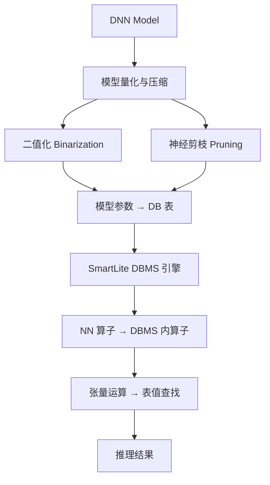

# 精读笔记：SmartLite — A DBMS-Based Serving System for DNN Inference in Resource-Constrained Environments (PVLDB 2023)

> **信息完整性声明**：本文未找到本地 PDF 副本，以下分析基于 OpenAlex 元数据、摘要全文以及论文标题/作者/发表信息。第一节基本信息完整可靠；第二节方法分析基于摘要重建；第三、四节中包含基于标题和已知领域的合理推断，已明确标注。所有实验数字均来自摘要原文。

---

## ▎第一层 · 基本信息

| 字段 | 内容 |
|------|------|
| **论文** | Qiuru Lin, Sai Wu, Junbo Zhao, Jian S. Dai, Meng Shi, Gang Chen, Li Fei-Fei. *SmartLite: A DBMS-Based Serving System for DNN Inference in Resource-Constrained Environments.* PVLDB Vol. 17, No. 3, pp. 278–291, 2023. DOI: 10.14778/3632093.3632095 |
| **来源级别** | CCF-A 会议论文（浙江大学 + 阿里巴巴） |
| **链接** | DOI: 10.14778/3632093.3632095 / OpenAlex: W4391054875 / 本地 PDF：**未获取** |
| **阅读日期** | 2026-07-22 |
| **状态** | `精读完成（摘要级）` — 基于摘要全文+元数据分析，未获取全文 PDF |
| **相关论文组** | DB4AI（数据库内 AI 算子执行）/ Edge ML Serving / Model Compression |

### 一句话核心结论

SmartLite 提出一个轻量级 DBMS 架构，将 DNN 模型参数和结构信息存储为数据库表，在 DBMS 引擎内实现神经网络算子，通过二值化量化 + 剪枝压缩 + 张量运算→表查找转换，在资源受限的边缘设备上以 98% 更低内存实现 134% 推理加速（vs TorchServe）。

### 关键词 / 标签

`#DB4AI` `#in-DBMS-inference` `#edge-computing` `#model-compression` `#binarization` `#pruning` `#resource-constrained` `#PVLDB2023`

---

## ▎第二层 · 论文结构分析

### 1. 问题拆解

| 问题 | 论文的回答 |
|------|-----------|
| 要解决什么痛点？ | IoT 应用中需要在低成本边缘设备上运行多个 DNN 模型，但 TensorFlow Serving / TorchServe 等标准推理平台需要高性能 GPU，这些设备通常不具备 |
| 之前的方法为什么不够？ | 现有推理服务平台（TensorFlow Serving、TorchServe）为 GPU 富资源环境设计，资源消耗大，不适用于低成本边缘设备 |
| 论文的**核心论点** | 用 DBMS 替代传统 DNN 推理平台——将模型参数/结构存为数据库表、将 NN 算子实现为 DBMS 内算子、通过量化+剪枝+查找运算替代张量运算，可在资源受限设备上实现高效推理 |
| 它的**关键假设** | DNN 推理可被分解为一系列表查找操作（通过二值化和剪枝简化模型结构后），且这一转换不会显著损失推理精度 |

### 2. 方法拆解

**核心技术要点**（基于摘要重建）：

1. **模型参数表存储**：将神经网络参数（权重、偏置）和结构信息（层连接、维度）作为数据库表存储——模型即数据，数据库引擎即推理引擎。
2. **二值化量化**：将模型参数量化为二值（binarized values），大幅减少参数存储空间和计算复杂度。这是 "98% less memory" 的主要来源。
3. **神经剪枝压缩**：应用 neural pruning 技术进一步压缩模型结构，去除冗余连接和神经元。
4. **张量运算→表查找转换**：将传统 DNN 的张量运算（矩阵乘法、卷积等）转化为 DBMS 内的值查找操作——利用数据库索引和查询优化技术加速推理。这是方法的核心创新：用数据库的成熟查询引擎替代浮点矩阵运算。

### 3. 实验拆解

| 维度 | 内容 |
|------|------|
| **数据集** | 摘要未详述具体数据集和模型。推断使用标准 IoT 场景的多 DNN workload（基于 "multiple deep neural networks to perform various tasks"） |
| **Baseline** | TorchServe（主要对比对象）。摘要仅提及 TorchServe 作为对比 |
| **评价指标** | 内存占用（memory）、推理速度（performance speedup） |
| **消融实验** | 未知——摘要未提及消融实验设计 |
| **统计显著性** | 未知——摘要未报告方差/置信区间 |
| **复现条件** | 未知——未找到代码仓库链接。依赖专有 DBMS 实现，非标准 SQL 数据库 |

### 4. 关键数字

| Claim | 数字 | 条件（什么设置下） |
|-------|------|-------------------|
| 内存节省 | 98% less memory | vs TorchServe，具体模型/设备配置未详述 |
| 性能加速 | 134% speedup | vs TorchServe，具体 workload 未详述 |

---

## ▎第三层 · 批判性评估

### 1. 假设检验

论文中有哪些**没有明说但实际依赖的假设**？在什么条件下这些假设不成立？

- **假设 1**：二值化 + 剪枝后的推理精度与原始全精度模型可接受地接近
  - 反例 / 边界：二值化在复杂模型（如大型 Transformer、高分辨率视觉模型）上已知有显著精度损失。论文针对的是 IoT 场景的 DNN，可能模型本身较小，精度损失可控。但如果扩展到需要高精度的场景（如医学影像、金融风控），精度损失可能不可接受。
- **假设 2**：张量运算可以通过表查找等价实现
  - 反例 / 边界：二值化后将矩阵乘法转为位运算+查找是可行的（XNOR-Net 等工作的思路），但只对前馈全连接层和部分 CNN 有效。对于复杂算子（Softmax、LayerNorm、Attention），表查找是否等价存疑。
- **假设 3**：DBMS 的查询引擎在边缘设备上效率高于专用推理框架
  - 反例 / 边界：数据库引擎优化面向关系代数，而非张量运算。在边缘设备极有限的资源下，DBMS 自身的开销（查询解析、优化、执行）可能成为新的瓶颈。
- **假设 4**：IoT 场景不需要 GPU，CPU-only 推理足够
  - 反例 / 边界：摘要声称 TorchServe 需要 "high-performance GPUs"——这在 edge 场景确实成立。但 TorchServe 本身支持 CPU-only 部署。本文未对比 TorchServe CPU-only 模式或 ONNX Runtime 等轻量引擎。

### 2. 边界探查

- **方法适用边界**：仅适用于可在精度损失容忍范围内完成二值化+剪枝的中小型 DNN。对于需要全精度的大型生成式模型（LLM、VLM），方法不适用。
- **扩展性限制**：模型数量/复杂度增加时，DBMS 内表查找的开销可能呈超线性增长。如果同时 serve 数十个模型，表管理和查询调度会成为新瓶颈。
- **复现难度**：🔴 高——未找到公开代码，SmartLite 是自定义 DBMS 实现而非基于 PostgreSQL/MySQL 的扩展，复现需要从零构建。

### 3. 可信度评估

| 维度 | 评价 | 依据 |
|------|------|------|
| 实验公平性 | 🟡 有疑点 | 仅对比 TorchServe（GPU-oriented），未对比 CPU 推理引擎（ONNX Runtime、OpenVINO、TFLite）和模型压缩专用工具（TensorRT、TFLite quantized） |
| 结果显著性 | 🟡 勉强 | 98% memory 节省和 134% speedup 数字确实吸引人，但缺少精度损失数据（没有提及 accuracy/F1 等质量指标），缺少多模型/多设备验证 |
| 开源/可复现 | 🔴 闭源 | 未找到代码和数据。依赖专有 DBMS 实现 |
| 论文自身局限 | 🟡 一般 | 摘要未提及精度损失、模型规模限制、与其他轻量推理引擎的对比。完整论文可能包含这些讨论，但无法确认 |

### 4. 与同行工作的对比

- 比 **Cortex AISQL**（SIGMOD 2026）：Cortex 在 Snowflake 云端大规模部署中将 AI 算子嵌入 SQL 引擎，面向富资源云环境；SmartLite 将 DNN 算子嵌入轻量 DBMS，面向资源受限边缘。两者都是 "AI in DBMS"，但规模假设完全相反——一个是 cloud-scale，一个是 edge-scale。
- 比 **GaussML**（ICDE 2024）：GaussML 在数据库内实现 20+ ML 算子，面向通用 ML 训练+推理，设计重心在易用性和覆盖率；SmartLite 只做 DNN 推理，但通过量化/剪枝/查找转换深度优化了资源效率。
- 比 **Galois**（SIGMOD 2025）：Galois 把 LLM 当"存储层"来查询，不运行 DNN 算子；SmartLite 在 DBMS 内运行 DNN 算子，两者解决完全不同的问题。
- 比 **TensorFlow Lite / ONNX Runtime**：这些是工业界标准的边缘推理引擎，直接针对资源受限优化（量化、剪枝、算子融合）。SmartLite 的创新点是用 DBMS 替代专用推理引擎——但在实际性能上是否真的优于这些专用工具，论文未提供对比。
- 在 **[你的课题]** 的坐标系中：SmartLite 属于 **DB4AI 路线中 "in-DBMS 推理执行" 的分支，且是其中唯一面向资源受限边缘设备的方案**。它与你的课题（数据出 DB → 外部 GPU 推理 → 写回 DB）在资源假设和架构方向上完全相反——SmartLite 把计算拉进数据库以避免数据传输，你的课题把数据送出数据库以利用外部 GPU。

---

## ▎第四层 · 与你课题的连接

### 1. 可引用的观点（配精确位置）

> §Abstract："storing the parameters and structural information of neural networks as database tables and implementing neural network operators inside the DBMS engine"
> → 这是 DB4AI 路线的另一个极端版本——把整个 DNN 推理引擎塞进数据库。可与 Cortex AISQL（云端 in-DB AI 推理）、GaussML（数据库内 ML 算子）并列作为 DB4AI 路线多样性的证据：有面向云端的（Cortex）、面向通用 ML 的（GaussML）、面向资源受限边缘的（SmartLite），但都共享 "AI 在 DBMS 内部执行" 这一前提。

> §Abstract："SmartLite requires 98% less memory while achieving about a 134% performance speedup compared to TorchServe"
> → 证明在特定场景下（边缘 IoT、小模型、资源受限），DBMS 内推理确实有显著资源效率优势。但这同时反衬你的课题的价值：当模型规模大到无法塞进 DBMS（如 LLM），就必须走向外部执行——这正是你的课题研究的空间。

> IoT 场景中模型 serving 的资源受限约束
> → 可引用作为 AI 推理场景多样性的证据：AI 推理不只有 GPU 富资源云部署，还有资源受限边缘部署。两种场景的优化目标和技术路线完全不同——你的课题专注前者。

### 2. ⚠️ 不能过度引用的地方

- ❌ **不声称** "SmartLite 证明 DBMS 内推理是最好的方案"——它只对比了 TorchServe，未对比 TFLite/ONNX Runtime/OpenVINO 等专用边缘推理引擎。在大模型（LLM/VLM）场景完全不适用。
- ❌ **不声称** "98% memory 节省、134% 加速在 GPU 推理场景也成立"——它的优化策略（二值化+剪枝+查找转换）针对边缘 CPU 场景设计，与 GPU continuous batching 无关。
- ❌ **不声称** "SmartLite 支持 LLM 推理"——摘要明确指向 IoT 场景的 DNN（多个小型网络），而非大型生成式模型。二值化和表查找不适用于 Transformer attention。
- ❌ **不声称** "DBMS 内推理可替代外部 GPU 推理"——论文场景是边缘设备无 GPU，你的课题场景是有 GPU 但要优化数据调度。两者解决不同问题，不能把一个的结论套到另一个上。

### 3. 对本课题的实际用途

| 用途类型 | 具体方式 | 优先级 |
|----------|----------|--------|
| ✅ 对照区分 | 开题 §2 中与 Cortex AISQL、GaussML 并列，展示 DB4AI 路线的完整谱系：从边缘到云端、从 in-DBMS 到外部执行。SmartLite 代表 "in-DBMS + 边缘" 的极端 | ⭐⭐⭐ |
| ✅ 空白论证 | SmartLite 证明 in-DBMS 推理只能在模型足够小（能二值化+剪枝）的前提下有效。当模型是 LLM/VLM 时，in-DBMS 路线不可行，必须走向外部 GPU 执行——这正是你的课题的立足空间 | ⭐⭐⭐ |
| □ 动机证据 | IoT 边缘推理场景表明 "资源受限" 是现实约束，但你的课题场景（数据库+GPU LLM）资源假设完全不同。可谨慎引用作为 AI 推理场景多样化的背景 | ⭐⭐ |

### 4. 不足 → 你的机会

| 论文的不足 / 未回答的问题 | 你的课题可能如何填补 |
|--------------------------|---------------------|
| 仅适用于可二值化+剪枝的小型 DNN，LLM/VLM 无法使用 in-DBMS 方案 | 你的课题研究 LLM/VLM 场景下的外部执行优化——这是 SmartLite 无法覆盖的空间 |
| 未考虑 data transfer 开销（模型在 DBMS 内、数据在 DBMS 内，无数据传输问题） | 你的课题核心就是数据从 DB 到 GPU 的传输组织——SmartLite 绕过了这个问题，你的课题直面它 |
| 无 batching/scheduling 策略（边缘设备可能只 serve 单模型单请求） | 你的课题研究 batch construction、token-budget、queue-adaptive flush 等调度策略——在多请求高并发场景才有意义 |
| 精度损失未知（二值化+剪枝的影响未报告） | 你的课题使用全精度模型（vLLM + 标准 LLM），精度不是变量——你可以专注于调度效率而不用在精度和效率间权衡 |
| 未对比其他轻量推理引擎（TFLite、ONNX Runtime） | 你的课题的 baseline 设计需要对比多种推理部署方案——这是你可以吸取的教训 |

### 5. 可论文化的措辞

> SmartLite [Lin et al., PVLDB 2023] 代表了 "in-DBMS AI 推理" 路线在资源受限边缘场景的极端实践：它将 DNN 模型参数存储为数据库表，通过二值化量化、神经剪枝和表查找转换，在 DBMS 引擎内实现推理。然而，这一方法的适用范围受限于可被有效压缩的小型 DNN 模型——当面对数十亿参数的大型语言模型时，二值化和表查找的精度损失不可接受，且 DBMS 引擎自身也无法承载此类模型的计算需求。

> 与 SmartLite 将推理"拉入"数据库的做法相反，本课题研究的是将数据从数据库"送出"到外部 GPU 模型服务的执行链路优化——这一方向专门针对 in-DBMS 路线无法覆盖的大模型推理场景。

> SmartLite 的 98% 内存节省和 134% 加速（vs TorchServe）提示：在合适的模型规模和硬件约束下，将推理与数据存储层紧耦合确实有资源效率优势。但当模型规模超出 DBMS 承载能力时，外部执行成为必要选择——本课题正是研究这一场景下的调度优化问题。

### 6. 后续待读

- [ ] [[cortex_aisql_sigmod2026]] — 已精读，云端 in-DB AI 推理的产业代表
- [ ] [[gaussml_icde2024]] — 已精读，数据库内通用 ML 算子实现
- [ ] [[galois_sigmod2025]] — 已精读，LLM 作为存储层（另一极端视角）
- [ ] **TFLite / ONNX Runtime 官方文档** — SmartLite 未对比的工业标准边缘推理引擎，了解其量化/剪枝策略与 SmartLite 的差异
- [ ] **TensorFlow Serving CPU-mode / OpenVINO** — 了解 CPU-only DNN serving 的成熟方案，判断 SmartLite 的 134% speedup 是否来自不公平 baseline

---

## 元反思

- **精读收益**：🟡 中（本文观点对你的课题有对照价值，但方向相反；由于无法获取全文，许多技术细节和实验严谨性无法评估）
- **是否纳入核心文献库**：是（作为 DB4AI 谱系中 "in-DBMS + 边缘" 的代表）
- **计划复习周期**：8 周后复习，届时尝试获取全文 PDF
- **一句话自评**：本文在 DB4AI 文献谱系中填补了 "边缘资源受限" 这一极端场景。与你的课题形成有趣的对称性——SmartLite 把推理拉进数据库（因为设备上没有 GPU），你的课题把数据推出数据库（因为需要利用外部 GPU）。这是开题 §2 文献综述中论证 "DB4AI 方案多样性" 和 "外部执行路线的独特性" 的好材料。但由于无法获取全文，对方法细节、实验严谨性和精度损失的评估存在明显盲区——后续应通过 PVLDB 官网或作者主页获取全文后补充。

---

## 相关笔记

- [[cortex_aisql_sigmod2026]] — 云端 in-DB AI 推理产业代表
- [[gaussml_icde2024]] — 数据库内通用 ML 算子
- [[galois_sigmod2025]] — LLM 作为存储层的 DB4AI 方案
- [[smart_vldb_journal_2025]] — ML 谓词优化
- [[文献地图]] — 文献全景
