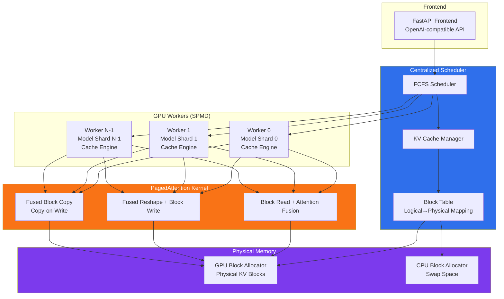

# 精读笔记：vLLM — Efficient Memory Management for Large Language Model Serving with PagedAttention (SOSP 2023, Best Paper)

---

## ▎第一层 · 基本信息

| 字段 | 内容 |
|------|------|
| **论文** | Kwon, Li, Zhuang, Sheng, Zheng, Yu, Gonzalez, Zhang, Stoica. *Efficient Memory Management for Large Language Model Serving with PagedAttention.* SOSP 2023, pp. 611-626. DOI:10.1145/3600006.3613165 |
| **来源级别** | CCF-A 会议论文（SOSP，操作系统顶会）+ Best Paper Award（UC Berkeley + Stanford + UC San Diego） |
| **链接** | DOI:10.1145/3600006.3613165 / 本地 PDF：`opening/literature/reference/3600006.3613165.pdf` / 代码：https://github.com/vllm-project/vllm |
| **阅读日期** | 2026-07-22 |
| **状态** | 精读完成 |
| **相关论文组** | LLM 推理服务 / GPU 内存管理 / KV cache |

### 一句话核心结论

vLLM 将操作系统虚拟内存与分页思想引入 LLM 推理的 KV cache 管理：PagedAttention 允许 KV cache 存储在非连续物理内存块中，消除内部/外部碎片（利用率从 20.4%-38.2% 提升至 96.3%），并通过 block 级 copy-on-write 实现跨请求/序列的 KV cache 共享，最终在相同延迟下将 LLM 推理吞吐提升 2-4 倍。

`#LLM-serving` `#PagedAttention` `#KV-cache` `#virtual-memory` `#throughput` `#SOSP2023` `#BestPaper`

---

## ▎第二层 · 论文结构分析

### 1. 问题拆解

| 问题 | 论文的回答 |
|------|-----------|
| 要解决什么痛点？ | LLM 推理服务中 KV cache 内存管理效率极低——现有系统（FasterTransformer、Orca）将 KV cache 存储在连续内存中，导致严重内部碎片（预分配最大长度）和外部碎片（不同请求大小不同），实际有效利用率仅 20.4%-38.2%。内存浪费直接限制 batch size，进而限制吞吐 |
| 之前的方法为什么不够？ | 深度学习框架（PyTorch、TensorFlow）要求 tensor 存储在连续内存中。现有 LLM 服务系统沿袭此假设，在 serving 开始即按 max sequence length 预分配连续内存。但 KV cache 具有独特性质——动态增长/收缩、生命周期和长度不可预知、跨请求/序列可部分共享——连续内存分配无法利用这些性质 |
| 论文的**核心论点** | 将 OS 虚拟内存的经典思想（paging、逻辑-物理地址映射、copy-on-write、swap）适配到 LLM serving 的 KV cache 管理，通过 block 级非连续内存分配 + 集中式调度器，可以实现接近零浪费的内存利用率和灵活的跨序列内存共享 |
| 它的**关键假设** | (1) LLM 推理吞吐是 memory-bound（而非 compute-bound）——此假设在长序列、大模型时成立，短序列小模型时可能不成立；(2) KV cache 的大小和生命周期主导 GPU 内存瓶颈；(3) 模型权重在 serving 期间不变，约占 65% GPU 内存 |

### 2. 方法拆解

**核心技术要点**：

1. **PagedAttention 算法**（§4.1）：将 KV cache 划分为固定大小的 KV block（每 block 含固定数量 token 的 key + value vector，默认 block size = 16）。Attention 计算改造为 block-wise 形式：将 query vector 分别与每个 KV block 计算注意力分数再聚合。KV block 可存储在非连续物理内存中，通过 block table 维护逻辑 block 到物理 block 的映射。**为什么有效**：打破了连续内存分配的约束，使内存管理可以按需动态分配，而非预分配最大长度。

2. **Block Table + 逻辑-物理映射**（§4.2-4.3）：每个请求维护一个 block table，记录每个逻辑 block 对应的物理 block ID 和已填充位置数。逻辑 block 从左到右按需增长——初始只分配 prompt 所需 block，decoding 阶段逐 token 填充，最后一个 block 满后才分配新物理 block。**为什么有效**：将每请求的内存浪费控制在最后一个 block 内（最多 block_size - 1 个 token），消除预分配导致的内部碎片（reserved + internal fragmentation）和大小不均导致的外部碎片。实验测得 KV cache 利用率达 96.3%（vs 现有系统的 20.4-38.2%）。

3. **Copy-on-Write 内存共享**（§4.4）：通过 block 级引用计数实现跨序列 KV cache 共享。(a) Parallel sampling：多个输出共享 prompt 的 KV block，仅生成阶段需要时触发 CoW 复制最后一个逻辑 block。(b) Beam search：多个 beam candidate 可以共享从 prompt 到分叉点之前的所有 block，且共享模式随 decoding 推进动态演变。(c) Shared prefix：服务商可预缓存 system prompt / few-shot example 的 KV block，用户请求只需映射到已缓存的物理 block。**为什么有效**：不同 decoding 算法有不同共享模式，但 block 级抽象统一了它们——LLM 执行内核只看到物理 block ID 列表，不需要感知共享逻辑。

4. **All-or-Nothing 抢占与 Recovery**（§4.5）：当 GPU 物理 block 耗尽时，采用 FCFS 调度 + all-or-nothing eviction（按序列组整组换出）。提供两种 recovery 机制：(a) **Swapping**：将 evicted block 拷贝到 CPU 内存，恢复时拷回 GPU（受 PCIe 带宽限制，小 block 时开销大）；(b) **Recomputation**：将已生成的 output token 与原始 prompt 拼接，在 prompt phase 一次并行重算所有位置的 KV cache（开销恒定，不受 block size 影响，且从未超过 swapping 延迟的 120%）。对于 block size 16-64，两者性能相当。

5. **分布式执行**（§4.6）：采用 Megatron-LM 风格 tensor model parallelism（SPMD），attention operator 按 head 维度切分。关键是**所有 GPU worker 共享同一套 block table**——scheduler 在每个 iteration 开始时广播 input token IDs + block table 给所有 worker，worker 按 block table 读取各自负责的 attention head 的 KV cache，无需额外同步。

6. **GPU Kernel 优化**（§5.1）：实现三个 fused kernel：fused reshape + block write（减少 kernel launch overhead）、fused block read + attention（根据 block table 读取 KV cache + on-the-fly attention，每个 GPU warp 负责一个 block 保证 coalesced memory access）、fused block copy（将多个不连续 block 的 CoW 拷贝操作合并为一次 kernel launch）。

### 3. 实验拆解

| 维度 | 内容 |
|------|------|
| **数据集** | ShareGPT（对话数据，平均 input 161 tokens / output 338 tokens，高方差）+ Alpaca（指令数据，平均 input 19 tokens / output 58 tokens，短序列）+ WMT16 英德翻译（shared prefix 实验）。请求到达时间用 Poisson 分布合成（数据集不含时间戳） |
| **Baseline** | FasterTransformer（NVIDIA 低延迟推理引擎，自建 dynamic batching scheduler）+ Orca 三个版本：Orca (Oracle)（已知真实 output 长度，理论上界）、Orca (Pow2)（最多 2x over-reserve）、Orca (Max)（始终预留 max sequence length 2048） |
| **评价指标** | **Normalized latency**（端到端延迟 / output token 数，s/token）——与 Orca 一致。组合不同请求率（req/s）扫描，正常吞吐应维持低 normalized latency。**#Batched requests**（同时处理的请求数）。**Memory saving**（共享节省的 block 数 / 无共享时的 block 总数） |
| **消融实验** | ✅ Kernel microbenchmark（attention kernel 延迟对比 FasterTransformer）、block size 影响（1-256 在 ShareGPT 和 Alpaca 上的端到端 normalized latency）、recomputation vs swapping 对比（microbenchmark + 端到端性能） |
| **统计显著性** | ❌ 未报告方差/置信区间（但多模型 × 多数据集 × 多 baseline 覆盖部分缓解；1 小时 trace 长度保证了统计稳定性） |
| **复现条件** | 🟢 代码完全开源（GitHub: vllm-project/vllm，8.5K Python + 2K C++/CUDA），使用公开模型（OPT、LLaMA）和公开数据集，实验配置详见表 1。使用 Google Cloud A2 实例（NVIDIA A100） |

### 4. 关键数字

| Claim | 数字 | 条件 |
|-------|------|------|
| KV cache 有效利用率提升 | 96.3% (vLLM) vs 20.4%-38.2% (Orca/FT) | OPT-13B，ShareGPT 实验期间平均 |
| 吞吐提升 vs Orca (Oracle) | 1.7×-2.7× | ShareGPT，OPT-13B/66B/175B |
| 吞吐提升 vs Orca (Max) | 2.7×-8× | 同上 |
| 吞吐提升 vs FasterTransformer | 最高 22× | ShareGPT，OPT-13B（FT 无 fine-grained scheduling + 内存低效） |
| 同时批处理请求数 | vLLM 30.42 vs Orca (Oracle) 13.62 vs Orca (Max) 7.00 | OPT-13B，ShareGPT，2 reqs/s |
| Parallel sampling 内存节省 | 6.1%-9.8%（Alpaca）/ 16.2%-30.5%（ShareGPT） | 取决于 parallel size |
| Beam search 内存节省 | 37.6%-55.2%（Alpaca）/ 44.3%-66.3%（ShareGPT） | beam width 2-6 |
| Shared prefix 吞吐提升 | 1.67×（1-shot）/ 3.58×（5-shot） | LLaMA-13B，WMT16 翻译 |
| PagedAttention kernel overhead | 20-26% higher attention kernel latency vs FasterTransformer | block size 16，batch size 8-32 |
| 默认 block size | 16 tokens | 在 ShareGPT 和 Alpaca 上经验最优 |
| 单 token KV cache 大小 | 800 KB | OPT-13B（2 × 5120 × 40 layers × 2 bytes FP16） |
| 单请求最大 KV cache | 1.6 GB | OPT-13B，max 2048 tokens |

---

## ▎第三层 · 批判性评估

### 1. 假设检验

- **假设 1**：LLM 推理吞吐是 memory-bound 的，提升内存利用率就能等比例提升吞吐
  - 反例 / 边界：论文自己发现了反例——OPT-175B + Alpaca 场景下，GPU 内存充裕（640 GB total，264 GB 可用于 KV cache），而 Alpaca 序列极短，Orca (Oracle) 和 Orca (Pow2) 也能 batch 大量请求。此时系统变为 **compute-bound**，vLLM 的优势缩小。这意味在短序列、大 GPU 内存场景下，PagedAttention 的价值有限。
- **假设 2**：KV cache 是 GPU 内存的唯一主导瓶颈
  - 反例 / 边界：论文 Fig 1 显示模型权重占 65%，KV cache 约 30%。当模型权重大到单 GPU 装不下时（如 GPT-3 175B），model parallelism 本身就消耗显著内存和通信开销，KV cache 管理优化带来的收益被稀释。论文承认了此点（§6.2），但没有深入讨论权重卸载（weight offloading）场景下的交互。
- **假设 3**：block table lookup 的开销可被 GPU kernel fusion 充分摊销
  - 反例 / 边界：论文测得 PagedAttention kernel 比 FasterTransformer 的连续内存 attention kernel 慢 20-26%。虽然端到端吞吐大幅领先，但这个 overhead 意味着如果内存本身不紧张（batch size 不受内存限制），vLLM 的延迟会略差于 FT。论文的 framed argument——"memory is the bottleneck"——使此 tradeoff 总是有利的，但并非所有部署场景都 memory-bound。

### 2. 边界探查

- **方法适用边界**：(1) 当 GPU 内存充裕而计算成为瓶颈时（短序列、大 GPU 内存/小模型），PagedAttention 的额外 kernel overhead 可能使 vLLM 不如连续内存方案；(2) 当请求量极低、不需要大量 batching 时（单请求 low-latency 场景），内存管理的收益无法体现；(3) PagedAttention 依赖 block 级管理的工程复杂度——对于不做 LLM serving 只做单次推理的场景（如离线 batch 推理），传统内存预分配更简单有效。
- **扩展性限制**：(1) Block size 的选择是 tradeoff：太小则 kernel parallelism 不足（每个 warp 处理 block 的效率降低），太大则碎片增加和共享概率降低。论文默认 16，但对极端长序列（如 100K token 上下文）可能需要重新调优；(2) 分布式场景中所有 worker 共享同一套 block table 的设计假设 homogeneous GPU——如果使用 heterogeneous GPU（不同容量），逻辑 block→物理 block 的映射需要 per-worker 差异化；(3) CPU swap 空间受限于 GPU KV cache 大小，当模型规模进一步增长时，PCIe 带宽可能成为瓶颈。
- **复现难度**：🟢 代码完全开源，已成为社区最主流的 LLM serving 框架（截至 2025 年 GitHub 60K+ stars），实验使用公开模型和数据集，完全可复现。

### 3. 可信度评估

| 维度 | 评价 | 依据 |
|------|------|------|
| 实验公平性 | 🟢 公平 | 3 种模型规模 × 2 种数据集负载 × 4 种 baseline（含 Oracle 理论上界）× 多种 decoding 算法。Orca baseline 自建但遵循论文设计，包含 Oracle 版本做上界对照 |
| 结果显著性 | 🟢 显著 | 2-4× 吞吐提升跨模型、跨数据集一致；96.3% vs 20.4% 的内存利用率差异极大；55% beam search 内存节省有实质意义 |
| 开源/可复现 | 🟢 全开 | 完全开源（GitHub），已成为事实标准 LLM serving 框架 |
| 论文自身局限 | 🟢 诚实 | 明确讨论 compute-bound 场景下优势缩小（§6.2）、kernel overhead 20-26%（§7.1）、block size tradeoff（§7.2）、swap vs recomputation 的权衡（§7.3）、PagedAttention 不适用于所有 GPU workload（§8） |

### 4. 与同行工作的对比

- 比 **Orca**（OSDI 2022）：Orca 的 iteration-level scheduling 和 vLLM 的 PagedAttention 是互补技术——Orca 解决"何时调度请求"的问题（让请求可以在单次 iteration 后加入/离开 batch），vLLM 解决"多少请求能同时放入内存"的问题。论文明确指出两者结合效果最佳。
- 比 **FasterTransformer**（NVIDIA）：FT 是低延迟推理引擎，关注 kernel 级优化（如 fused multi-head attention），但不做内存管理优化和细粒度调度。vLLM 在 FT 基础上引入了 OS 层面的内存管理思想。
- 比 **FlashAttention**（Dao et al., NeurIPS 2022）：FlashAttention 解决 attention 计算本身的 memory I/O 问题（tiling + recomputation 减少 HBM 访问），vLLM 解决 attention 结果（KV cache）的存储管理问题。两者正交且兼容——vLLM 的 PagedAttention kernel 可与 FlashAttention 的技术结合。
- 比 **FlexGen**（Sheng et al., ICML 2023）：FlexGen 针对离线、单 GPU 的 LLM 推理（swapping weights + token states），不适用于在线 serving。vLLM 针对在线 serving 场景（高并发、低延迟要求）。
- 在 **[你的课题]** 的坐标系中：vLLM 是本课题的**部署平台**（不修改其内部）。本课题研究的是到达 vLLM 之前的"上游调度"——数据如何从数据库组织为请求、以什么节奏发送、如何根据 vLLM 的队列状态调节并发。vLLM 的 continuous batching + PagedAttention 是本课题的 baseline 环境。

---

## ▎第四层 · 与你课题的连接

### 1. 可引用的观点（配精确位置）

> §2.2 Autoregressive Generation：LLM 推理分为 prompt phase（GPU compute-bound，矩阵-矩阵乘法并行化高效）和 autoregressive generation phase（memory-bound，逐 token 生成，矩阵-向量乘法低效，占单请求延迟的大头）。
> → **直接支撑你课题的研究动机**：autoregressive generation phase 是 memory-bound 且 GPU 利用率低，这解释了为什么上游调度优化（更好的 batch construction + 提交控制）有机会提升端到端吞吐——更好的 batching 可以将更多请求同时送入 memory-bound 阶段，摊销模型权重加载开销。

> §3 Large KV cache：OPT-13B 单 token 的 KV cache 为 800KB，max 2048 token 的请求高达 1.6GB。GPU 算力增速超过内存容量增速（A100→H100：FLOPS 2×+，memory 仍为 80GB），内存将成为越来越显著的瓶颈。
> → **支撑你课题中"调度须感知模型服务资源状态"的论点**：KV cache 的膨胀意味着上游提交过多请求会导致 GPU 内存耗尽触发 swap/preemption，queue-adaptive flush 正是为了解决此问题。

> §4.5 Scheduling and Preemption："当请求流量超过系统容量时，vLLM 必须优先处理部分请求……当 GPU 物理 block 耗尽，需要决定驱逐哪些 block。"
> → **直接对应你课题的"queue-adaptive flush"策略**：如果上游可以感知 vLLM 的 KV cache 压力和队列深度，就可以在请求提交端做适应性调节（减缓/加速/分池路由），而不是被动等待 vLLM 内部 preempt。

> §4.4 Memory Sharing：不同 decoding 算法有不同的 KV cache 共享模式，block 级抽象统一了它们——LLM 执行内核只看到物理 block ID。
> → **启发**：你课题中的"异构 actor pool 分池路由"可以利用类似的抽象层——按请求的计算特征（token 量/frame 量）将请求路由到不同的 actor pool，每个 pool 面对不同 batch size、不同 GPU 分配，但 actor 执行端不需要感知路由逻辑。

> §6.2 "当 GPU 内存充裕（短序列 + 大 GPU）时，系统变为 compute-bound，vLLM 优势缩小"
> → **对你课题的警示**：如果 workload 本身是短序列（如 AI_EMBED 的 sentence embedding），且 GPU 内存充裕，则 KV cache 管理不是瓶颈——此时上游调度优化的重点必须从"避免 GPU 内存压力"转向"提高 GPU 计算利用率"（更好的 batch packing 以形成大矩阵乘法）。你的实验设计需要对比短序列（Alpaca-like）和长序列（ShareGPT-like）两种场景。

### 2. ⚠️ 不能过度引用的地方

- ❌ **不声称** "本课题改进 vLLM 的 PagedAttention 或 KV cache 管理"——vLLM 是本课题的部署平台，作为 baseline 使用，不修改其内部。
- ❌ **不声称** "本课题的调度策略优于 vLLM 的 FCFS + preemption"——vLLM 的调度是 GPU 内存管理驱动的（all-or-nothing preemption），你课题的调度是数据量驱动的（token-budget / queue-adaptive），两者作用在不同层面：vLLM 在 GPU 内部，你在提交通道上。
- ❌ **不声称** "PagedAttention 的内存节省（55% beam search）在你的 AI_COMPLETE/AI_EMBED 场景同样成立"——你的场景是 basic sampling（每个 prompt 一个输出），不涉及 parallel sampling 或 beam search，共享收益几乎为零。
- ❌ **不声称** "vLLM 的 2-4× 吞吐提升验证了本课题的优化空间"——vLLM 相比 Orca/FT 的提升来自 KV cache 管理，与你的上游数据组织/提交控制是正交的优化维度。

### 3. 对本课题的实际用途

| 用途类型 | 具体方式 | 优先级 |
|----------|----------|--------|
| ✅ Baseline 环境 | 本课题以 vLLM（continuous batching + PagedAttention）作为模型服务部署平台，所有数据组织策略和提交控制策略的实验在此平台上运行。实验中不修改 vLLM，将其吞吐/延迟作为对照基线 | ⭐⭐⭐ |
| ✅ 动机证据 | vLLM §2.2 对 prompt phase（compute-bound）与 generation phase（memory-bound）的区分，直接支撑"上游需要按 token 计算量而非行数组织 batch"的动机 | ⭐⭐⭐ |
| ✅ 设计参考 | vLLM 的 block table 抽象（逻辑-物理分离）对你的 token-budget batch construction 有启发：可以将逻辑 request group 映射到物理 batch slot，类似地解耦"逻辑分组"和"物理提交" | ⭐⭐ |
| ✅ 设计参考 | vLLM 的 all-or-nothing preemption + recomputation 思路启发 queue-adaptive flush：当上游检测到 vLLM 队列深度超标，可以主动 flush 部分请求组的已生成结果（类比 recomputation——代价可控） | ⭐⭐ |
| ✅ 对照区分 | 在开题 §2 和论文 related work 中明确区分：vLLM 优化的是"GPU 内部的内存管理和连续批处理"，本课题优化的是"数据到达 GPU 之前的组织与调度" | ⭐⭐⭐ |

### 4. 不足 → 你的机会

| 论文的不足 / 未回答的问题 | 你的课题可能如何填补 |
|--------------------------|---------------------|
| vLLM 假设所有请求无差别地进入 FCFS 队列，不区分请求的计算量差异 | 你的 token-budget batching 策略会按 token 量分组，形成计算量均匀的 batch，减少 padding 浪费和 straggler |
| vLLM 的 preemption 是"被动响应 GPU 内存耗尽"，没有"主动根据队列压力调节输入速率"的机制 | 你的 queue-adaptive flush 策略实现了这种"前馈调节"——在 vLLM 前端感知队列深度并主动减速/加速提交 |
| vLLM 不关心请求来源（数据如何从数据库组织、以什么格式到达） | 你的课题覆盖从 PostgreSQL→Daft DataFrame→Ray→vLLM 的完整链路，研究数据组织方式对端到端吞吐的影响 |
| vLLM 使用统一的 block size 和 batch 策略，不感知 workload 的模态差异（文本 vs 图像） | 你的多模态泛化验证证明了"token-budget → frame-budget"的抽象一致性——同一套策略代码可跨模态工作 |

### 5. 可论文化的措辞

> 本课题以 vLLM [Kwon et al., SOSP 2023] 作为模型服务部署平台——利用其 continuous batching 和 PagedAttention 提供的高吞吐推理能力，但不修改 vLLM 的内部调度和内存管理。优化作用在 vLLM 的上游：数据如何从数据库组织为请求、以什么节奏提交、如何根据模型服务的队列状态进行适应性调节。

> 正如 Kwon et al. [SOSP 2023] 在 §2.2 中所分析的，LLM 推理的 autoregressive generation phase 是 memory-bound 且 GPU 利用率低的——这一观察直接支撑了本课题的动机：在上游对请求进行更好的组织（按计算量分组而非固定行数）和更智能的提交控制（感知队列深度和 KV cache 压力），可以提升 GPU 利用率和端到端吞吐。

> 与 Kwon et al. 的 vLLM 侧重 GPU 内部的 KV cache 管理不同，本课题关注的是数据到达 GPU 之前的"上游调度"——包括数据组织（token-budget batch construction）和提交控制（queue-adaptive flush）。两者在优化链路中互补：vLLM 解决"GPU 内能同时服务多少请求"，本课题解决"以什么形式、什么节奏把请求送入 GPU"。

### 6. 后续待读

- [ ] [[orca_osdi2022]] — vLLM 的主要 baseline 和互补系统（OSDI 2022），iteration-level scheduling 的原始论文；本地 PDF：`opening/literature/reference/orca_osdi2022.pdf`
- [ ] [[diskann_neurips2019]] — 本地已有 PDF，向量索引方向参考
- [ ] **FlashAttention** (Dao et al., NeurIPS 2022) — attention 计算 I/O 优化的正交工作，vLLM 的 PagedAttention kernel 可与之结合
- [ ] **FlexGen** (Sheng et al., ICML 2023) — 离线 LLM 推理内存优化的对照
- [ ] **Sarathi-Serve** (Agrawal et al., OSDI 2024) — 后续工作：将 prefill 和 decode 分阶段调度，进一步优化 vLLM 的 continuous batching

---

## 元反思

- **精读收益**：🟢 高（vLLM 是本课题的部署平台，理解其内存管理和调度机制是设计上游优化策略的前提。§2.2 的 prompt/autoregressive phase 分析和 §4.5 的 preemption 机制直接指导你的实验设计）
- **是否纳入核心文献库**：是（作为"部署平台 baseline"而非"优化对象"纳入）
- **计划复习周期**：4 周后复习，尤其是 §2.2 和 §4.5 部分
- **一句话自评**：理解到位。vLLM 解决的是"GPU 内部"问题（KV cache 内存管理），你解决的是"GPU 上游"问题（数据组织 + 提交控制）。两者的互补关系（而非竞争关系）需要在开题报告和论文中精确表述——vLLM 是 baseline 环境，不是优化对象。

---

## 相关笔记

- [[galois_sigmod2025]] — 已精读，同为 CCF-A，DB4AI 路线
- [[cortex_aisql_sigmod2026]] — 已精读，Snowflake 工业 AI 算子
- [[smart_vldb_journal_2025]] — 已精读，ML 谓词优化
- [[gaussml_icde2024]] — 已精读，数据库内置 ML 算子
- [[文献地图]] — 文献全景
